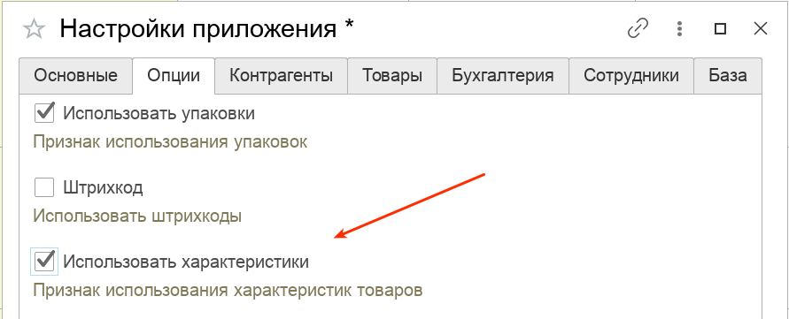
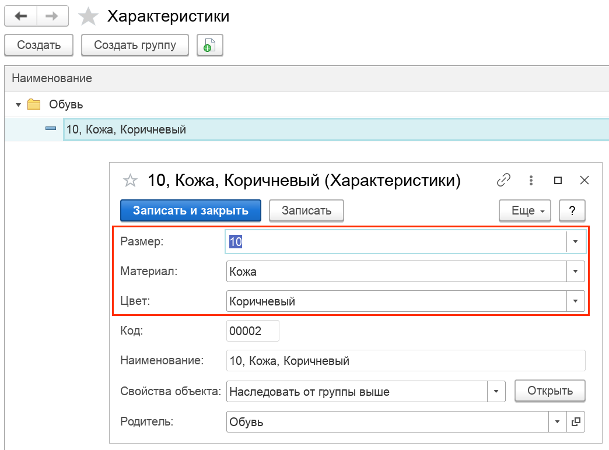
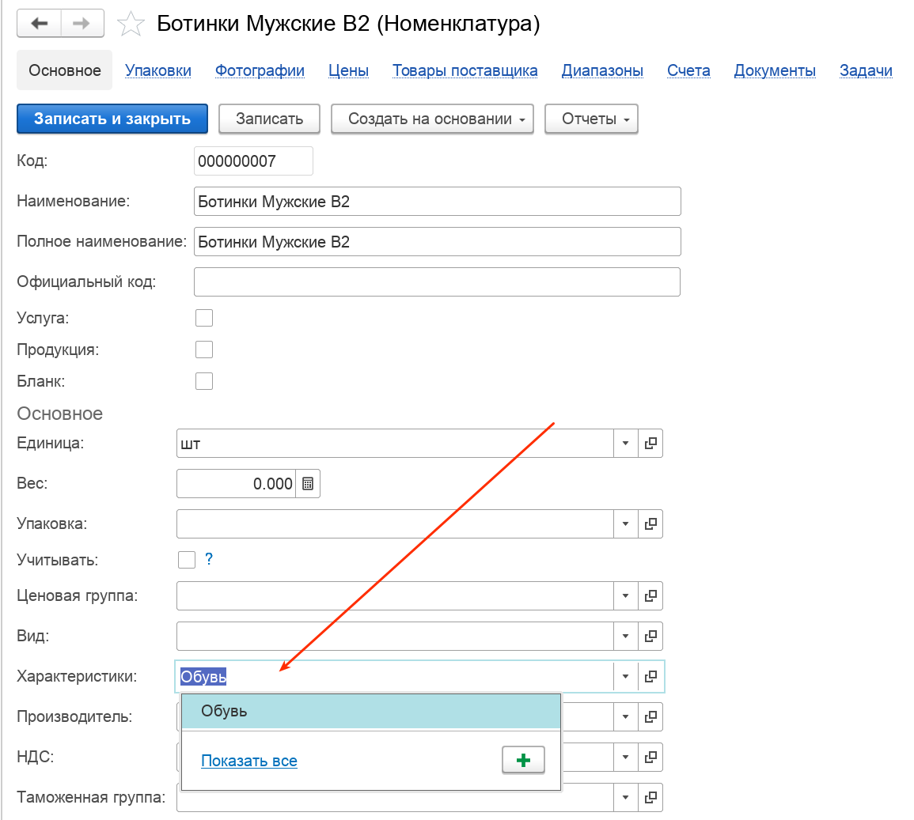
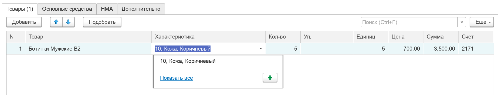
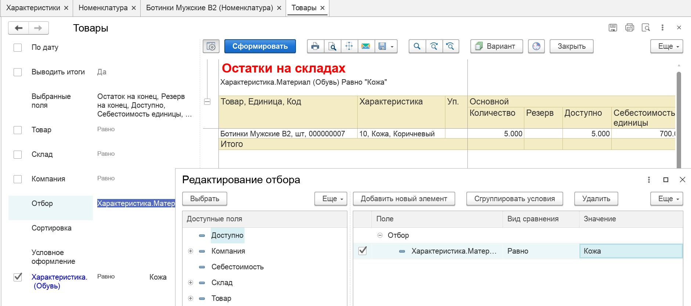

Справочник характеристик товаров. Используется для наделения [номенклатуре](/c/Items) дополнительных признаков, не меняющих сущности самого товара. Для справочника предусмотрена возможность задания [дополнительных реквизитов](/properties).

Хорошими кандидатами на использование характеристик могут быть такие группы товаров как: Обувь, Одежда, Строительные материалы (плитка, обои, ламы) и другие. Без использования характеристик, товары, имеющие размер, тип и другие свойства, пришлось бы заводить в справочник Номенклатура отдельными позициями, что часто приводит к дублированию и сложности анализа товаров по определенному свойству. Например, без учета по характеристикам было бы сложно ответить на вопрос, сколько осталось ботинок 10 размера.

!!!warning "Внимание!"
    Следует очень осмотрительно подходить к вопросу структуры характеристик и их использованию как таковых. Обязательно советуйтесь с вашим товароведом для определения правильной стратегии учета НСИ.

!!!info "Примечание!"
    Доступность справочника определяется функциональной опцией `Использовать характеристики`. Убедитесь, что в настройках приложения эта опция включена: 

Предусматривается следующая логика работы со справочником:

- На первом уровне, в справочнике создаются группы, объединяющие в себе некий набор характеристик, общий для определенной группы товаров. Например, если предприятие торгует обувью, в качестве группы характеристик может выступать группа Обувь, со следующим набором дополнительных реквизитов:
 

!!!tip "Подсказка"
    Подробнее о том, как конфигурируются дополнительные реквизиты читайте [здесь](/properties)

- В свою очередь, создание новой характеристики в этой папке будет выглядеть следующим образом:
   

- Для того, чтобы назначить товару принадлежность к группе характеристик, необходимо в справочнике Номенклатура, для требуемого элемента указать характеристику:

Таким образом, характеристики связываются с товарами, а сами значения характеристик становятся доступными при работе с первичными документами и отчетами.

На картинке ниже типовой пример табличной части документа с указанием характеристики товара:

А также отчет, где мы получаем остатки по всем кожаным ботинкам:

