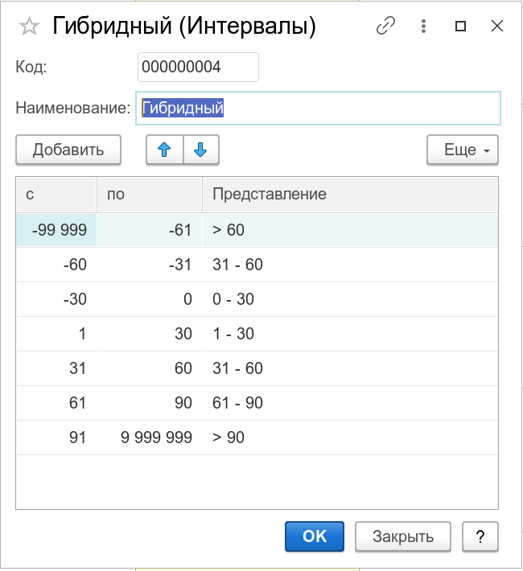

Интервалы группировки устаревания долгов. Используется в отчетах [Дебиторы](/r/Debts) и [Кредиторы](/r/VendorDebts).

Таблица интервалов, задает промежуток дней (включительно), который определяет требуемую группировку дат оплат на временной оси календаря. При этом, следует учитывать, что в качестве интервалов могут быть заданы как положительные значения дней, так и отрицательные. По смыслу, положительные значения задают интервалы просроченной задолженности, а отрицательные - предстоящей. Таким образом, можно создать гибридный набор периодов, отчет по которому, одновременно, выведет информацию по ожидаемой и просроченной задолженности.

Ниже, приведен пример такого интервала:

