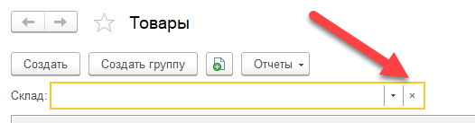

Справочник хранит информацию по товарам, материалам и услугам предприятия. Кроме этого, в справочник могут вноситься и ОС и НМА, если на предприятии используется система внутренних заказов и/или ввод в эксплуатацию не датой поступления актива.

# Форма списка

Форма списка содержит весь перечень товаров предприятия, по умолчанию, в иерархически сгруппированном виде. Для изменения представления списка, можно воспользоваться `Меню / Еще / Режим просмотра`.

!!!tip "Подсказка"
	При открытии формы, система по умолчанию отображает только имеющиеся в наличие товары. Для отображения полного списка, необходимо отключить фильтр по складу: 
	

# Флаг Продукция и таблица Подразделения

Флаг доступен при включенной опции `Использовать производственные операции` (см. `Меню / Настройки / Приложение / Опции`).

Включение флага означает, что данный элемент производится в нашей компании. Это может быть продукция, полуфабрикат или производственная услуга.

При активации флага, становится доступной для ввода таблица `Подразделения`. В таблицу `Подразделения` вводятся производственные подразделения, выпускающие данный актив. Эта информация используется в процессе заполнения заказа на производство (см. документ [Заказ на производство](/d/ProductionOrder)), в случае предварительного размещения требований.

# Единица

В поле задается базовая единица изменения товара. Если для товара будут создаваться упаковки, данная единица измерения будет считаться минимальной единицей количества товара в упаковке.

# Упаковка

Поле доступно при включенной опции `Использовать упаковки` (см. `Меню / Настройки / Приложение / Опции`)

В поле задается упаковка по умолчанию (наиболее часто-используемая) для данного товара. Для товара может быть создано неограниченное число упаковок. Значение данного поля будет автоматически подставляться в соответствующие поля при вводе документов.

При работе с упаковками, могут возникать два связанных вопроса: Использование упаковок и Учет в нескольких единицах измерения.

Использование упаковок – это вспомогательный механизм, при помощи которого в систему можно внести информацию об упаковках товаров, включая ввод операций по поступлению/выбытию с указанием упаковок и их автоматическому пересчету в базовые единицы. Однако, данная функция является помощником пересчета единиц/цен, и не влияет на складской учет с точки зрения дополнительной аналитики по упаковкам. В большинстве случаев, складской учетной единицей является базовая единица и такой дополнительный учет не требуется.

Учет в нескольких единицах измерения – это дополнительный механизм при использовании упаковок. Он позволяет вести складкой учет движений и остатков товаров в разрезе упаковок. В этом случае, система будет контролировать движения и отображать остатки в отчетах в разрезе упаковок. 

# Учитывать

Включение контроля остатков товаров на складах в разрезе упаковок. Если флаг выключен, контроль остатков ведется по общему количеству в базовых единицах измерения данного товара. Не рекомендуется включать данный флаг, если фактический складской учет не предполагает идентификацию остатков по видам упаковок.

# Характеристики

Использование характеристик в системе опционально. Для включения данной опции, необходимо перейти в `Меню / Настройки / Приложение / Опции / Использовать характеристики`.

# Серии

Использование серий в системе опционально. Для включения данной опции, необходимо перейти в `Меню / Настройки / Приложение / Опции / Использовать серии`.

# Штрих-коды

Использование штрих-кодов в системе опционально. Для включения данной опции, необходимо перейти в `Меню / Настройки / Приложение / Опции / Штрих-код`. Не рекомендуется включать флаги, если учет товаров на предприятии не предполагает аналитику в разрезе характеристик и/или серий, а так же ввиду отсутствия идентификации товара по штрих-коду.

# Единица измерения

Настройки по умолчанию задаются в `Меню / Настройки / Приложение / Товары / Единица`

# Точность

Настройки по умолчанию задаются в `Меню / Настройки / Приложение / Товары / Точность`.

# Социально значимый

Для учета социально значимого товара установите этот флаг.

# Таможенная группа

Значение будет использовано для автозаполнения таможенной декларации при операциях импорта.

# Расчет стоимости

Значение определяет метод расчета себестоимости товара. Возможно, установить свой метод учета для каждой номенклатуры в отдельности.