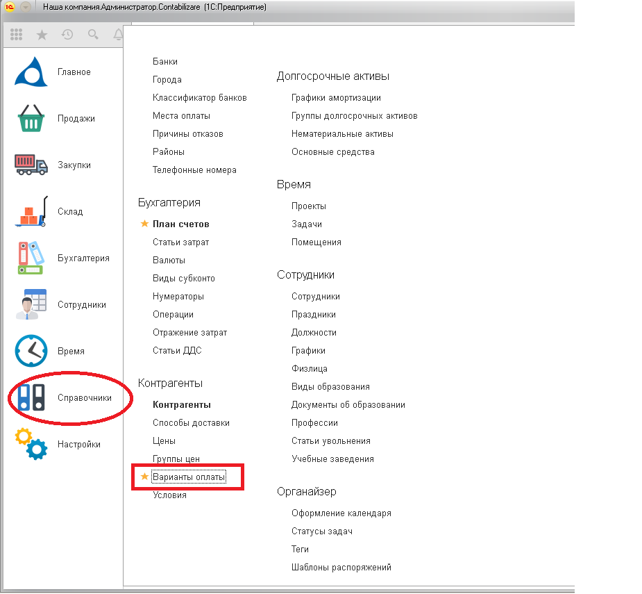

Справочник вариантов оплаты задолженности покупателей поставщикам. Применяется для детализации этапов оплаты в документах Заказ покупателя, Заказ поставщику и других.

Справочник используется для детализации вариантов оплаты, а также определяет расчет скидки за срочность платежа. Функциональность скидок за срочность платежа опционален, и может быть отключен, см. справочник [Организации](/c/Companies) / `Скидки за срочность платежа`.

Справочник несет на себе несколько функций:

- Определяет дату оплаты в документах по реализации или поступлении товаров. Количество дней оплаты задается в календарных днях в реквизите `В течение`. В случае включенного флага `До окончания срока действия договора`, дата оплаты будет рассчитываться не от даты документа, а от даты окончания действия договора, указанного в исходном документе.
- Участвует в формировании условий оплаты, см. справочник [Условия платежей](/c/Terms).
- Определят скидки за срочность платежа в документах оплатах.
- Может быть использован в качестве фильтра для отчетов [Дебиторы](/r/Debts) и [Кредиторы](/r/VendorDebts). Это может быть полезно для определения предстоящих потоков денежных средств в пользовательской аналитике.

Примеры вариантов оплаты:

- Касса, офис.
- Банк, 2% 10 дн.

