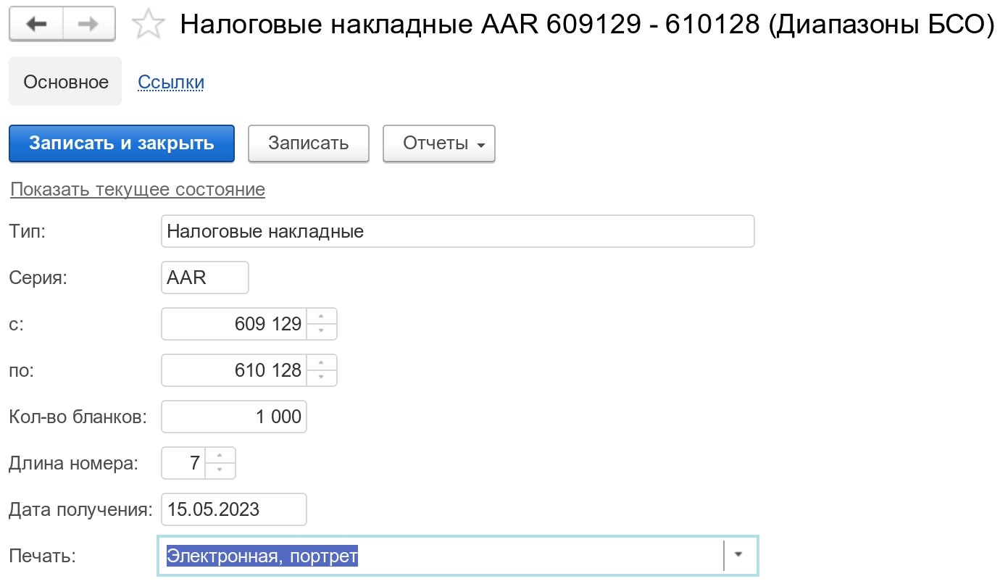

Справочник диапазонов бланков строгой отчетности. Содержит информацию о номерах и типах бланков строгой отчетности, используемых на предприятии. Служит для обеспечения и контроля учета использования каждого бланка.

Пример создания диапазона для налоговых накладных, нумерация которых начинается с `AAR0609129`:

!!!tip "Подсказка"
	Обратите внимание, что начало и конец диапазона задаются числами, без лидирующих нулей. Само же формирование номера, с учетом лидирующих нулей, выполняется системой автоматически при печати документов, принимая во внимание установленную длину номера, в реквизите `Длина номера`.

---

{!id/ranges.md!}