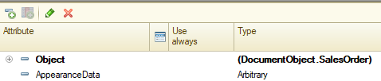

Предназначение
==============

Язык условного оформления (язык УО) предназначен для задания правил оформления
полей формы, за исключением полей таблиц и списков. Например, если видимость
реквизита формы зависит от состояния поля объекта, данную связь можно задать в
языке УО, не прибегая к написанию специальных для этого процедур модуля формы.

Инициализация
=============

Инициализация движка условного оформления производится в обработчике
`OnCreateAtServer` путем вызова локальной процедуры `readAppearance` примерно
следующего содержания:

```
&AtServer
Procedure OnCreateAtServer ( Cancel, StandardProcessing )

    readAppearance ();

    Appearance.Apply ( ThisObject );

EndProcedure

&AtServer
Procedure readAppearance ()

    rules = new Array ();
    rules.Add ( "
    |Links show ShowLinks;
    |Rate Factor enable filled ( LocalCurrency ) and filled ( ContractCurrency ) and
    |( Object.Currency <> LocalCurrency or Object.ContractCurrency <> LocalCurrency )
    |" );
    Appearance.Read ( ThisObject, rules );

EndProcedure
```

Также, в форме должен существовать реквизит `AppearanceData`, где язык УО будет
хранить служебные данные:



Язык
====

Язык состоит из следующих элементов:

`[<#><s|c|с|к>] <Идентификатор поля 1 | Идентификатор поля N> <show | hide | enable | disable | lock | unlock | press | release | mark | unmark | title/id | hint/id> <expression> [;]`

где:

| Элемент                | Описание                                                                                                                                                                                                                                                                     |
|------------------------|------------------------------------------------------------------------------------------------------------------------------------------------------------------------------------------------------------------------------------------------------------------------------|
| #                      | Признак начала директивы, определяющей контекст исполнения условного оформления                                                                                                                                                                                              |
| s \| c \| с \| к       | Контекст условного оформления, где: s или с (рус) - на сервере, c или к (рус) - на клиенте                                                                                                                                                                                   |
| Идентификатор поля     | Идентификатор поля на форме. Может быть указано более одного поля, в этом случае поля разделяются пробелом. В качестве поля формы может быть указана и сама форма, для этого в качестве идентификатора необходимо указать `ThisObject` или `ЭтотОбъект`                          |
| show, hide и т.д.      | Операторы оформления, если больше одного - разделяются дефисом. Описание операторов описано ниже.                                                                                                                                                                            |
| show \| показать       | Установка видимости.                                                                                                                                                                                                                                                         |
| hide \| скрыть         | Установка невидимости.                                                                                                                                                                                                                                                       |
| enable \| включить     | Установка доступности.                                                                                                                                                                                                                                                       |
| disable \| выключить   | Установка недоступности.                                                                                                                                                                                                                                                     |
| lock \| закрыть        | Установка только чтение                                                                                                                                                                                                                                                      |
| unlock \| открыть      | Сброс только чтение                                                                                                                                                                                                                                                          |
| press \| прижать       | Прижатое состояние кнопки                                                                                                                                                                                                                                                    |
| release \| отжать      | Отжатое состояние кнопки                                                                                                                                                                                                                                                     |
| mark \| отметить       | Выделить красным                                                                                                                                                                                                                                                             |
| unmark \| снятьотметку | Снять выделение красным                                                                                                                                                                                                                                                      |
| title \| назвать       | Задать заголовок (группы, декорации)                                                                                                                                                                                                                                         |
| hint \| подсказать     | Установить подсказку внутри поля ввода                                                                                                                                                                                                                                       |
| id                     | Полный путь к экспортной функции без параметров, в которой формируется строка с использованием `NStr ()`. Обычно, это функции модуля Output. Также, допускается использовать идентификатор реквизита формы или  объекта, например: `Form.ContractCurrency`, или `Form.Object.Memo` |
| expression             | Выражение на языке 1С, вычисление результата которого должно иметь булевый тип. Не рекомендуется использовать сложные вычисления и серверные функции. Желательно значения, используемые в языке выражений получать заблаговременно                                           |
| ;                      | Разделитель задаваемых правил. В одной стоке может быть задано сразу несколько правил оформления, разделенных ";"                                                                                                                                                            |

По умолчанию, без указания директивы, условное оформление может быть вызвано как
с клиента, так и с сервера, с сохранением контекста исполнения.

Для тех случаев, когда условное оформление может быть определено только на
сервере (или только на клиенте), указание директивы позволяет экранировать
правило оформления от неподходящего контекста.

Например, при таком правиле:

    #s ShowPanel hide Options.SimpleInterface ()

применить оформление (методами `Appearance.Apply ()`, `Appearance.Update()`) можно
только с сервера. Вызов `Appearance.Apply ()` с клиента, будет игнорировать
серверные правила. Тоже самое, но в обратном направлении, справедливо и для
директивы На клиенте.

!!!note "Примечание"
    Комментарии в языке выражений не поддерживаются

Вызов обновления
================

Автоматического обновления формы при изменении завязанных на условное оформление
реквизитов не происходит. Для этого нужно самостоятельно перехватывать
обработчики `xxxOnChange ()` и по окончании прикладной логики, вызывать метод
`Appearance.Apply ( ThisObject, "ChangedField" )`, либо `Appearance.Update ( ThisObject, "Control" )`, где:

| Элемент      | Описание                                                                  |
|--------------|---------------------------------------------------------------------------|
| ChangedField | Полный путь к реквизиту, который был изменен. Например: `"Object.Contract"` |
| Control      | Имя поля формы, например `"Contract"`                                       |

`Appearance.Apply ()` – производит вычисление и запуск всех правил условного оформления, выражения в которых зависят от переданного вторым параметром имени измененного поля. Например, если вызвать `Appearance.Apply ( ThisObject, "Object.Contract" )`, система выполнит все правила, в выражениях которых участвует `"Object.Contract"`.

`Appearance.Update ( ThisObject, "Control" )` – выполняет аналогичную функцию, с той разницей, что в качестве параметра передается имя элемента формы, который требуется обновить. Система вычислит все правила, где участвует данный элемент и применит их. На практике, использование данной функции часто применяется в случаях сложных выражений, задающих условия срабатывания правила. Например, если в условии правила используется вызов функции, сложное выражение или задается путь к полю некоторой коллекции формы, то система не сможет автоматически разобрать такое выражение для вычленения зависимых полей. Чтобы обновить такое правило, нужно будет применить `Appearance.Update ()` с прямым указанием идентификатора обновляемого элемента формы.

Например, в правилах ниже:

    rules = new Array ();
    rules.Add ( "
    |Links show ShowLinks;
    |Rate Factor enable
    |filled ( LocalCurrency ) and filled ( ContractCurrency ) and
    |( Object.Currency <> LocalCurrency or Object.ContractCurrency <> LocalCurrency )
    |" );

`Appearance.Apply ( ThisObject, "Object.ContractCurrency" )` выполнит оформление
полей `Rate` и `Factor`.

В свою очередь:

`Appearance.Update ( ThisObject, "Links" )` выполнит оформление элемента формы
`Links`.

Примеры правил
==============

Несколько примеров правил:

    Contract show-lock filled ( Contract ) and HasAccess;

    GroupUser title/Output.UserTitle inlist ( Object.UserClass, Enum.Users.Admin, Enum.Users.Sysadmin );

    Currency unlock Object.Currency <> Catalog.Currencies.Local;

    Password hint/Output.PasswordRules InvalidPassword;

    ThisObject lock DocumentPosted;

 
