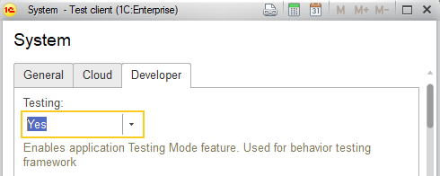

Отладка и тестирование фоновых заданий может быть затруднительна из-за проблем работы отладчика при пошаговой отладке кода фонового задания, а также неопределенного времени ожидания окончания фонового задания, в случае тестирования сценарным тестом (на разных компьютерах, скорость отработки фонового задания может быть разной, соответственно, приходится подбирать заведомо большие паузы).

Для решения этих проблем, можно использовать метод Application.Testing (), который возвращает значение константы Testing. Значение константы, устанавливается в форме системных настроек:

(данную константу следует включать в базах разработчиков и тестирования).

Для запуска фоновых заданий, в конфигурации есть метод Jobs.Run (), который можно использовать следующим образом:

    Jobs.Run ( "YourModule.YourProcedure", params, id, , Application.Testing () );

где последним параметром, можно передать булево значение, как именно запускать задание: непосредственно или в фоне. В случае тестирования, будет передаваться истина, и целевая процедура будет запускаться в том же потоке.

Таким образом, выполнение кода в фоне определяется только флагом, и не влияет на семантику самого вызова.