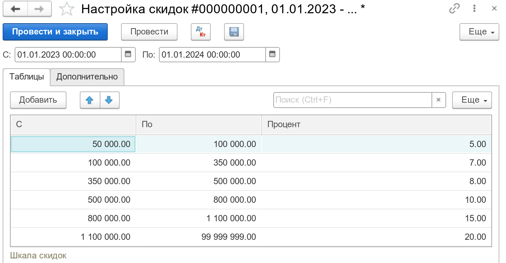

Документ предназначен для регистрации правил предоставления скидки за объём проданных товаров. Объёмом считается сумма продаж в национальной валюте включая НДС, за минусом возвратов от покупателя.

Работа скидок за объём организована следующим образом:

- В шапке документа задаётся период действия скидки. Обратите внимание, что имеет значение и время в этом периоде.
- Дата окончания периода действия скидки может быть не указана. В этом случае, период действия скидки не ограничен. Если по истечении времени, скидку всё-таки нужно будет ограничить, то достаточно будет открыть введенный ранее документ и задать в нём окончание периода действия.
- В таблице `Шкала скидок`, задаются интервалы сумм продаж и соответствующих им процентов скидок. Интервал задаётся `С` не включительно и `По` включительно. Пример шкалы: 
- В таблице с товарами, задаётся состав групп товаров, на которые распространяется скидка. Могут быть выбраны как группы товаров, так и конкретные элементы.

Документ можно вводить на разные группы товаров и на разные (включая пересекающиеся) периоды. Например, если для товаров группы Оргтехника введена скидка с периодом действия год, и внутри этого года введена другая скидка, на эту же группу товаров с периодом действия - месяц июль, то июль будет исключен из годовой скидки, так как продажи за этот месяц будут попадать под июльскую скидку. Как следствие, годовая скидка будет фактически рассчитана за 11 месяцев продаж.

# Выставление скидки 

Момент выставления скидки определяется организацией. Для принятия решений по выставлению скидок, в системе существует отчет [Скидки](/r/Discounts), при помощи которого, можно проанализировать за период, сколько скидки положено клиенту, сколько уже предоставлено, объём продаж и текущую задолженность.

В разработке подсистемы скидок закладывался сценарий, при котором скидка выставляется клиенту до оплаты задолженности. То есть, заказчик производит оплату долга за минусом скидки (эта информация может быть получена из отчета), а затем, ему выставляется скидка. Скидка может быть выставлена многократно.

В программе нет специальных средств по автоматической или массовой генерации документов по предоставлению скидки. Также, учет скидки не имеет каких-то специальных регистров, и не накапливается на каких-то служебных счетах.

Скидка может быть предоставлена одним из способов:

- [Расходная накладная](/d/Invoice) с минусом, где в качестве скидки, указывается услуга;
- [Корректировка долга](/d/AdjustDebts) с выпиской налоговой накладной.

Для регистрации выставления скидки, данные документы не требуют от пользователя указания каких-либо специальных признаков. Чтобы программа предоставила корректный отчет по скидкам, нужно лишь, чтобы выбираемая в документах услуга для скидки, так же была выбрана в настойках отчета по скидкам. Если вы планируете использовать несколько элементов-услуг для внутренней аналитики, поместите эти услуги в одну группу справочника товаров, а в отчёте по скидкам, укажите эту группу.

---

См. также:

- [Отчёт по скидкам](/r/Discounts)
- [Акт сверки](/r/Reconciliation)
- [Корректировка долга](/d/AdjustDebts)
- [Договора](/c/Contracts)
