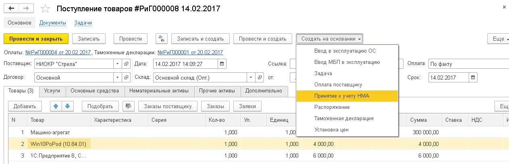

Для принятия к учёту нематериальных активов, используется документ “Поступления товаров” закладка ”Нематериальные активы” – `если НМА будет сразу введён в эксплуатацию и по нему не требуется никаких дополнительных расходов для начала его использования, если НМА незавершённый, тогда пользователь оприходует  его на закладке “Товары”  на счёт 111 или 217.1,  а затем вводит его в эксплуатацию документом “Принятие к учёту НМА”. Для этого в документе Поступление товаров пользователь нажимает на кнопку Создать на основании`:

После этого открывается  новый документ “Принятие к учёту НМА” , где пользователь указывает Подразделение и Материально-ответственное лицо.

В табличной части закладки “Основные Средства” нужно вручную выбрать товар и  НМА которым он станет после ввода в эксплуатацию. После проведения документа  образуются соответствующие проводки и регистры по введению в эксплуатацию. На основании документа  пользователь может сформировать  печатную форму AN-1.