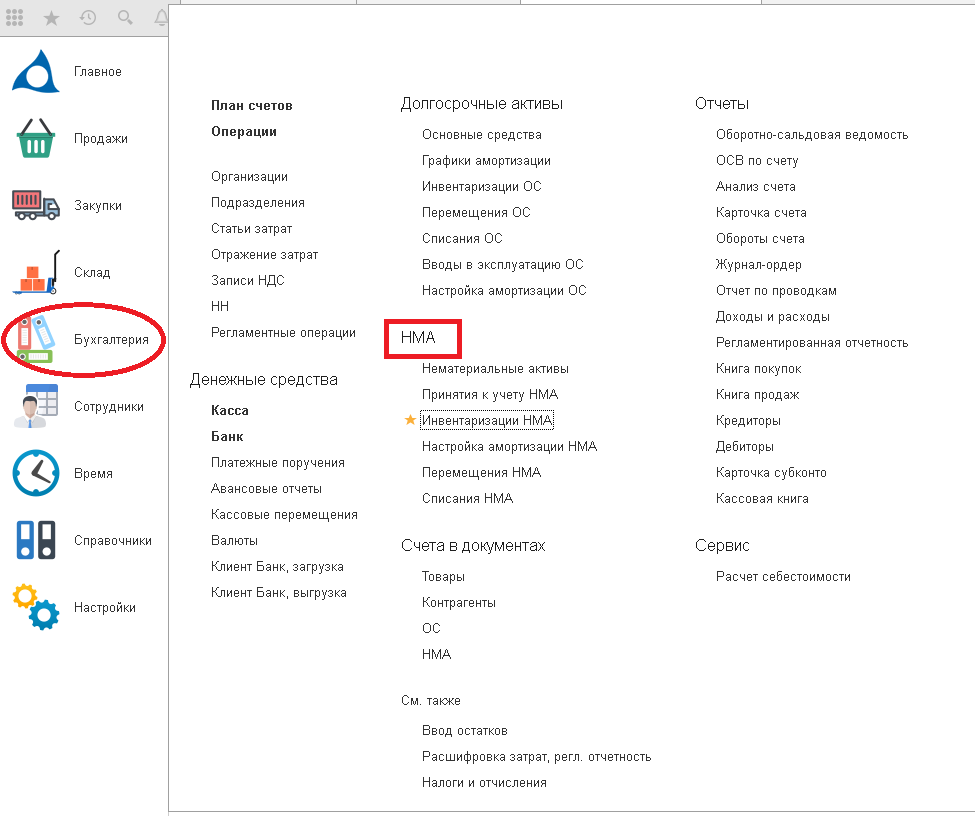
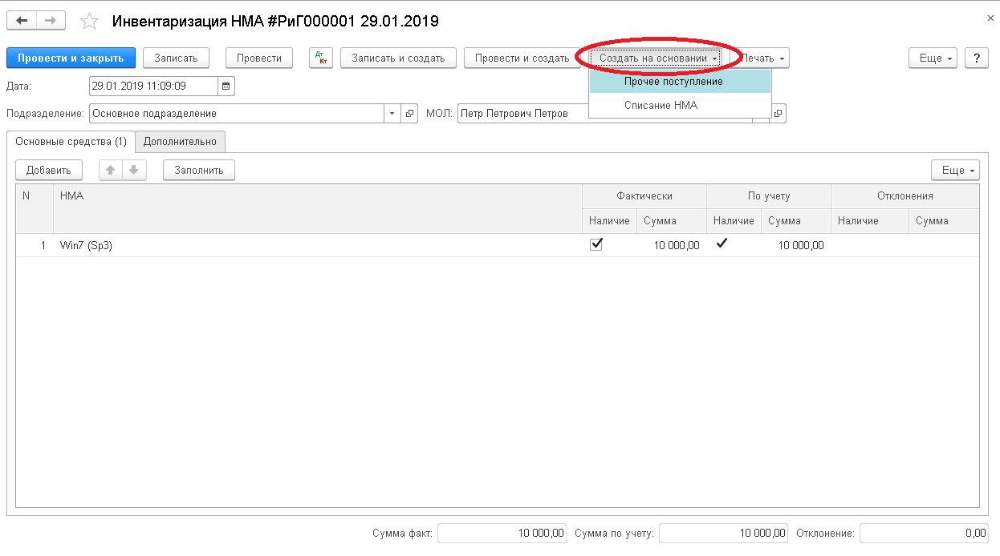

Документ вводится для отражения операций по инвентаризации нематериальных активов. Документ формирует печатную форму ИНВ-1.

По результатам инвентаризации, на основании данных документа, создаются операции по списанию НМА или прочим поступлениям.

Документ можно найти:

`Обратите внимание на заполнение полей в шапке документа:`

*   необходимо установить дату проведения. Остатки будут заполнены именно на эту дату;
*   остатки можно заполнить: `в целом по выбранному подразделению, без материально-ответственного лица(МОЛ), либо остатки по подразделению в разрезе по  МОЛ.`

 После автоматического заполнения  документа, в колонке  **Фактически- Наличие** проставляется или снимается флаг, в зависимости от этого  программа рассчитывает отклонение, после этого документ  записывается и проводится.

В зависимости от недостачи и излишков НМА формируются документы “Прочее поступление” и “Списание”, которые заполнятся автоматически данными из документа Инвентаризации, если их открыть следующим образом:

