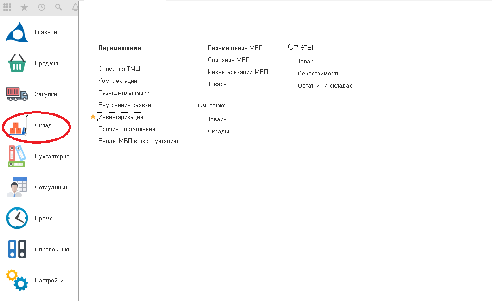
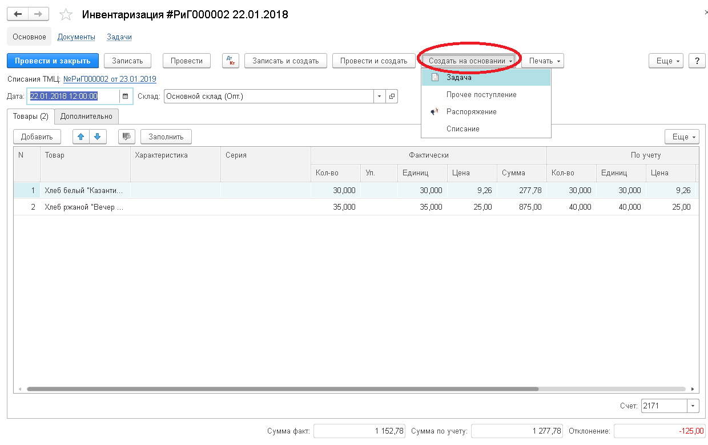

Документ вводится для отражения операций по инвентаризации товаров, т.е. определение фактического остатка на складах и отражение их в учёте. На основании документа формируется печатная форма Инвентаризационная опись.

При инвентаризации могут выявиться отклонения по количеству той или иной номенклатуры как в большую, так и в меньшую сторону. Привести фактические значения в соответствие с указанными в информационной базе позволит документ инвентаризации в [1С Бухгалтерия](https://scloud.ru/1c_programm/1c_buhgalteria.php), на основании которого впоследствии корректируются данные о количестве товаров.

 На основании данных документа, по результатам инвентаризации, создаются операции по списанию ТМЦ или прочим поступлениям.

**`Заполнение документа инвентаризации в 1С:Бухгалтерия:`**

Для данной операции в интерфейсе программы предусмотрен отдельный пункт в разделе «Склад»:

Обратите внимание на заполнение полей в шапке документа:

*   необходимо установить дату проведения. Остатки будут заполнены именно на эту дату;
*   остатки будут заполнятся только по выбранному складу.

Документ нужно заполнить, делается это автоматически при нажатии на  кнопку «Заполнить», которая и обновляет документ данными по остаткам на складах. После автоматического заполнения учётных и фактических данных  в документе, пользователь корректирует фактические данные, основываясь на проведённую инвентаризацию на складе.

`Программа сама рассчитывает отклонение`: красным цветом со знаком «-» указываются недостачи, черным цветом – излишки. После заполнения столбца документ записывается и проводится.

В зависимости от недостачи и излишков формируются документы “Прочее поступление” и “Списание”, которые заполнятся автоматически данными из документа Инвентаризации, если их открыть следующим образом:

