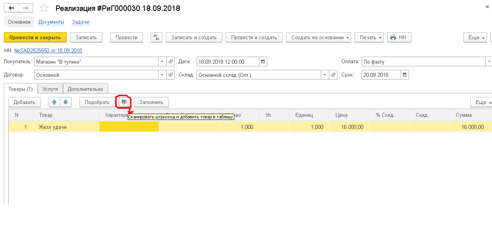

# **Описание**

Документ вводится для отражения операций по продаже товаров и услуг.

Документ может быть заполнен автоматически, в зависимости от способа его ввода в систему. Поддерживаются следующие сценарии:

1.  Ввод на основании документа [Заказ покупателя](/d/SalesOrder).
2.  Автоматическое заполнение при ручном вводе. При выборе покупателя, система автоматически определяет основной договор, и производит заполнение табличных частей документа остатками невыполненных заказов (при условии, что табличные части на этот момент еще не заполнены).
3.  Ручной режим заполнения документа, с использованием функции Подбор или Заполнить (команды расположена в командных панелях соответствующих вкладок Товары, Услуги).

# **Реквизиты**

**Покупатель**

Выбираем из справочника  «Контрагенты» соответствующего покупателя.

**Договор**

При выборе «Покупателя» значение заполнится автоматически, если договоров несколько, выбираем нужный.

**Склад**

Место откуда будет произведена  отгрузка товаров.

**Оплата**

При выборе «Договора» реквизит “Оплата” автоматически заполнится, а так же есть возможность изменить значение вручную.

**Срок**

В данном реквизите автоматически заполняется предполагаемая дата оплаты документа, пользователь при необходимости может изменить данный реквизит вручную.

### **Закладка «Товары» / «Услуги»**

При помощи функций  «Добавить» или «Подобрать» заполняем табличные части документа с соответствующей номенклатурой и/ или услугами. На закладке “Товары” можно осуществить подбор в таблицу документа, при помощи сканера штрих кода нажав на следующую иконку:

Так же табличную часть можно заполнить нажав кнопку Заполнить  на основании заказов покупателей.

### **Закладка Дополнительно**

_Поля валюта и счёт учёта покупателя_ заполняются автоматически после выбора договора.

Значение флага _Закрывать предоплату_ заполняется автоматически из договора с контрагентом.

Если флаг в документе выключен, сумма  будет сразу определена как дебиторская  задолженность, а зачет авансов, необходимо будет производить вручную, при помощи документа [Корректировка долга покупателя](/d/AdjustDebts).

Если флаг включен, алгоритм проведения будет производить анализ и закрытие предоплаты по договору, заказу и расчетному документу. Оставшуюся после закрытия аванса сумму, система будет проводить как задолженность покупателя. Счета для бухгалтерских проводок по задолженности и авансам, будут взяты из документа.

Хотим обратить Ваше внимание, что данный флаг никак не влияет на формирование бухгалтерских проводок, то есть зачет авансов производится в документе “Закрытие полученных авансов” в конце каждого месяца. Роль данного флага это детализация полученных авансов на более глубоком и детальном уровне по договору, заказу и расчетному документу.

_Номер отгрузки и  заказа_ заполняются  при наличии таковых пользователем.

После проведения  документа “Реализации” пользователь может :

*   распечатать счёт-фактуру (Печать-> Накладная).  Счет-фактура выставляется продавцом покупателю (заказчику) после окончательного приёма товара и/или услуг, выписанный счет-фактура подтверждает сумму НДС и даёт возможность принять его к вычету.
*   ввести Налоговую Накладную (в шапке документа). НН заполнится на основании данных из Реализации, пользователю нужно будет указать серию и номер НН, дату НН, дату поставки товара/ оказания услуг, также при необходимости серию и номер Путевого листа и Доверенности.

<u>На закладке Дополнительно в документе НН</u> пользователь указывает Параметры печати: тип формы НН, количество строк в приложении и на первой странице, флаг печатать на оборотной стороне (при необходимости).

### **Преимущества:**

В программе встроен механизм отправки документов из системы без дополнительных неудобств, что экономит время пользователя, уменьшает возможность совершения  ошибки и упрощает процесс ведения отношений с другими контрагентами.

Так пользователь может отправить счёт-фактуру и налоговую накладную сразу после проведения документов прямо из системы (После открытия печатных форм соответствующих документов, нажимаем  Ещё --> Выслать).

На основании документа Реализации пользователь может сразу перейти к документу оплата покупателя, что сэкономит время на поиске и вводе данных. (создать на основании→ оплата покупателя).Так же пользователь может сделать задачу, распоряжение на основании документа и заполнить исполнителя, комментарий, дату начала/завершения и при этом контролировать исполнение( создать на основании→ задача/распоряжение).

См. также:

*   [Варианты оплаты](/c/PaymentOptions)
*   [Почему в проводках я не вижу заказ покупателя или документ задолженности?](/faqaccounting#WhereAreDetails)
*   [Почему при выборе счетов для авансов полученных/выданных доступны кредиторские и дебиторские счета?](/faqaccounting#AdvanceAccounts)
*   [Почему я не вижу проводки по авансам контрагентов?](/faqaccounting#WhereIsAdvance)