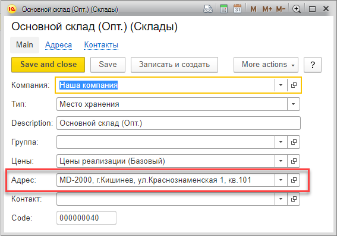
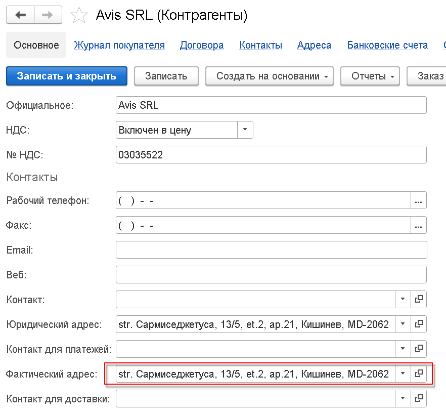
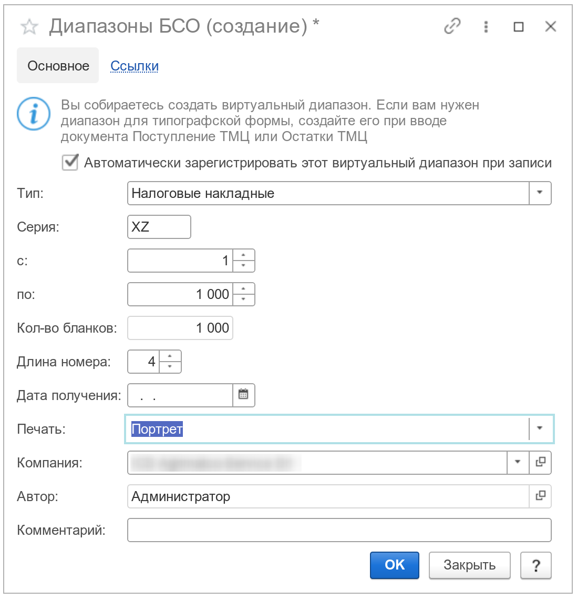

Документ вводится для подготовки формы налоговой накладной. Документ может быть введен непосредственно через журнал учета налоговых накладных (меню `Учет / ТТН, НН`), или на основании документов: Реализация, Перемещение, Возврат поставщику и ряда других. Обратите внимание, при использовании типографских бланков, система умеет вести контроль возвращенных налоговых накладных, подробнее см. [Контроль налоговых накладных](/cf/Settings#TaxInvoiceControl).

# Начальное заполнение полей

Налоговая накладная содержит в себе большой набор полей для заполнения, поэтому при вводе нового документа, система предоставляет сервис автоматической инициализации условно-постоянных значений реквизитов формы. В частности, выполняются такие вычисления:

1. Если НН вводится на основании, большая часть реквизитов будет получена из документа основания (Склад, Компания, номенклатурный состав и другие).
2. Если используются диапазоны номеров накладных, программа автоматически будет пытаться определить использованный в последний раз, данным пользователем, диапазон.
3. Такие поля как `Перевозчик`, `Диспетчер`, `Кладовщик`, копируются из последней налоговой накладной, введенной по данному складу. Таким образом, чтобы они заполнялись автоматически, необходимо наличие в базе как минимум одной введенной накладной по каждому используемому складу.
4. Поле `Банковский счет` устанавливается в значение `Банковский счет`, заданное в договоре с покупателем. При вводе на основании, в качестве договора используется договор из документа-основания. При непосредственном вводе, используется банковский счет, установленный для основного договора. В случе внутренних перемещений, используется банковский счет нашей компании, заданный по умолчанию, в справочнике [Компании](/c/Companies).
5. Поля `Пункт погрузки` и `Адрес` содержат информацию об отправителе и его адресе. Чтобы адрес заполнился автоматически, для значения в поле `Пункт погрузки`, должно быть установлено значение адреса. В частности, если пунктом погрузки является склад, адрес склада задается в его карточке:  
6. Поля `Пункт разгрузки` и `Адрес` содержат информацию о получателе и его адресе. По аналогии с пунктом погрузки, для автоматического заполнения адреса, нужно чтобы значение адреса было предварительно задано. В частности, если накладная выписывается на основании реализации, в карточке клиента нужно задать фактический адрес, как показано на картинке:  

!!!note "Примечание"
    Обратите внимание, что каждое из указанных выше полей, при необходимости, может быть изменено уже после того, как накладная была создана. Однако, доступность этих полей зависит от статуса документа (см. ниже раздел Статус документа). Учитывайте это, и меняйте статус в зависимости от ситуации.

# Формирование номера

Для автоматического формирования номера накладной, в документе должно быть задано значение поля `Диапазон`. По умолчанию, при вводе нового документа, данное поле заполняется значением диапазона из предыдущего документа, поэтому если значение не задано, достаточно будет его указать один раз на диапазон.

Если поле `Диапазон` заполнено, поля `Серия` и `Номер` можно оставить пустыми. В этом случае, система автоматически проинициализирует данные поля при записи документа. При этом будет соблюдена последовательная нумерация и контроль дубликатов. В некоторых случаях, например при вводе документа задним числом, вы можете указать серию и номер самостоятельно, система в любом случае проведет контроль дубликата и не позволит внести в систему два документа с одним номером.

Стоит обратить внимание, что поле `Диапазон` рекомендуемо, но не является обязательным к заполнению. Если диапазон не указан, программой будет предпринята попытка установить серию и номер документа, автоматически. В этом случае применяется следующий алгоритм: программа находит последний введенный в систему документ по складу, указанному в документе, и увеличивает номер на единицу. Полученный результат устанавливается в качестве нового номера документа. При необходимости, номер можно ввести вручную.

!!!warning "Внимание!"
    При интенсивной отгрузке и формировании большого числа налоговых накладных, рекомендуется использовать диапазоны, во-избежании проблемы дублирования номеров фактур.

При использовании e-Factura, данные по номерам документов могут быть загружены обработкой [Загрузка накладных](/r/LoadInvoices). Если этот сервис по каким-либо причинам не может быть использован, вы можете ввести данные о номере вручную, непосредственно в сам документ. Однако, следует учитывать, что для правильного формирования полного номера фактуры, должна быть корректно заполнена длина номера (без учета серии) в поле `Длина номера` справочника [Диапазоны](/c/Ranges).

Информация о документах без диапазона и/или пропусках в нумерации, может быть получена при помощи отчета `Проблемные БСО` (см. меню `Бухгалтерия / Отчеты / Проблемные БСО`).

# Статус документа

Каждая налоговая накладная в системе имеет статус, по которому пользователь может ориентироваться и при необходимости, устанавливать его вручную.

В таблице ниже определены статусы и их значение:

| Статус                | Значение                                                                                                                                                                                                                                                                                                                                                                                                                                    |
| --------------------- | ------------------------------------------------------------------------------------------------------------------------------------------------------------------------------------------------------------------------------------------------------------------------------------------------------------------------------------------------------------------------------------------------------------------------------------------- |
| Записано              | Значение устанавливается автоматически, при записи документа                                                                                                                                                                                                                                                                                                                                                                                |
| Напечатано            | Значение устанавливается автоматически, при печати документа. В этом (и ниже) статусах, становится недоступным для редактирования документ-основание. Для физических бланков, начиная со статуса `Напечатано`, в системе автоматически формируется бухгалтерская запись по списанию бланка (см. меню `Бухгалтерия / БСО / Автосписание бланков`). Если статус вернуть обратно в состояние `Записано`, бухгалтерская запись будет удалена. |
| Отправлено            | Значение устанавливается вручную.                                                                                                                                                                                                                                                                                                                                                                                                           |
| Возвращено            | Значение устанавливается вручную и отражает операцию получения от покупателя подписанной налоговой накладной. |
| Ожидание номера       | Значение устанавливается автоматически после выгрузки накладных в систему [eFactura](/p/UnloadInvoices)                                                                                                                                                                                                                                                                                                                                     |
| Выгружено в e-Factura | Значение устанавливается после загрузки номеров из [eFactura](/p/LoadInvoices).                                                                                                                                                                                                                                                                                                                                                             |
| Аннулировано          | Значение устанавливается вручную. Имеет смысл задавать только для физических бланков (электронный бланк может быть распечатан повторно).                                                                                                                                                                                                                                                                                                    |

При печати накладной, ее статус устанавливается в значение `Напечатано` и редактирование документа блокируется. В том случае, если по каким-то причинам необходимо изменить уже распечатанный документ, необходимо выполнить следующие действия:

1. Изменить статус налоговой накладной с `Напечатано` на `Записано`.
2. Записать и закрыть налоговую накладную.
3. Открыть требуемый документ Реализация, при этом он уже должен открыться с возможностью редактирования.
4. Внести изменения в реализацию, и провести ее. При проведении, программа автоматически обновит введенную на основании налоговую накладную.
5. Открыть и повторно распечатать налоговую накладную.

# Изменять выписанные накладные

По умолчанию, распечатанная или выгруженная в [eFactura](/p/LoadInvoices) накладная, блокирует изменение как самой накладной, так и документа-основания. Это полезная функциональность при отлаженной оперативной работе предприятия; пользователи будут защищены от случайной модификации уже обработанных документов. Однако, в процессе опытной эксплуатации программы или интенсивной работе по перепроведению документов задним числом, такая блокировка может стать неудобством. Решением этой проблемы является наделение пользователя специальным правом `Изменять выписанные накладные` (см. меню `Настройки / Пользователи / <Выбранный пользователь> / Доступ`). Пользователь с таким правом может производить модификацию документа-основания без необходимости смены статуса выписанной налоговой накладной. Также, это право отключает для пользователя [Кредитный контроль](/cf/Settings#CreditControl) и [Контроль договоров](/cf/Settings#ContractsControl).

!!!tip "Подсказка"
    Синхронизация изменений документа-основания и выписанной накладной происходит автоматически, по направлению: документ основание -> налоговая накладная (но не наоборот). То есть, если вы в реализации изменили количество товара, это изменение автоматически попадет в налоговую накладную при записи реализации. Изменение же количества товара в налоговой накладной, не повлечет за собой изменения количества в реализации.

# Печать

За печать налоговой накладной отвечает группа реквизитов, расположенная на вкладке `Дополнительно`.

|Тип формы|Описание|
|---------|--------|
|НН (ландшафт)|Налоговая накладная для печати на типографском бланке|
|Электронная НН (ландшафт)|Налоговая накладная для печати на чистом листе A4|

Тип формы заполняется автоматически при вводе документа, и определяется согласно используемого диапазона (который, напомним, заполняется значением диапазона из предыдущего документа). За значение типа формы налоговой накладной отвечает реквизит `Печать`, который задается в форме используемого в документе диапазона:

Пример. Допустим компании требуется печать налоговых накладных на чистых бланках А4 согласно полученного диапазона от государственной службы. Для этого, в программе необходимо:

1. [Зарегистрировать](/forms#RegisterRange) полученный диапазон. При создании нового диапазона, не забудьте выбрать в поле `Печать`, в форме `Диапазоны БСО`, значение `Электронная, портрет` (или ландшафт, по ситуации);
2. В форме налоговой накладной, в поле `Диапазон`, выбрать созданный ранее диапазон.
3. Произвести печать документа по нажатию на кнопку `Печать`.

При выполненных настройках, система должна сформировать готовый для вывода на принтер бланк.

!!!tip "Подсказка"
    Если для [компании](/c/Companies) задан логотип, тогда он будет выведен на титульном листе налоговой накладной (в приложениях, ни штрих-код ни логотип не выводятся)

---

{!id/ranges.md!}
- [Контроль налоговых накладных](/cf/Settings#TaxInvoiceControl).