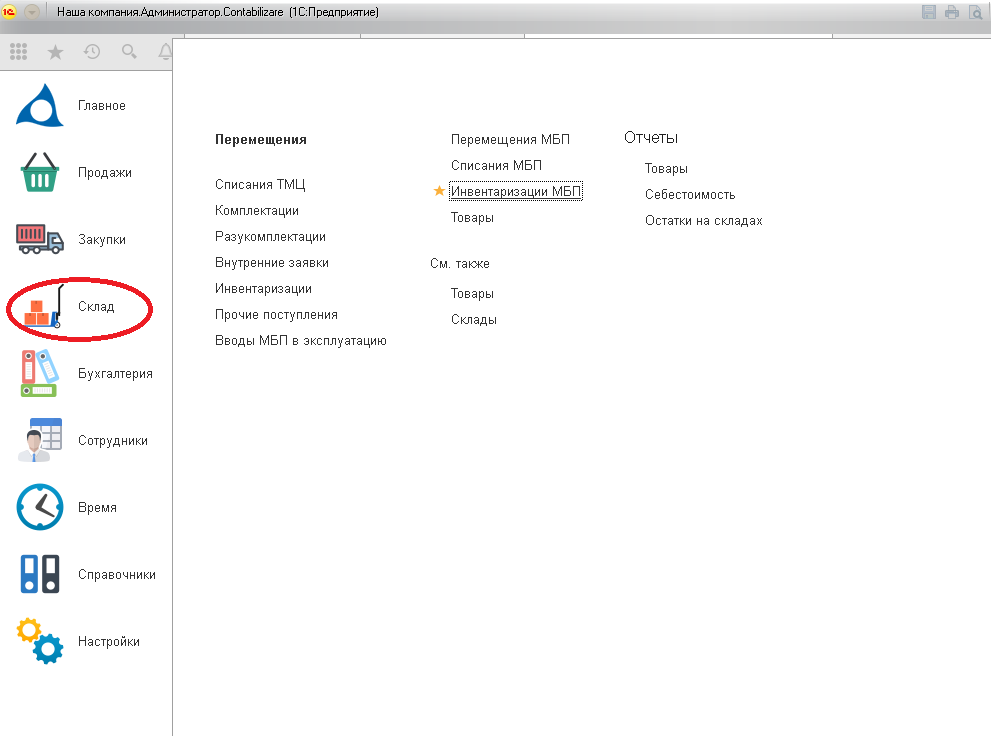

Документ вводится для отражения операций по инвентаризации МБП. Документ формирует печатную форму Инвентаризационная опись.

По результатам инвентаризации, на основании данных документа, создаются операции по списанию МБП или прочим поступлениям.

Документ можно найти:

`**Обратите внимание на заполнение полей в шапке документа:**`

*   необходимо установить дату проведения. Остатки будут заполнены именно на эту дату;
*   остатки будут заполняться в зависимости от указанного подразделения и счёта.

 После автоматического заполнения  документа,  пользователь может откорректировать колонку **Фактически- Наличие**, в зависимости от этого  программа рассчитает отклонение: **красным цветом** со знаком «-» указываются недостачи, **чёрным цветом** – излишки, после этого документ  записывается и проводится.

В зависимости от недостачи и излишков МБП формируются документы “Прочее поступление” и “Списание МБП”, которые заполнятся на основании документа Инвентаризации МБП.