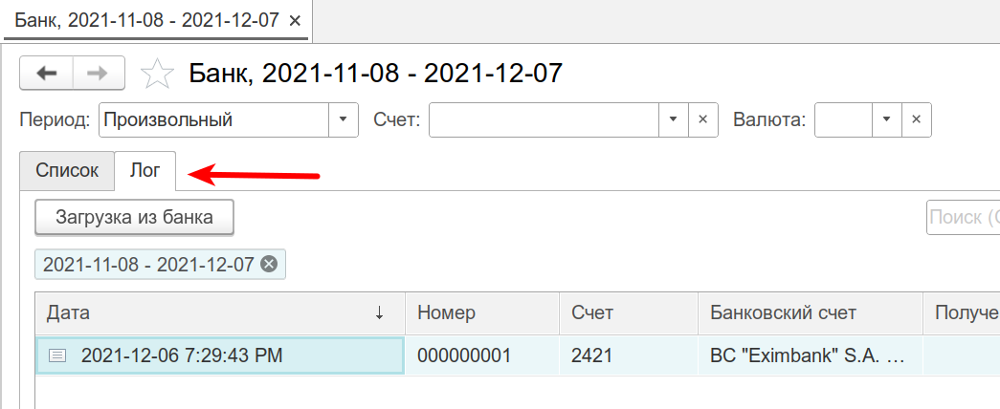
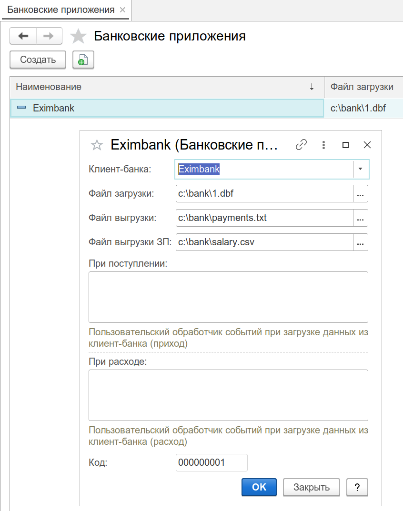
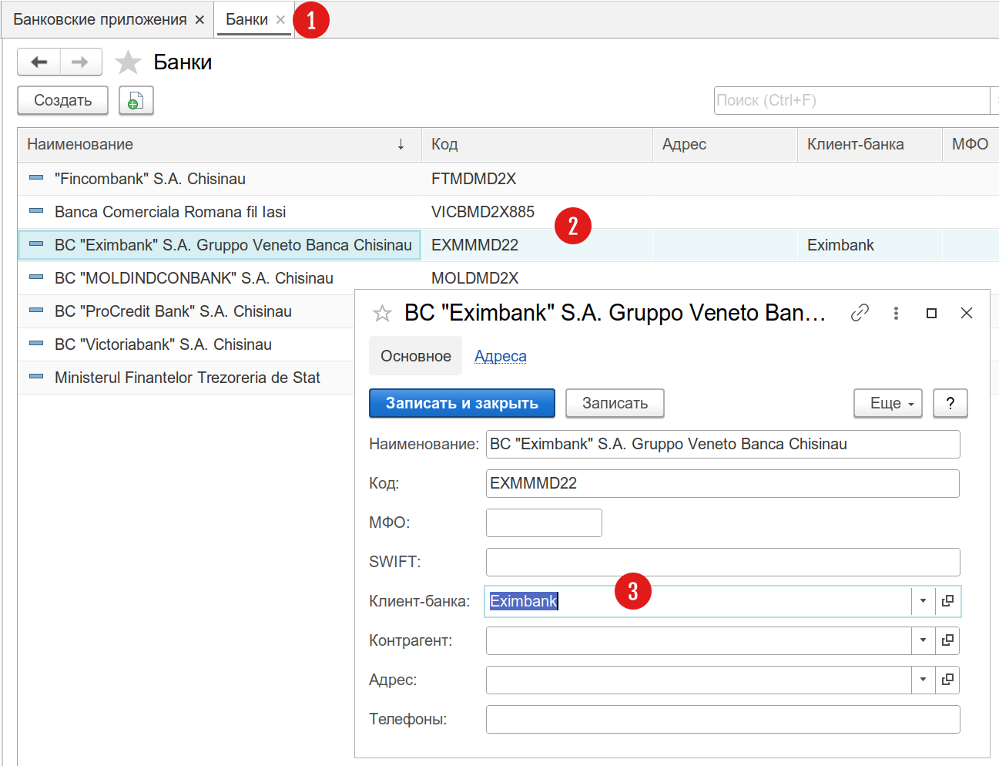
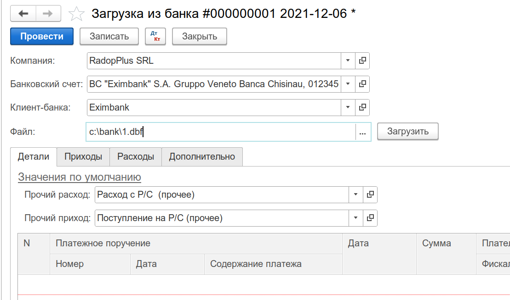
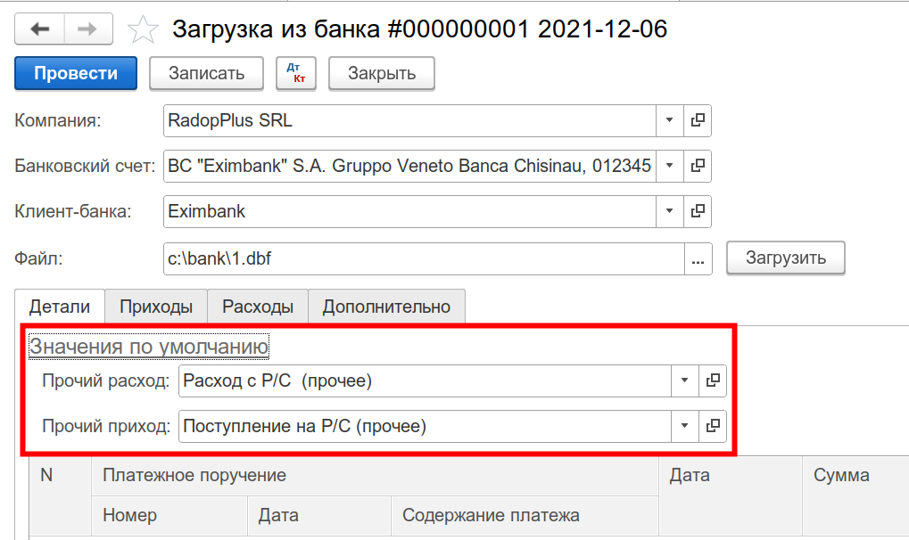
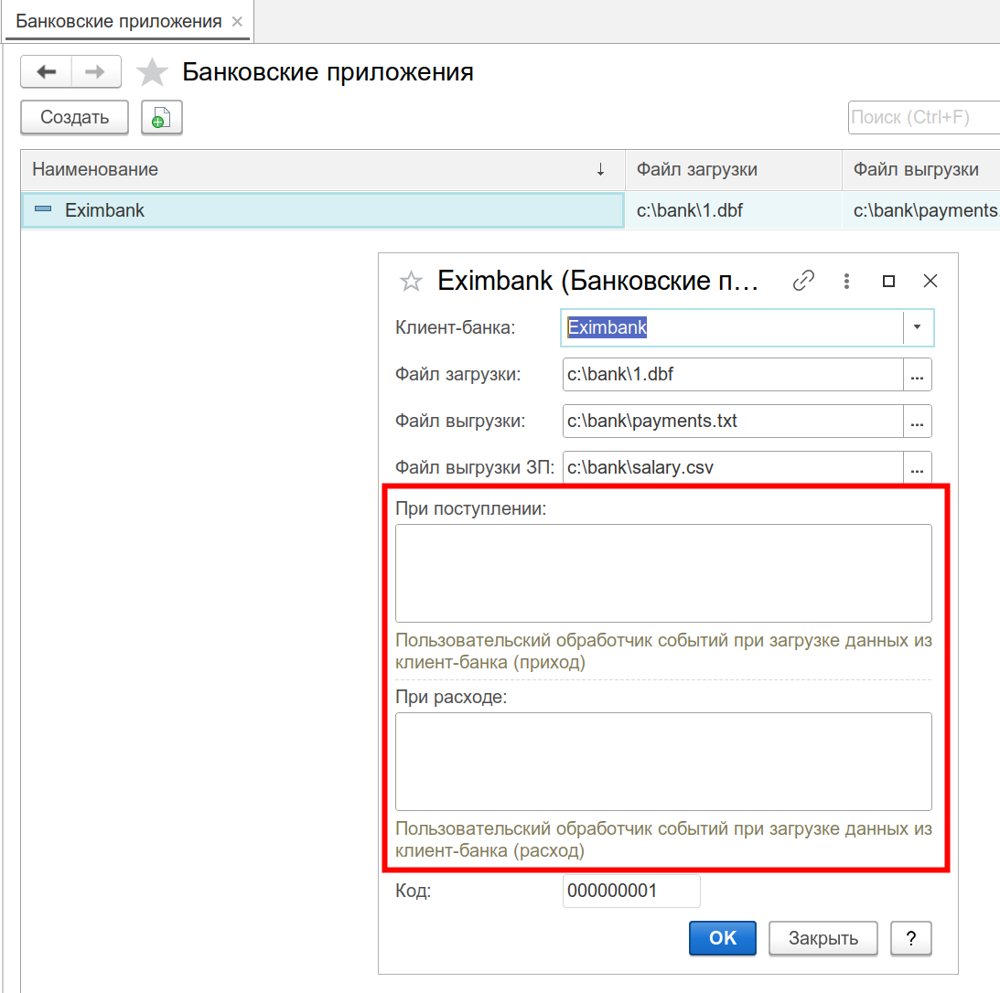
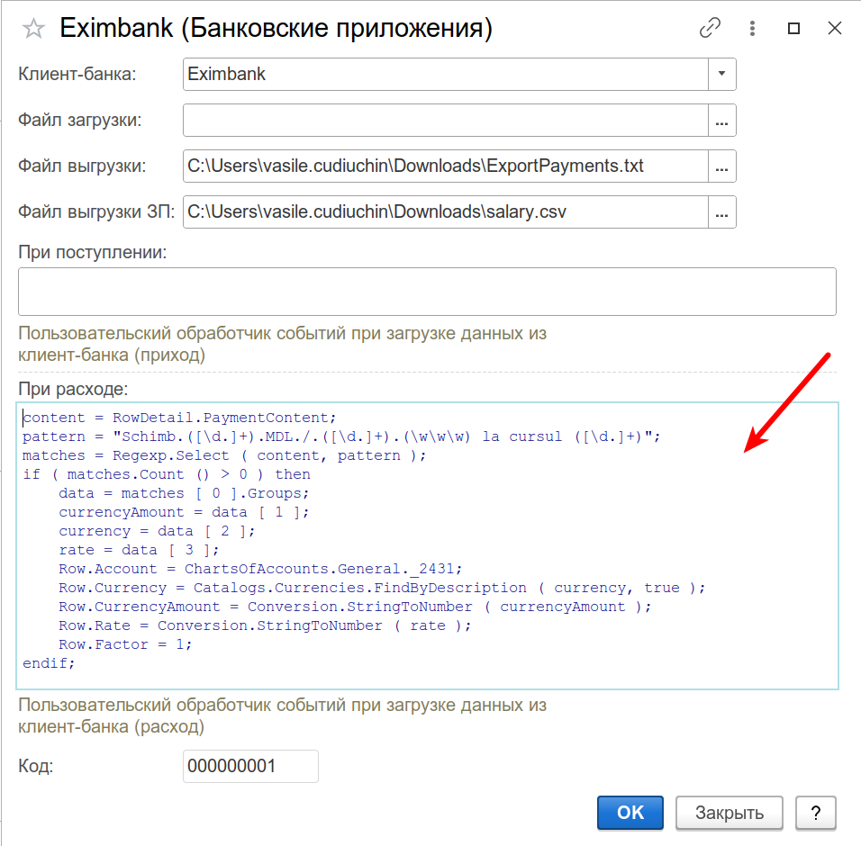

Документ для проведения операций загрузки данных из файлов системы Клиент-Банка. Документ не формирует проводки или движения по регистрам, вместо этого, он в автоматическом режиме создает и проводит соответствующие банковским операциям, документы, как если бы они были введены вручную. Документ не имеет в основном интерфейсе программы отдельного пункта меню и вызывается из командной панели журнала Банк (см. меню `Бухгалтерия / Денежные средства / Банк`). Список созданных в системе документов Загрузка из банка, хранится на отдельной вкладке `Лог`, в журнале Банк:

Работа с документом состоит из следующих этапов:

### Предварительные действия

В программе существует специальный справочник, в котором регистрируются используемые предприятием внешние программы для работы с банком. Справочник находится в меню `Настройки / Обмен / Банковские приложения`. В данном справочнике необходимо зарегистрировать используемый вами клиент банка, пример:

После этого, нужно связать зарегистрированное приложение с банком. Для этого необходимо открыть справочник банков и задать там поле `Клиент-банка`:

После сохранения данных, все расчетные счета, связанные с Eximbank будут привязаны к зарегистрированному банковскому приложению. Данные настройки являются настройками по умолчанию, и могут быть изменены на уровне непосредственно операции по загрузке данных.

### Загрузка данных из файла

На этом этапе необходимо выбрать и загрузить файл системы Клиент-банка. Алгоритм разбора файла с данными задается в поле `Клиент-банка`. Если вы предварительно зарегистрировали банковское приложение (см. выше), то данное поле и путь к файлу будут заполнены автоматически:

Для загрузки информации из файла, нажмите кнопку `Загрузить`. После этого, информация из файла будет проанализирована и загружена в документ для дальнейшего анализа и обработки.

### Алгоритм обработки данных 

На этом этапе, система производит анализ содержимого файла и формирует для каждой записи, бухгалтерскую операцию. При этом выполняется следующий анализ:

Для списаний:

1. Программа пытается найти введенное ранее в базу [платежное поручение](/d/PaymentOrder). Из платежного поручения, программа понимает, была ли эта стандартная оплата или оплата налога. Если это казначейская платежка, счет и аналитика налога будут заполнены автоматически из данных платежки.
2. Если платежка не казначейская, программа смотрит на сумму платежа из файла. Если сумма из файла меньше суммы платежки, программа относит такую строку на прочее списание (в большинстве случаев, это комиссия банка). Если сумма равна платежке, то в зависимости от типа контрагента (покупатель или поставщик, что задается соответствующими флагами в карточке контрагента), формируется операция оплаты поставщику или возврат денег покупателю.
3. Если платежка не найдена, программа анализирует содержание платежа. Если оно содержит слова "comision plata" или "deservirea", строка относится на прочие списания.
4. Если платежка не найдена, и это не услуги банка, по строке формируется оплата поставщику или возврат денег покупателю, в зависимости от параметров найденного контрагента.
5. Также, учитываются перемещения между расчетными счетами, покупка валют и другие операции.

Для поступлений:

1. Программа пытается найти плательщика по фискальному коду, согласно справочника Контрагенты. Если контрагент найден, формируется оплата от покупателя или возврат денег от поставщика, в зависимости от параметров найденного контрагента.
2. Во всех остальных случаях формируется прочее поступление.

При формировании записей по прочим операциям, существует возможность автоматической установки корреспондирующих с банком счетов. Для этого нужно на вкладке `Детали`, открыть группу `Значения по умолчанию` и задать там соответствующие операции:

При загрузке данных, для прочих списаний/поступлений, система установит корреспондирующий счет согласно счетам, указанным в выбранных операциях. Остальные счета (для контрагентов) определяются автоматически, согласно настроек счетов, см. меню `Бухгалтерия / Счета в документах / Контрагенты`.

В том случае, когда встроенный в программу алгоритм ошибается или не учитывает какие-то особенности платежа, существует возможность ручной корректировки загруженных данных, или разработки собственного алгоритма анализа данных. Подробнее о реализации собственного алгоритма, см. ниже в разделе [Собственный алгоритм загрузки](#CustomAlgorithm).

### Анализ и корректировка загруженных данных

Если загрузка файла прошла успешно, таблицы с данными будут заполнены и готовы для обработки. В таблице `Детали` программа отображает все операции, полученные из файла, эта таблица не доступна для изменения. В таблице `Приходы`, система выводит данные по поступлениям на расчетный счет, в таблице `Расходы` - выбытия, включая внутренние перемещения между счетами.

!!!tip "Подсказка"
	При двойном клике на строке таблицы `Детали`, программа автоматически активирует связанную со строкой операцию в таблице `Расходы` или `Приходы` соответственно.

Таблицы `Приходы` и `Расходы` доступны для изменения, до тех пор, пока документ не проведен. Ключевым параметром каждой строки таблицы, является колонка `Банковская операция`. Банковская операция определяет тип создаваемого документа в терминах Nullarity 5. При загрузке данных, банковская операция определяется автоматически, но может быть изменена пользователем при необходимости. В зависимости от вида банковской операции, система определяет доступность редактируемых колонок. Например, для операций `Прочий приход` или `Прочий расход` становится возможным указать операцию в колонке `Операция` (при этом, ряд других колонок будет заблокирован от изменения).

Задание банковской операции - это важный шаг в работе с документом. Следует придерживаться следующего подхода: всю дебиторскую и кредиторскую задолженность следует относить на операции `Оплата поставщику`, `Возврат покупателю`, `Оплата покупателя`, `Возврат от поставщика`. Все остальные операции определять в прочие.

!!!warning "Внимание!"
	Колонка `Банковская операция` становится недоступной после проведения документа. Это означает, что даже если вы отмените проведение документа `Загрузка из банка`, изменить банковскую операцию всё равно не получится, так как для неё уже будет храниться в системе сформированный документ. Чтобы провести повторную загрузку данных с заменой операций, необходимо ввести новый документ `Загрузка из банка`, предварительно пометив предыдущий, на удаление.

### Проведение документа

Процесс проведения документа включает в себя создание и проведение документов, согласно заполненных данных в таблицах `Приходы` и `Расходы`. При необходимости, документ может быть проведен повторно. В этом случае, у пользователя существует возможность отметить флажками строки в таблицах, которые требуется переформировать.

Сформированные после проведения документы, отображаются в таблицах в виде гиперссылок, в колонке `Документ`. Это сделано для того, чтобы в случае необходимости у пользователя была возможность проанализировать / отредактировать каждую сформированную в автоматическом режиме, операцию. Например, таким образом может быть заполнена дополнительная аналитика по каким-то прочим операциям, или выбран конкретный заказ / накладная в документе оплаты покупателя.

!!!warning "Внимание!"
	Любые действия с документом `Загрузка из банка` будут согласованы с документами, которые в нем содержатся. Например, если вы пометите документ на удаление, также будут помечены на удаление все входящие в таблицы с данными, документы. Тоже самое будет происходить и при проведении / отмене проведения документа.

### Собственный алгоритм загрузки

!!!note "Примечание"
	Информация ниже предназначена для специалистов внедрения или пользователей с навыками конфигурирования решений на базе платформы 1С:Предприятие 8. 

В общем случае, информации от банка не всегда достаточно для однозначного определения операции с бухгалтерской точки зрения. В свою очередь, это может приводить к неверному определению операции встроенным в программу алгоритмом для конкретно вашего предприятия. Решением этой проблемы, является возможность реализации собственного алгоритма обработки каждой строки банковского платежа. Алгоритм обработки описывается на встроенном языке 1С и задается в полях `При поступлении` и `При расходе`, в справочнике Банковские приложения:

Описанные алгоритмы выполняются для каждой строки таблицы `Детали` (которая фактически является отображением загружаемого файла). Выполнение происходит после отработки стандартной логики программы. Доступны следующие переменные:

- **RowDetail**. Строка табличной части `Детали`. Состав полей коллекции смотрите в конфигураторе: `Документы / LoadPayments / Таблицы / Details`.
- **Row**. Строка таблицы расхода или прихода. Состав полей коллекций смотрите в конфигураторе: `Документы / LoadPayments / Таблицы / Expenses(Receipts)`.
- **findContent ( RowDetail, Strings )**. Вспомогательная функция, возвращающая истину в случае нахождения **Strings** в содержании платежа. Параметр **Strings** - это строка, разделенная запятыми. Регистр строк значения не имеет.

В примере ниже, анализируется содержание платежа с использованием регулярного выражения. Если текст платежа удовлетворяет поисковому запросу, код обработчика получает из строки нужные для формирования бухгалтерской операции, данные:

	content = RowDetail.PaymentContent;
	pattern = "Schimb.([\d.]+).MDL./.([\d.]+).(\w\w\w) la cursul ([\d.]+)";
	matches = Regexp.Select ( content, pattern );
	if ( matches.Count () > 0 ) then
		data = matches [ 0 ].Groups;
		currencyAmount = data [ 1 ];
		currency = data [ 2 ];
		rate = data [ 3 ];
		Row.Account = ChartsOfAccounts.General._2431;
		Row.Currency = Catalogs.Currencies.FindByDescription ( currency, true );
		Row.CurrencyAmount = Conversion.StringToNumber ( currencyAmount );
		Row.Rate = Conversion.StringToNumber ( rate );
		Row.Factor = 1;

	endif;

Таким образом, при загрузке данных, строка с примерно таким содержимым:

	 Schimb 12120 MDL / 600 EUR la cursul 20.2 cu data valutei 19-11-2021, curs BN 20.022 scop: Cumparare valutei pentru cheltuieli deplasare

будет обработана с вычленением нужных данных (валюта, сумма в валюте и курс) для формирования бухгалтерской записи.

!!!tip "Совет"
	При отладке обработчиков, рекомендуется в настройках приложения, временно включить режим `Тестирование`, см. меню `Настройки / Система / Разработка / Тестирование`. В этом режиме, выполнение загрузки не будет выполняться в фоновом режиме, что упростит анализ ошибочных ситуаций. Также, рекомендуется предварительно запустить программу из конфигуратора в режиме отладки, для получения сообщений об ошибках непосредственно в диалоге об ошибке.