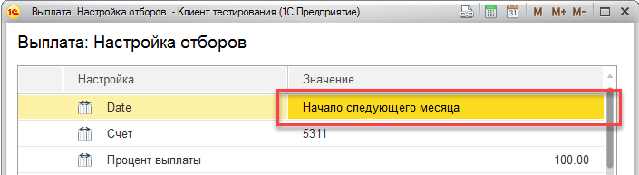

Направление на выплату заработной платы.

# Выплата в месяце начисления

При выплате ЗП в месяце начисления ЗП, нужно обращать внимание на дату документа Начисление ЗП. Дело в том, что система, по умолчанию, устанавливает дату документа начисления концом месяца. В этом случае, выплата может не “увидеть” произведенное в текущем месяце начисление.

Для решения этой проблемы, необходимо при заполнении документа Выплата ЗП, установить дату заполнения на начало следующего месяца, как показано на картинке:

---

См. также:

- [Частые вопросы по зарплате](/faqsalary).
- [Зарплата](/salary)