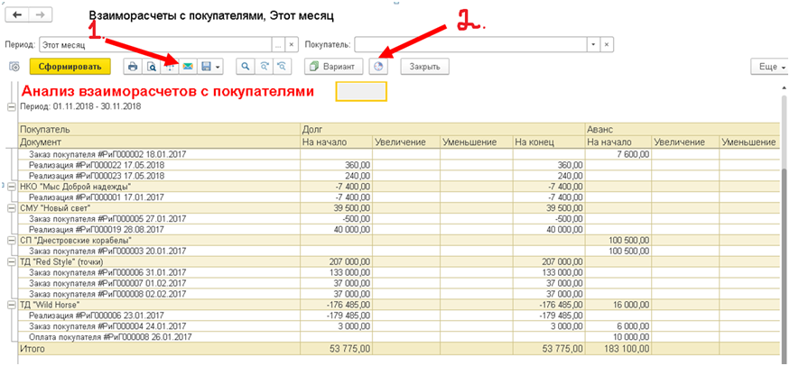

Документ вводится для отражения поступления денежных средств по оплатам покупателей. Он фиксирует сумму оплаты, способ, счет и место получения, информацию о платежных документах. Автоматически распределяет сумму платежа, по уже существующим заказам покупателя. Документ может быть создан как отдельно, так и на основании из документа Реализации, где автоматически заполнится текущими данными.

При выборе покупателя в документе, в табличной части заполнятся все его задолженности  (документы Реализации и Заказы покупателей).

Если покупатель погашает свою задолженность частично, не равными суммами, есть возможность указать полученную  сумму в шапке документа в поле Оплата и нажать кнопку Заполнить, система распределит сумму по всем задолженностям, изначально закрывая более раннюю,переходя к последующей.

**`Стоит обратить внимание на множество  способов оплаты  для покупателя`**, так как его  интересует широта охвата системы, или говоря другими словами, сможет ли выбранный поставщик принять чек, электронный перевод или оплату через PayPal и др. Безналичная оплата – это один из наиболее удобных вариантов ведения расчетов по  причине высокой  скорости  осуществления платежей и практически полном отсутствии нормативных ограничений в осуществлении платежей и чем больше форм безналичных расчётов  на предприятии, тем удобнее и проще работать с покупателями и с поставщиками.

Если в документе Оплата покупателя способ оплаты: Наличные, то после проведения документа  в системе сформируется Приходный кассовый ордер. Если способ оплаты:  Безналичные, после проведения документа сформируется банковская операция (приход).

Данные документа отражаются в таких отчётах как: Дебиторы, Взаиморасчёты с покупателями и Продажи.

**_Отчёт «Продажи_**» позволяет анализировать результаты продаж товаров, оказания услуг клиентам компании. В отчете суммы продаж можно сравнить с себестоимостью продаваемой номенклатуры, а так же узнать сумму и % прибыли без дополнительных расчётов.

_**Отчеты «Дебиторы» и «Взаиморасчеты с покупателями»**_ позволяют увидеть подробное состояние взаиморасчётов с покупателями, задолженность, полученные авансы, остаток долга контрагента, а также распределение долгов по интервалам. Таким образом, пользователь может узнать не только сумму долга, но и понять, как давно она возникла. Интервалы, на которые разбиваются долги, пользователь определяет сам в Настройках отчёта.

 Отчет «Дебиторы» формируется  по документам Реализация товаров и Оплата покупателей,  отчёт  «Взаиморасчеты с покупателями» по тем же документам +Заказ покупателя.

**Достоинства данных отчётов** заключаются в их простоте, расшифровке до документа, в возможности быстро и понятно предоставить информацию руководству компании.

**Отчёты можно отправить по электронной почте** сразу же после их сформирования в системе, нажав на следующую кнопку **(1)**либо есть возможность сделать автоматическую рассылку **(2)**, то есть отчёты  будут формироваться  и отправляться автоматически, после указания даты начала рассылки, периодичности рассылки и  электронного адреса отправителя и получателя:

