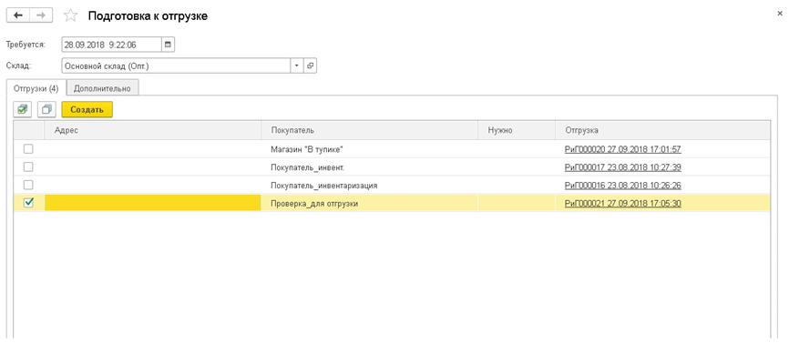
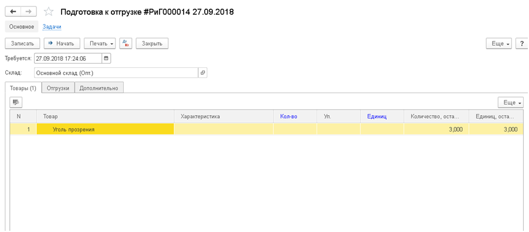
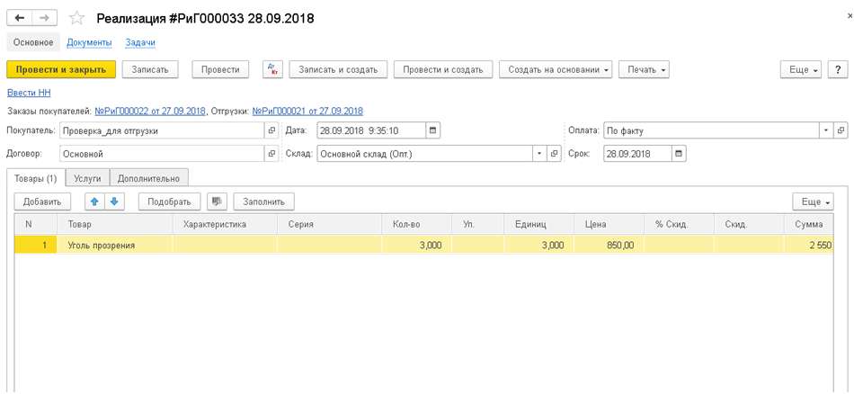

Документ вводится для отражения операций по подготовке товаров к отгрузке.

## Опция «Логистический департамент. Погрузчики»

Подготовка к отгрузке - является подпроцессом. Документ объединяет на уровне склада, все заказы в единый «Наряд на комплектацию». После завершения, программа автоматически закрывает отгрузку и создает реализацию. Если товар был загружен не весь, система создает еще одну отгрузку на оставшееся количество, которое потом опять может быть запущено по процессу «подготовка к отгрузке».

### Сценарий использования

Компания располагает:

*   складом
*   рабочими с тележками
*   погрузчиками
*   менеджером склада (кладовщиком), который обеспечивает отправку машин с грузом.

Менеджер склада входит в журнал «Подготовки к отгрузкам» и создает «наряды» для погрузчиков. На этом этапе, он только создает документы, но не начинает процесс комплектации. В системе может быть несколько отгрузок, но «наряд на комплектацию» создается один.

Наряды распечатываются (можно через мобильный телефон), попадают погрузчикам, которые ездят по территории, подбирают товар. Далее открывают в программе документ «Подготовка к отгрузке», начинают процесс комплектации, вводят данные, отмечая выбранные товары, и завершают процесс. Когда товар загружен в машину, экспедитору передают документы, и он осуществляет доставку, выгружая столько товаров, сколько указано в накладной для данного заказчика.

Бизнес-процесс 1С – это цепочки хозяйственных операций, связанные логически. Каждую отдельную операцию из этой цепочки могут выполнять разные сотрудники, а контролировать – ещё другие.

Документ Подготовка к отгрузке одна из составляющих бизнес-процесса 1С- оформление покупателем заказа с последующей оплатой и отгрузкой.

Документ Подготовка к отгрузке создаётся из раннее утверждённого руководителем подразделения Заказа покупателя (где в документе Заказ покупателя текущее состояние процесса утверждения: Отгрузка).

После нажатия кнопки создать в Журнале документов Подготовка к отгрузке открывается следующая форма:

  

# **Реквизиты**

### **Требуется**

Дата, на которую груз уже должен быть готов к погрузке.

### **Склад**

Склад, на котором выполняется подготовка груза.

В табличной части Закладки Отгрузки, показаны документы отгрузки основанные на заказах покупателя, пользователь проставляет флаг на документах, которые содержат нужную номенклатуру для текущей отгрузки и нажимает кнопку Создать.После этого появится  новый документ Подготовка к отгрузке с статусом: Новая, что послужит   нарядом  для погрузчиков.

Чтобы начать процесс комплектации в образовавшемся документе Подготовка к отгрузке нажимаем кнопку Начать:

**Закладка Товары**

Здесь пользователь отмечает  флагом  выбранные товары, а так же указывает количество товаров, которое было загружено, система автоматически показывает какое количество осталось загрузить. Так как товар может быть загружен не весь, система создаст еще одну отгрузку на оставшееся количество, которое потом опять может быть запущено по процессу «подготовка к отгрузке».

**Закладка Отгрузки**

Здесь уже указаны все документы отгрузки для наряда, а Поля Количество и Единиц заполняются автоматически после указания их в закладке Товары.

**Закладка Дополнительно**

На этой закладке пользователь может указать дату и номер документа Подготовка к отгрузке.

По окончанию погрузки товаров  нажимается кнопка Завершить (что означает  завершить процесс комплектации заказа). Системой автоматически сделан документ Реализации на основании данных из документа Подготовка к отгрузке:

### Преимущества бизнес-процесса:

*   Исключён пропуск какого-либо этапа, что не позволяет нарушать установленный порядок работы и существенно уменьшает вероятность возникновения ошибок.
*   Постоянный, оперативный контроль, что и на каком этапе находится, а также оценка общего состояния выполняемого сегмента работы.
*   Выявление неэффективных решений с последующей оптимизацией бизнес-процессов в 1С.

См. также справку по  <u>Реализации.</u>