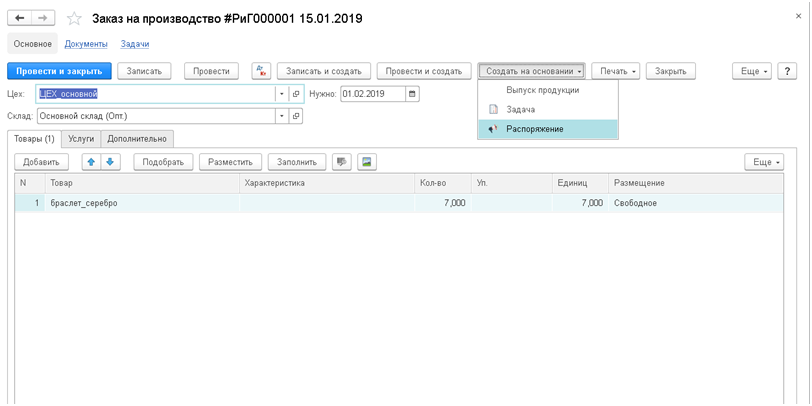

**Заказ на производство** — это заказ производственному подразделению на изготовление продукции, полуфабрикатов, оказание услуг (внутренних либо контрагенту). Для регистрирования заказа на производство используется документ «Заказ на производство».

Документ доступен при включенной опции  Использовать производственные операции (см. меню `Настройки / Приложение / Опции`).  

`Алгоритм заказов на производство предназначен для формирования следующих операций:`

*   планирование изготовления готовой продукции, полуфабрикатов, оказания услуг и контроль выполнения планов;
*   планирование потребностей  в материалах и полуфабрикатах требуемых для исполнения заказа на производство;
*   резервирование материалов и полуфабрикатов на складах под заказ на производство;
*   учет затрат и расчет себестоимости в разрезе заказов на производство.

Под исполнением заказа на производство имеется ввиду, что  выпущена вся продукция, полуфабрикаты, оказаны услуги, заданные в заказе.

**Реквизиты:**

**Цех**: указывается цех, где производится продукция;

**Склад**: место, на котором будет произведено получение заказа;

**Нужно:** ожидаемая дата получения товара и\или оказания услуг.

В табличной части закладок «Товары» и «Услуги» указывается соответствующая номенклатура.

Обратите внимание на имеющиеся функции  которые заполняют  табличную часть:

**Разместить:** размещение товаров на складе;

**Заполнить:** размещение заказов покупателей и внутренних заявок внутри данного заказа на производство.

У пользователя есть возможность сделать «Распоряжение» на основании заказа на производство, где он укажет исполнителя, краткое описание работы, дату начала и дату конца:

После сохранения распоряжения в календаре исполнителя появится задача или распоряжение для выполнения.

`Для быстрого поиска информации по  заказам на производство  можно использовать отчёт “Заказы на производство” с определёнными фильтрами.`