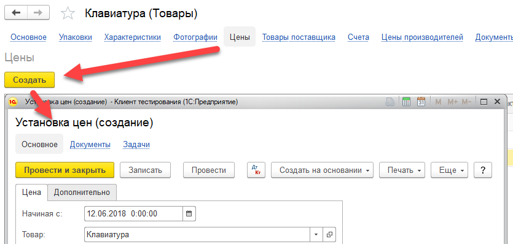

Документ устанавливает сведения по ценам организации.

При установке цен, важно обращать внимание на дату документа, начиная с неё указанные цены будут автоматически применяться при вводе документов.

Также, действие цен может быть ограничено по периоду, ограничение задается в поле `По, `с точностью до времени дня.

Состав полей документа зависит от настроек типов цен, используемых на предприятии (см. [Цены](/c/Prices)).

Если в системе ведется учет по характеристикам, следует учитывать, что приоритет цены, заданной для характеристики, выше цены, заданной за упаковку.

# Ввод на основании

Данный документ имеет две формы для ввода: Основная и Простая.

Основная форма ввода используется при установке цен сразу для нескольких элементов номенклатуры, типов цен и других параметров.

Основная форма является формой по умолчанию и используется при работе с документом через журнал, или при вводе на основании документа [Поступление товаров](/d/VendorInvoice).

Простая форма используется только при вводе на основании товара, для быстрой регистрации цены при вводе товара в систему:

Простую форму рекомендуется использовать организациям, с простой схемой ведения учета цен.

# Цены по договору

Кроме установки цен данным документом, существует возможность определения цен в карточке договора с контрагентом.

Цены, заданные в договоре, имеют высший приоритет над ценами, устанавливаемыми по системе в целом. Это означает, при определении цены позиции в исходном документе (например, в документе [Расходная накладная](/d/Invoice)), система вначале проанализирует договор с покупателем, и если цена в договоре не будет задана, система установит цену согласно установленной данным документом. Подробнее см. справочник [Договоры](/c/Contracts).