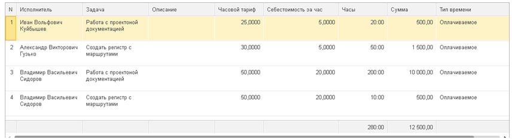

Учёт рабочего времени – необходимость каждой современной компании. Составление отчётов о проделанной работе не только указывает на качественный [тайм-менеджмент](https://biz30.timedoctor.com/ru/), но и определяется законодательством.

Во времена, когда табель учёта рабочего времени – устарел, не так просто определиться с качественной программой, способной заменить табель. В табеле отражается общий объём рабочего времени в разрезе сотрудника, проекта и  времени, основой для заполнения табеля  в программе  является документ Запись времени.

 Информацию о табеле можно получить в разделе [Табель](/d/Timesheet)

Документ “Запись времени”  – предназначен для детальной регистрации рабочего времени сотрудника организации, и служит его фотографий рабочего дня.

В документе есть функция `Таймер`, с которой можно замерять отработанное время с точностью до минуты. Окно таймера находится в нижней части документа:

  – запуск таймера для начала записи времени.

 – остановка таймера и добавление записанного отрезка времени.

 – отмена таймера записи времени.

**`Важной функцией этого документа`** является его интеграция с календарем. Запись времени можно делать будущим числом. Это позволяет не только фиксировать фактическое время, но и планировать его. Пользователь может сделать Запись времени как себе, так и любому другому сотруднику.

**Особое внимание нужно обратить таким реквизитам шапки документа  как:  Проект и Цвет.**

**Проект **-  представляет собой цель, которая будет достигнута посредством выполненных задач, т.е.  действий, которые  нам необходимо предпринять для достижения этой цели. Пример  Проекта:

**Наша цель**:  <u>разработка СНИПА  по монтажу электросетей</u> (наименование проекта), а чуть ниже представлены исполнители и  задачи после выполнения которых цель будет достигнута и проект завершён.

Следовательно когда пользователь будет вносить Запись времени,  в табличной части документа он будет выбирать задачу, предназначенную для него (которая указана в проекте).

**Цвет:** необходим для оформления календаря, определённый цвет может означать, что задача ещё не выполнена находится в плане, либо задача фактически выполнена и обозначена другим цветом. После обозначения некоторых цветов, Календарь (начальная страница) в котором отражаются все записи времени по всем сотрудникам становится нагляднее и выразительнее. Информацию о Календаре можно получить ссылку добавить!!

После завершения проекта у пользователя есть возможность сделать документ “Реализация по проекту” выбрав необходимый способ заполнения: <u>по записям времени или по проектам</u>. См. справку по документу Реализация по проекту ссылку добавить!!

**Обратите внимание **, что на  на закладке Дополнительно указывается`**дата документа**, а так же **напомнить за`**,т.е. исполнителю будет отправлено напоминание о задаче с её описанием на адрес электронной почты, который указан в контактной информации пользователя.

После проведения и закрытия документа Запись времени он графически отразится в Календаре (начальная страница), цветом который был выбран в документе.