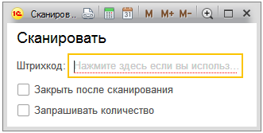

Документ вводится для отражения операций перемещению товаров по складам. На основании документа формируется печатная форма накладной для внутреннего перемещения.

# Меню операций.

В табличной части Товары кроме построчного ввода предусмотрена возможность подбора позиций в табличную часть документа с помощью кнопки «**Подбор**» либо путём«**сканирования шрих-кода**».

При нажатии на кнопку «Подбор» откроется справочник «Номенклатура» в режиме подбора с возможностью отражения резервов (флаг “показывать резервы”) и доступного количества номенклатуры, а так же таблица “Товары” в которой будет отражена вся выбранная номенклатура с указанным количеством (флаг “показывать выбор”).

**Сканирование штрих кода   **

Позволяет осуществлять подбор товаров в таблицу документа, при помощи сканера штрих кода.

`**На основании документа “Перемещение” пользователь может внести налоговую накладную.**`