# Как вводить документы на определенную дату?

При вводе документов в систему, дата документа устанавливается в текущую дату сеанса пользователя.

Однако, при вводе документов задним числом, может потребоваться, чтобы дата документа автоматически устанавливалась в определенную дату, без необходимости её изменения каждый раз при вводе нового документа.

Для этой задачи, при вводе документа, в его форме, нажмите правым кликом в поле `Дата. В появившемся контекстном меню, выберите Закрепить дату`. В результате этого действия, появится диалоговое окно с возможностью выбора нужной даты для новых документов данного типа. Данная настройка работает для каждого типа документа отдельно.

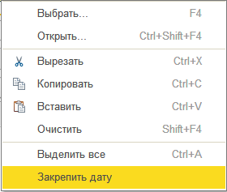

{!id/note.md!}
	Если в контекстном меню отсутствует данная функция, возможно у пользователя нет прав на сохранение настроек, либо тип документа не предусматривает такую возможность (например, документы по вводу остатков).

# Почему не могу найти покупателя в списке выбора?

Убедитесь, что в справочнике [Контрагенты](/c/Organizations), для покупателя установлен флаг Покупатель:

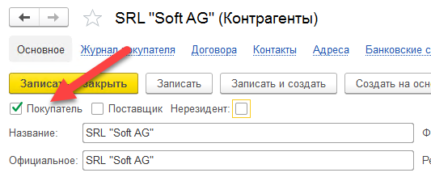

# Почему не могу найти поставщика в списке выбора?

Убедитесь, что в справочнике [Контрагенты](/c/Organizations), для требуемого элемента, установлен флаг `Поставщик`.

# Как выслать отчет по почте или расписанию?

**Отчёт можно отправить по электронной почте** сразу же после его сформирования в системе, нажав на  кнопку **Выслать (Ещё - > Выслать) **либо есть возможность сделать автоматическую рассылку **нажав на кнопку   **, то есть отчёты будет формироваться  и отправляться автоматически, после указания даты начала рассылки, периодичности рассылки и электронного адреса отправителя и получателя:

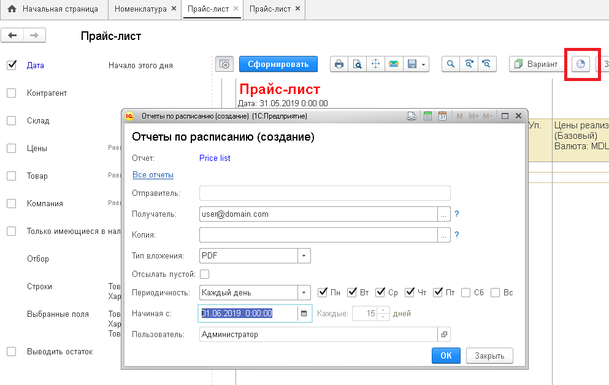

# Каждый раз при запуске программы мне приходится дважды авторизовываться

Для того, чтобы вам не приходилось каждый раз указывать с какой организацией вы хотите работать, нужную организацию можно прописать в параметрах запуска, в стартовом диалоговом окне 1С.

Ниже на картинках пошаговая инструкция:

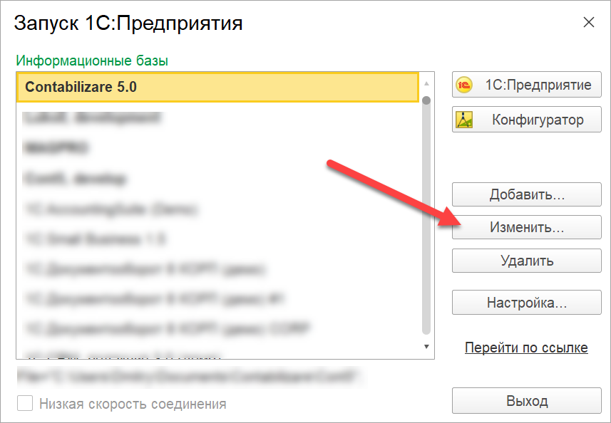

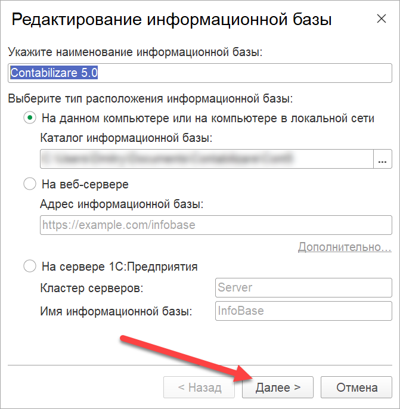

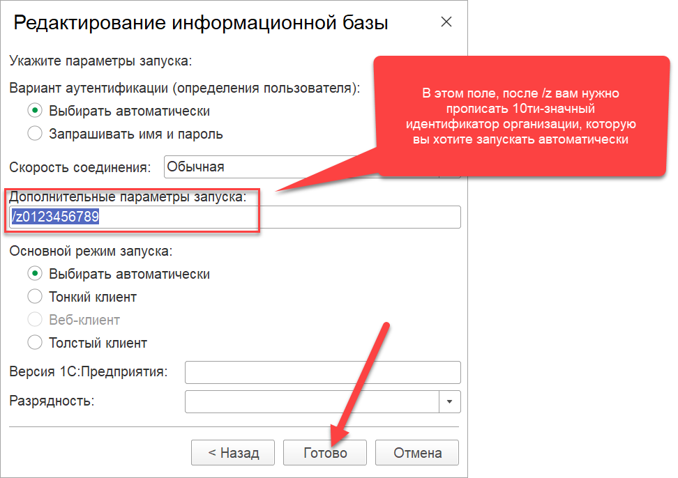

Для того, чтобы узнать 10ти значный код базы организации, нужно открыть в программе:

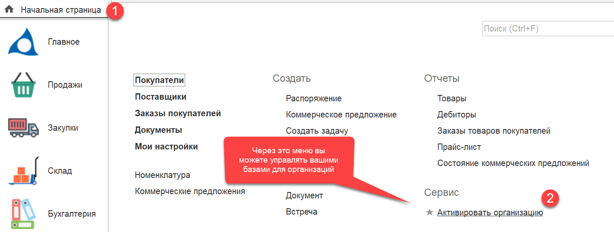

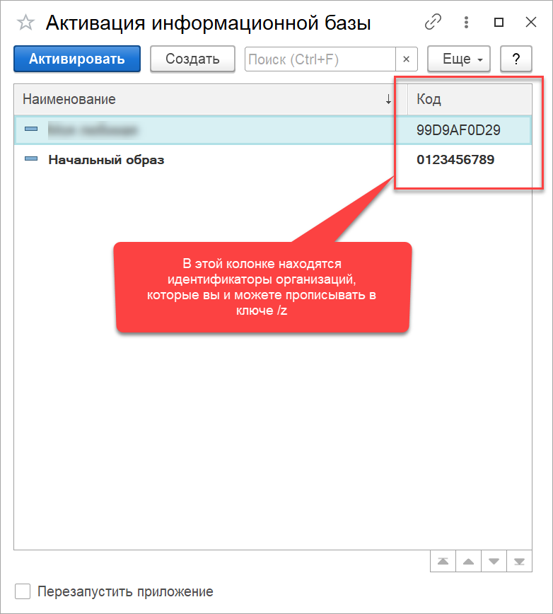

# Куда делось меню Все функции?

Начиная с версии платформы 1С:Предприятие 8.3.17, в программе был реализован механизм под названием **Режим технического специалиста**. Только в этом режиме, пользователю (при наличии соответствующих прав доступа) доступна возможность просмотра всех объектов конфигурации. По умолчанию, эта настройка выключена, и для ее включения, необходимо выполнить следующие действия:

<video width="800" controls><source src="/img/Peek 2021-03-31 15-01.mp4" type="video/mp4"></video>

# Как менять печатные формы?

Если вас не устраивает сформированная программой печатная форма документа, вы можете изменить ее по месту, включив режим редактирования, как показано в этом ролике:

<video width="800" controls><source src="/img/Peek 2021-04-01 16-02.mp4" type="video/mp4"></video>

Если вам нужно на постоянной основе внести изменение в печатную форму программы, мы рекомендуем использовать для этой задачи механизм расширений. Подробнее о том, как это делать см. раздел [Кастомизация](/customization). Там же, смотрите [соответствие идентификаторов и имен документов](/customization#objectNames).

# Как поменять язык печатной формы, однажды я нажал "Больше не спрашивать" но теперь надо

Некоторая часть печатных форм в программе, поддерживает многоязычность и предлагает пользователю выбор языка печати. Однако, если вы нажали `Больше спрашивать`, то программа запомнит ваш выбор и больше язык печати прелагать не будет.

Для того, чтобы вернуть возможность выбора языка, нужно открыть свои пользовательские настройки (меню `Настройки / Мои настройки`) и удалить (или модифицировать) соответствующую строку в таблице `Языки печатных форм`:

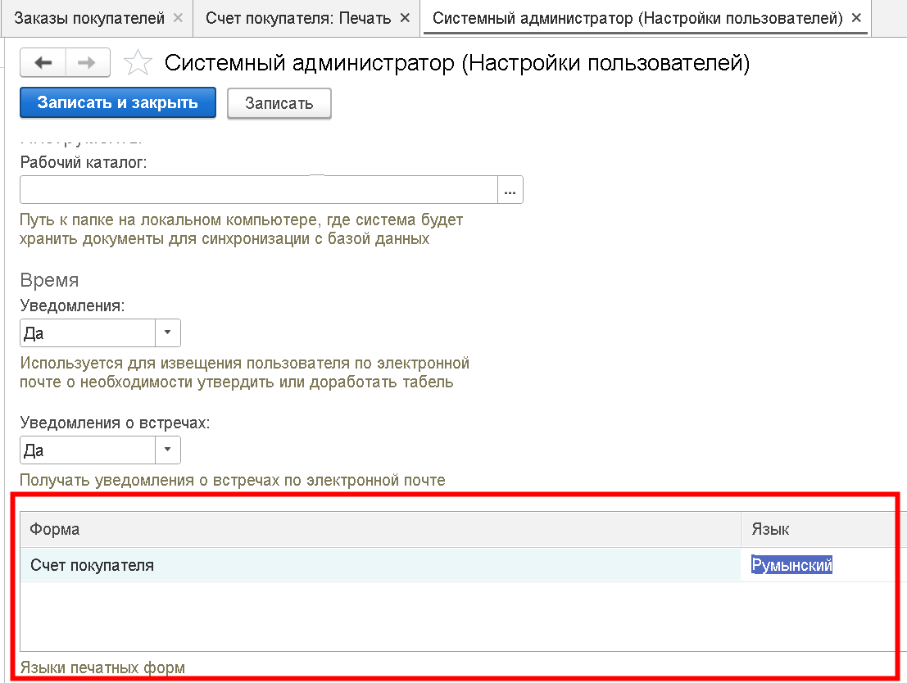

# Как прикрепить файл к справочнику или любому другому объекту системы?

Для этого можно воспользоваться механизмом `Документы`, который автоматически встраивается в навигационную панель наиболее востребованных для такой задачи объектов. Пример ниже, демонстрирует это на справочнике Контрагенты:

Вначале, нужно открыть целевой объект и перейти по ссылке `Документы`:

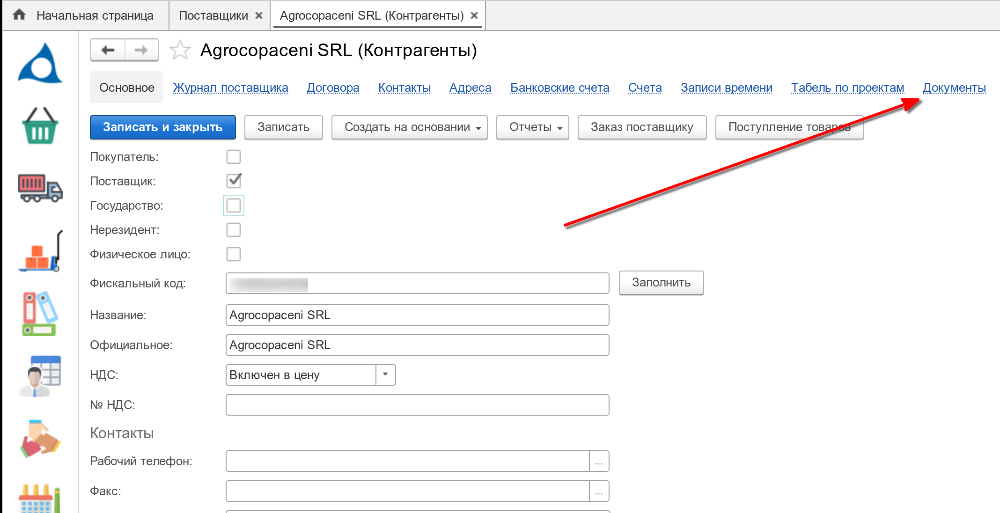

Затем, нужно:

1. Открыть панель с папками (книгами)
2. Создать или выбрать нужную книгу
3. И по правому клику в основном списке, вызвать контекстное меню и загрузить файлы

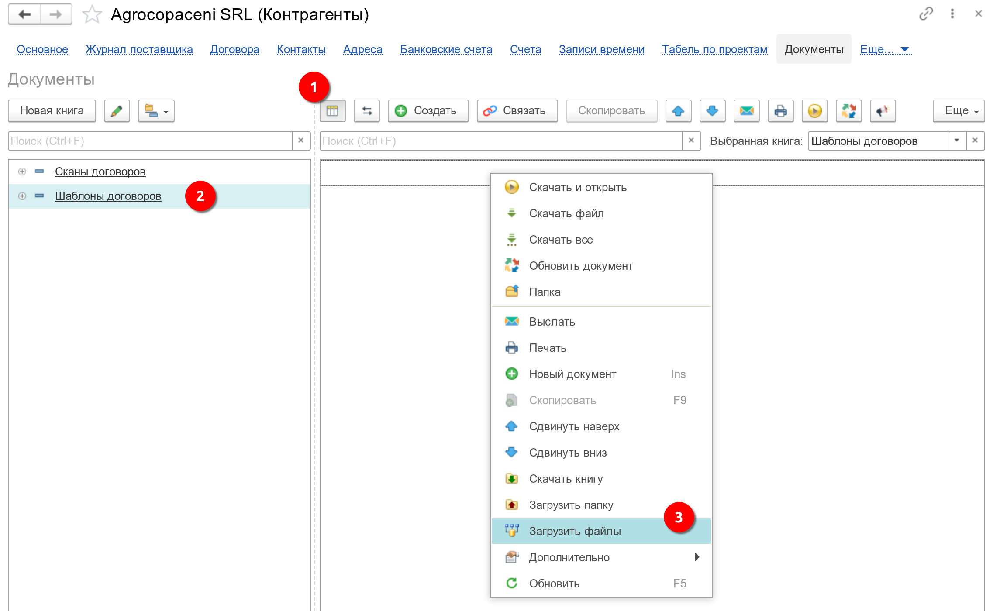  

И результат должен получиться примерно таким:

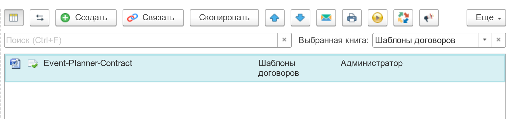  