# Каким образом ввести сотруднику оклад и премиальные, рассчитываемые от суммы оклада?

При [приеме на работу](/d/Hiring) следует воспользоваться таблицей `Дополнительные начисления` (таблица доступна при начале редактирования строки требуемого сотрудника), где указать начисление `Процент от оклада` и заполнить значение процента.

# Для чего нужно отклонение с типом «Резерв +/-»?

Это нужно в случаях, когда предприятие вместо сверхурочных, накапливает часы переработки, с последующей возможностью их зачета в случае отсутствия сотрудника на работе. Эта информация регистрируется при вводе документа {!id/timesheet.md!}.

Например, если сотруднику нужно уйти в среду с работы на два часа раньше, он может в понедельник, отработать больше положенного по графику, на эти два часа. В табеле он укажет 8 часов + 2 часа «Резерв +», а в среду 6 часов и 2 часа «Резерв –». Позже эти сведения попадают в начисление зарплаты, а затем это отражается в расчетном листке и других отчетах.

# Чем отличаются Сотрудники от Физических лиц?

Физические лица в программе ассоциированы с физическим субъектами, или проще говоря - с конкретными людьми. Сотрудник - это профиль трудового отношения, в котором определяется табельный номер, должность, и другие параметры.

Таким образом, в системе может быть создано несколько сотрудников со ссылкой на одно и тоже физическое лицо. Примерами таких случаев могут быть:

- Работа сотрудника по совместительству. В этом случае, нам нужно будет создать в справочнике [Сотрудники](/c/Employees) двух сотрудников и принять их на работу.
- Сотрудник работал и уволился, и через продолжительное время, снова устроился к нам на работу. В том случае, вы можете выдать ему другой табельный номер, а для этого нужно будет создать нового сотрудника ([со ссылкой на уже существующее физическое лицо](#sameemployee)).

# Как принять на работу уволенного ранее сотрудника?

Если сотрудник повторно принимается на работу и при этом сохраняется его предыдущий табельный номер, вводить в базу нового сотрудника не обязательно, в новом приеме на работу, его можно выбрать повторно.
Если сотруднику необходимо присвоить новый табельный номер, тогда в справочник сотрудники нужно ввести нового сотрудника, [со ссылкой на уже существующее физическое лицо](#sameemployee).

# Как принять сотрудника на внутреннее совместительство?

При приеме на работу по внутреннему совместительству, предполагается, что сотрудник уже работает в нашей компании, по основной занятости. Так как каждый сотрудник представляет собой профиль трудовых отношений (см. [Чем отличаются Сотрудники от Физических лиц?](#empvsind)), принять на работу по совместительству уже работающего по основному месту сотрудника, не допускается.

Таким образом, для оформления новых трудовых отношений, в программу нужно внести нового сотрудника [со ссылкой на уже существующее физическое лицо](#sameemployee). После этого, нужно стандартно провести прием этого сотрудника на работу, обязательно указав в поле `Занятость`, значение `Внутреннее совместительство`:

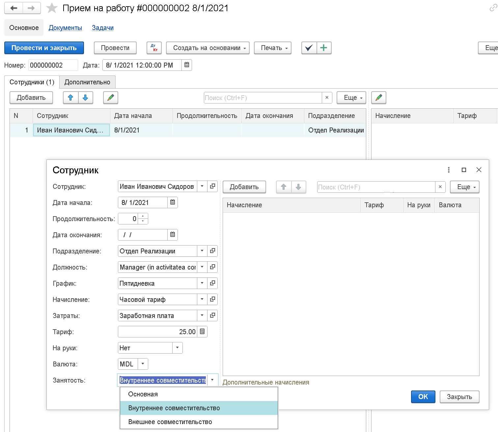

!!!note "Примечание"
	При этом следует иметь ввиду, что если сотрудник по совместительству будет уволен, а затем снова принят на работу, создавать каждый раз нового сотрудника не обязательно, можно выбирать уже существующего.

# Как завести в базу нового сотрудника, со ссылкой на уже существующее физическое лицо?

Это может потребоваться при приеме сотрудника по внутреннему совместительству, либо при приеме уволенного ранее сотрудника с необходимостью замены ему табельного номера.

Итак, для этого нам нужно:

1. Открыть список сотрудников, меню `Сотрудники / Сотрудники`.
2. Нажать `Создать`.
3. В появившейся карточке, на командной панели, нажать `Выбрать физлицо`:  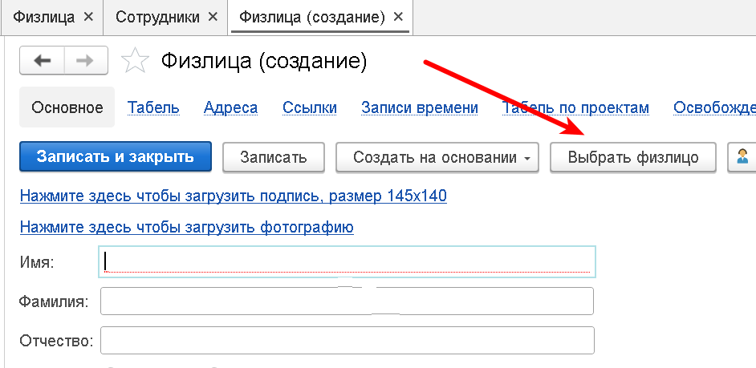
4. Появится форма выбора, в которой нужно выбрать нужное физлицо и нажать `Выбрать`:  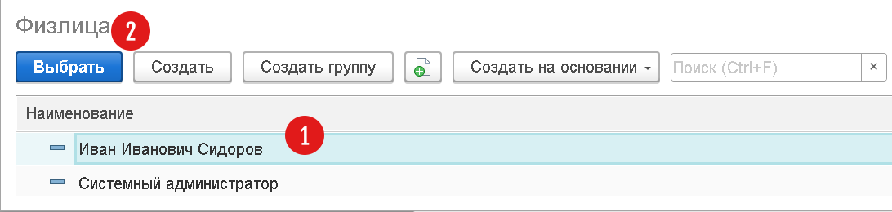
5. После выбора, все поля будут заполнены данными физического лица.
6. Введите в поле `Отметки` какой-нибудь текст, например так:  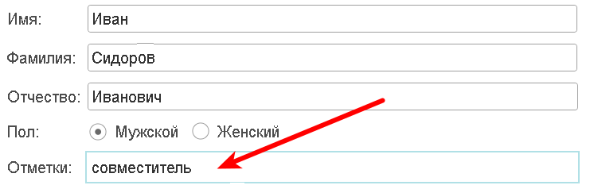
7. Затем нажмите `Сохранить`, система попросит подтверждения, согласитесь и затем закройте форму. В списке вы увидите примерно следующее:  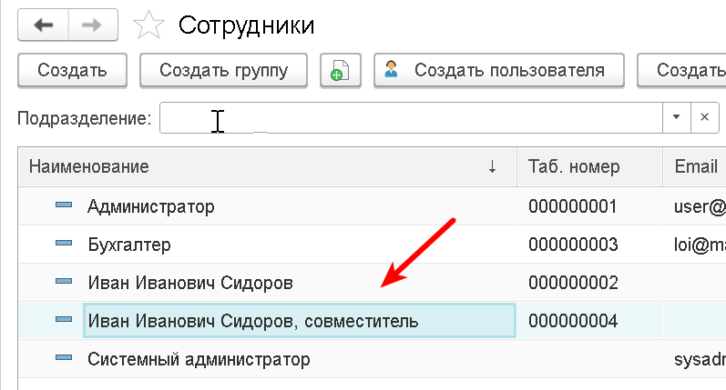

!!!note "Примечание"
	Шаг 6 был не обязательным, но таким образом, вы в списках сможете визуально отличать одного сотрудника, от другого.

# Как начислить заработную плату от обратного?

Для того, чтобы документ [Начисление ЗП](/d/Payroll) производил расчет начисленной заработной платы от суммы на руки, необходимо в документе [Прием на работу](/d/Hiring), установить флаг `На руки` для выбранного сотрудника.

# А можно в одном месяце ввести несколько начислений/выплат?

Да, конечно. Только в случае с начислениями стоит иметь ввиду, что программа контролирует ранее выполненные начисления за указанный в документе период.

Например, у вас в компании работает 10 сотрудников. В октябре, вы делаете начисление зарплаты по всем 10 сотрудникам, одним документом. Затем, вы понимаете, что забыли провести по базе прием на работу 11-го сотрудника, начавшего работать с середины октября. Вы проводите примем на работу, но изменять уже существующий документ начисления по 10 сотрудникам не хотите (допустим, вы туда внесли какие-то ручные корректировки). Ничего страшного, вы можете ввести еще один документ начисления зарплаты, и при его заполнении (даже без установленных фильтров), программа увидит, что по 10 сотрудникам, зарплата уже была начислена, а по 11-му еще нет. Таким образом, в результат заполнения второго начисления зарплаты, ожидаемо попадет только один сотрудник.

# Как ввести больничный за счет БГСС?

Для регистрации такого больничного необходимо:

1. Открыть журнал `Сотрудники / Больничные`
2. Создать документ
3. Заполнить реквизиты, а в поле `Начисление` указать вид начисления, метод расчета которого задан как `Больничные, только БГСС`:
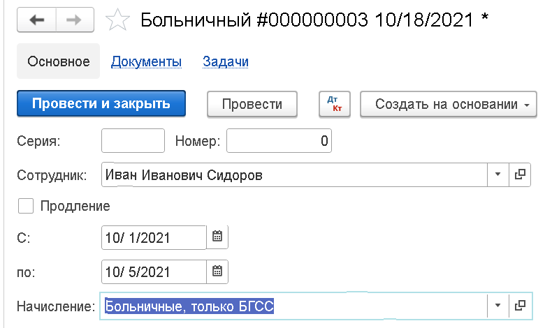

Если в вашей базе нет такого начисления, создайте его, задав соответствующий метод расчета:

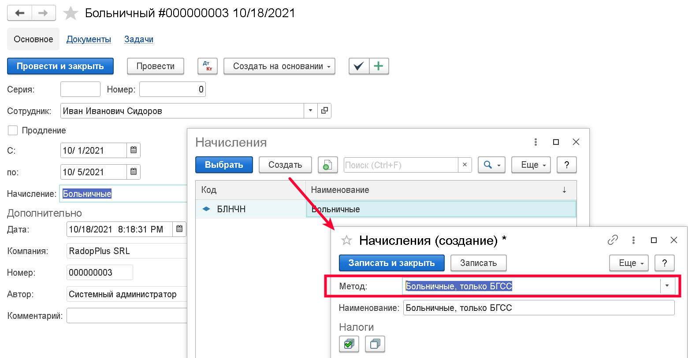

!!!warning "Внимание!"
	Для того, чтобы больничный попал в отчет IPC, в системе нужно рассчитать и провести документ Начисление ЗП за соответствующий период. В этом случае, больничный будет принят в расчет (даже если период больничного целый месяц) и учтен в отчете.

# Как начислить зарплату за произвольный период?

Для этого нужно в документе начисления зарплаты, указать нужный период заполнения:

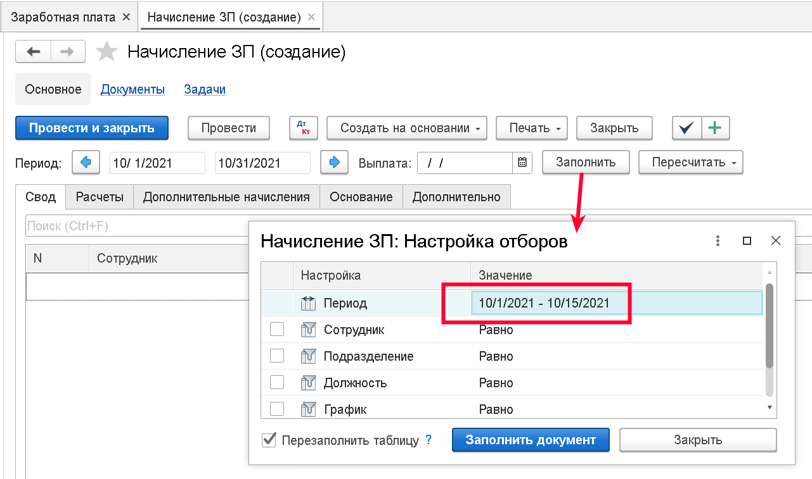

# Как поменять начисленную сотруднику сумму зарплаты и как делать произвольные корректировки?

Документ начисления зарплаты производит расчет сумм к начислению автоматически. При необходимости, автоматические расчеты можно скорректировать, удалить или добавить собственные. Если вам нужно изменить какую-то запись, для этого нужно перейти к требуемой строке расчета, открыть ее двойным кликом, включить возможность редактирования флагом `Редактировать` и внести нужные изменения:

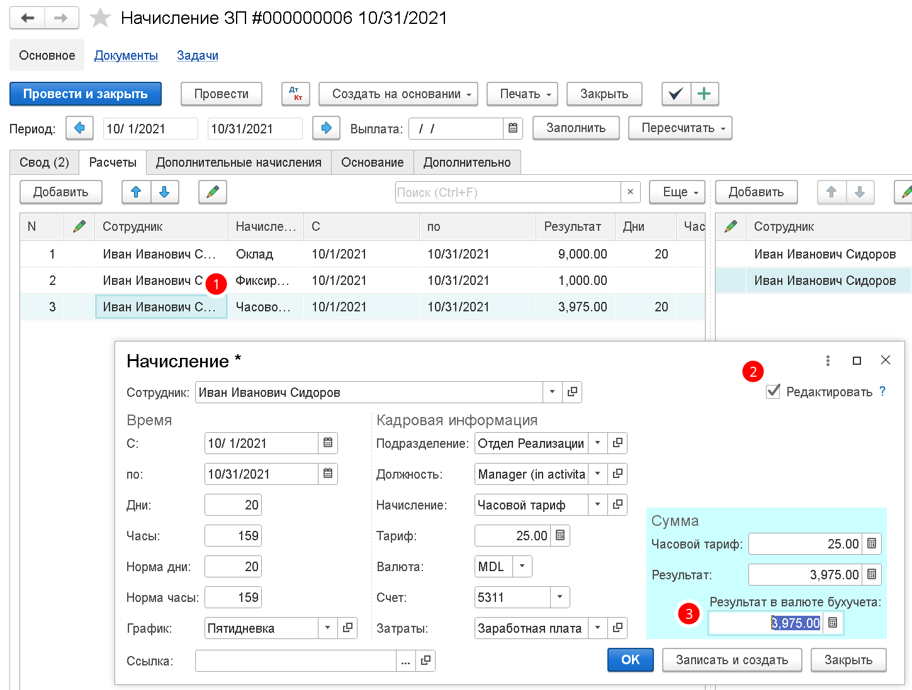

При включенном режиме редактирования, пользователю становятся доступными все поля с данными. Система не производит контроль над информацией, внесенной пользователем в таком режиме.

!!!tip "Подсказка"
	Если требуется изменить только сумму расчета, новую сумму нужно ввести в два поля: `Результат` и `Результат в валюте бухучета`. В поле `Результат` нужно внести сумму начисления в валюте начисления, в поле `Результат в валюте бухучета` нужно ввести сумму в леях.

Добавление и удаление расчетов, выполняется стандартными действиями, как при работе с таблицами.

!!!warning "Внимание!"
	Если вы изменили сумму расчета начисления, вполне вероятно, что вам понадобится произвести пересчет налогов. Для этой цели, после завершения всех корректировок в таблице `Расчеты`, произведите пересчет налогов, как показано на картинке ниже.

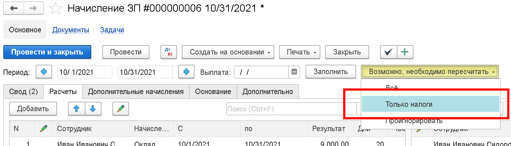

Измененные/удаленные/добавленные пользователем расчеты имеют следующую особенность поведения при повторном расчете документа:

- Если вы удалили запись и заново рассчитали документ, удаленная запись снова будет добавлена в документ. Это же касается и таблицы с налогами. Будьте аккуратны с такого рода модификациями, делайте их в последнюю очередь, когда перерасчет документа больше не предвидится.
- Если вы в автоматически рассчитанной программой записи, изменили период, должность, подразделение или график, то при повторном расчете документа, автоматическая запись снова будет добавлена. Это связано с тем, что при перерасчете, программа объединяет автоматически рассчитанные данные и откорректированные пользователем. И если для автоматического расчета, по периоду, должности, подразделению и графику не нашлось пользовательской корректировки, автоматическая запись добавляется. Имейте это ввиду при повторных перерасчетах документов, в которых были выполнены пользовательские корректировки.

!!!note "Примечание"
	Строго говоря, возможность корректировки рассчитанных записей должна задействоваться в крайнем случае, и уже после того, как данные были проверены, откорректированы, а повторного перерасчета не предполагается.

# Как произвести дополнительное разовое начисление?

Разовые дополнительные начисления (например, компенсация за неиспользованный отпуск) выполняются в документе [Начисление ЗП](/d/Payroll). Для этого, необходимо воспользоваться таблицей `Дополнительные начисления`:

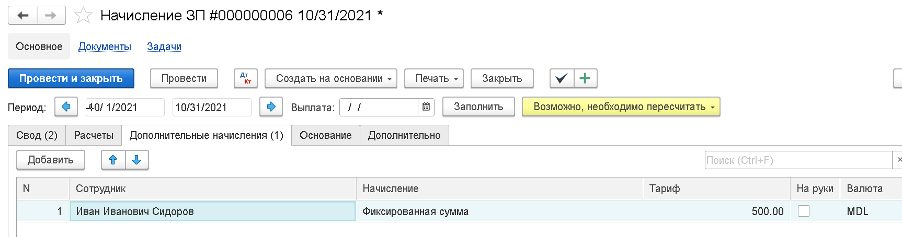

Следует учитывать следующие нюансы:

- Зарегистрировать разовое дополнительное начисление можно только с основным. Нельзя ввести документ начисления зарплаты, в котором будут только дополнительные начисления. Это связано с тем, что в общем случае, дополнительное начисление может быть связано с основным (например, процент от оклада), которое (оклад) могло меняться в течении периода начисления зарплаты. В этом случае, дополнительное начисление будет разбито за две (или более) записи в таблице расчетов, в соответствии с зависимостью от основного.
- Рекомендуется заполнять таблицу с дополнительными начислениями, до заполнения самого документа. Так, вам не придется пересчитывать документ после добавления дополнительных начислений.

Для постоянных дополнительных начислений, следует использовать документы [Прием на работу](/d/Hiring) или [Кадровые изменения](/d/EmployeesTransfer).

# Налоги посчитались неправильно, что делать?

Этот вопрос относится сразу к двум документам: [Начисление ЗП](/d/Payroll) и [Выплата ЗП](/d/PayEmployees). Если никак не удается понять, почему программа произвела расчет налогов не так, как вы того ожидали, всегда есть возможность эти расчеты скорректировать. Для этого, в таблице с налогами (таблица расположена справа от таблицы `Расчеты`), нужно перейти к требуемой строке, открыть двойным кликом запись, включить возможность редактирования флагом `Редактировать` и внести нужные изменения:

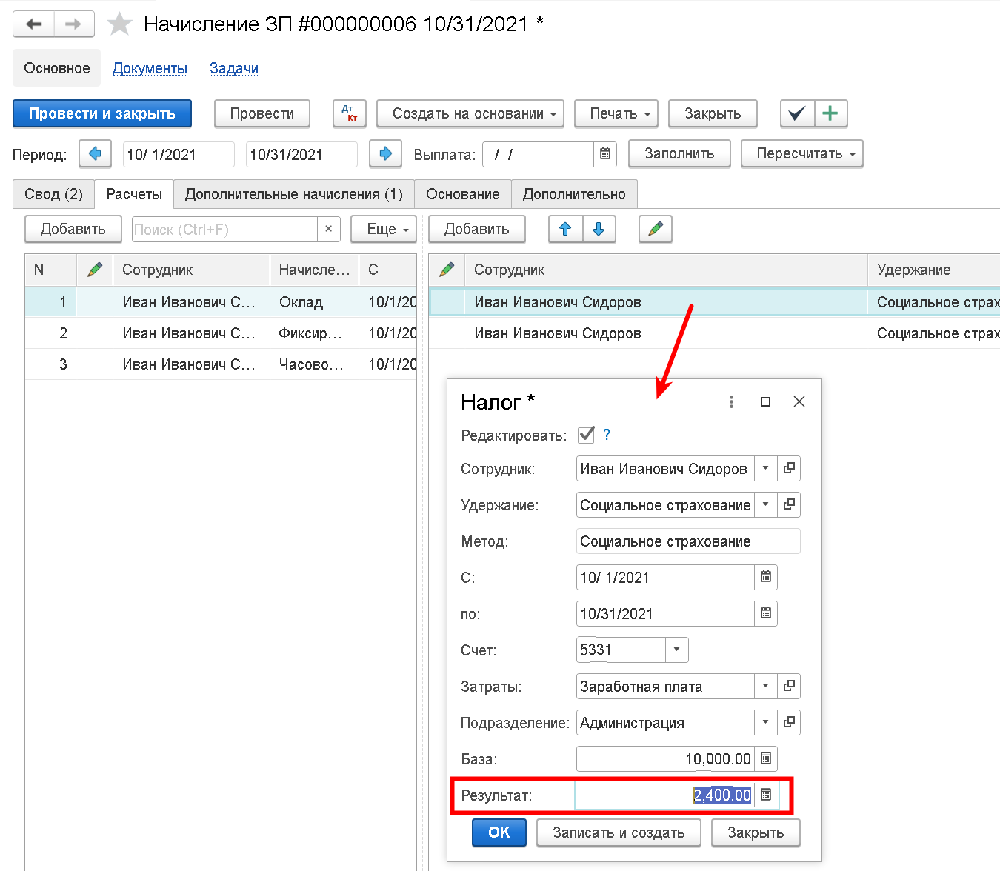

При включенном режиме редактирования, пользователю становятся доступными для редактирования все поля с данными. Система не производит контроль над информацией, внесенной пользователем в таком режиме. Кроме редактирования строк таблицы, вы можете добавлять или удалять расчеты по своему усмотрению.

# Как выдать зарплату частично?

Существует два варианта. Первый - это указать процент выплаты при заполнении документа [Выплата ЗП](/d/PayEmployees):

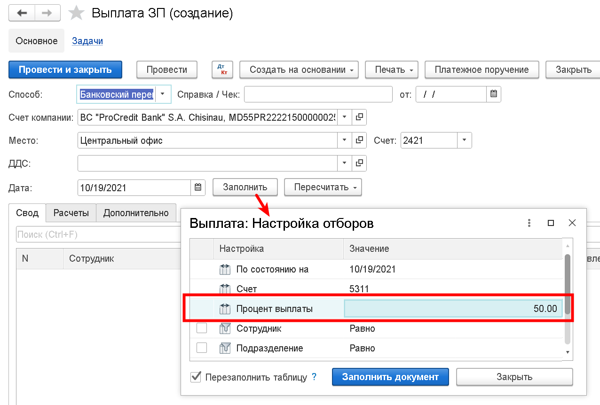

Второй - это скорректировать сумму на руки, используя механизм корректировки записей. Для этой цели, после того, как вы заполнили документ, нужно перейти к требуемой строке расчета, открыть двойным кликом запись, включить возможность редактирования флагом `Редактировать` и внести нужные изменения:

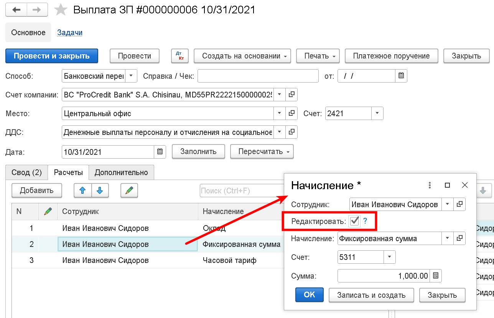

Строго говоря, документ можно предварительно не заполнять, запись с суммой на выплату может быть добавлена в таблицу вручную, стандартным образом.

!!!warning "Внимание!"
	Не забывайте производить пересчет налогов, после того, как вы меняете направляемые на выплату суммы.

# Почему не считаются отпускные?

Может быть несколько причин, нужно проверить следующее:

- Убедитесь, что в базе есть информация по предыдущим начислениям за три месяца (просто проводок по 5311 недостаточно, должны быть именно документы Начисление ЗП). Если начислений нет, опускные рассчитаны быть не могут. И что же делать? См. [здесь](#manualchanges).
- Убедитесь, что еще не начислили отпускные ранее. Может у вас уже есть документ Начисление ЗП, в котором отпуск был рассчитан.
- Проверьте процент расчета отпуска. Он задается для приложения в целом и находится в меню `Настройки / Приложение / Бухгалтерия / Поправка на стаж (в таблице)`. Откройте этот параметр и убедить в двух вещах:
  - в поле `Значение` задан процент (на момент написания документации, это 75)
  - в поле `Дата` указана дата, когда это значение вступило в силу (ну или как минимум, дата должна быть раньше даты, когда вы делаете начисление отпуска)
- Проверьте, не меняли ли вы график работы или праздничные дни для тех периодов, когда зарплата уже была начислена. Если это так, то уже введенные начисления нужно будет или перезаполнить или [откорректировать](#manualchanges).

Если предыдущие пункты в порядке, тогда смотрим дальше:

1. Откройте документ с отпуском, который вы ввели.
2. В таблице `Сотрудники`, войдите в режим редактирования колонки `Начисление` нужного сотрудника, правым кликом в этой колонке откройте контекстное меню и выберите `Открыть`. Должна открыться карточка вида расчета.
3. В карточке, проверьте содержимое двух таблиц: `Налоги` и `База расчета`. Убедитесь, что у вас задана база расчета. База расчета, это список начислений, который лежит в основе расчета отпуска. То есть там должны быть такие начисления как: Оклад, Премия, Отпускные и другие.
4. Сохраните информацию, закройте отпуск (сохранять документ не обязательно), вернитесь в документ Начисление ЗП и заполните (или пересчитайте) его.

Если ничего не помогло, или возможности разбираться дальше нет, можно ввести необходимые записи [вручную](#manualchanges).

# Почему не считаются больничные?

Может быть несколько причин, нужно проверить следующее:

- Убедитесь, что в базе есть информация по предыдущим начислениям за три месяца (просто проводок по 5311 недостаточно, должны быть именно документы Начисление ЗП). Если начислений нет, больничные рассчитаны быть не могут. И что же делать? См. [здесь](#manualchanges).
- Убедитесь, что еще не начислили больничные ранее. Может у вас уже есть документ Начисление ЗП, в котором больничный был рассчитан.
- Проверьте параметры нетрудоспособности. Для этого откройте меню `Настройки / Приложение / Бухгалтерия`, и в таблице, просмотрите группу настроек `Больничные листы`.
- Проверьте, не меняли ли вы график работы или праздничные дни для тех периодов, когда зарплата уже была начислена. Если это так, то уже введенные начисления нужно будет или перезаполнить или [откорректировать](#manualchanges).

Если предыдущие пункты в порядке, тогда смотрим дальше:

1. Откройте документ с больничным, который вы ввели.
2. Откройте начисление; для этого перейдите в поле `Начисление`, правым кликом откройте контекстное меню и выберите `Открыть`. Должна открыться карточка вида расчета.
3. В карточке, проверьте содержимое двух таблиц: `Налоги` и `База расчета`. Убедитесь, что у вас задана база расчета. База расчета, это список начислений, который лежит в основе расчета больничных. То есть там должны быть такие начисления как: Оклад, Премия, Отпускные, Больничные и другие.
4. Сохраните информацию, закройте больничный (сохранять документ не обязательно), вернитесь в документ Начисление ЗП и заполните (или пересчитайте) его.

Если ничего не помогло, или возможности разбираться дальше нет, можно ввести необходимые записи [вручную](#manualchanges).

# В документ Начисление ЗП попадает запись без суммы по больничному, почему?

Это нормальная ситуация, периоды больничных за счет БГСС отражаются в начислении заработной платы без суммы. Эти записи нужны для формирования регламентированной отчетности (IPC например).

# Как ввести праздничный день для определенного подразделения?

Например, в день города Кишинева, отдыхают подразделения, относящиеся к городу, все остальные районы работают. Для того, чтобы в программе отразить эту ситуацию необходимо:

1. Открыть справочник праздники, меню `Сотрудники / Праздники`.
2. Выбрать и открыть из списка требуемый календарь праздников.
3. Ввести (или отредактировать) записи, с указанием территориальных подразделений, к которым относится праздник: 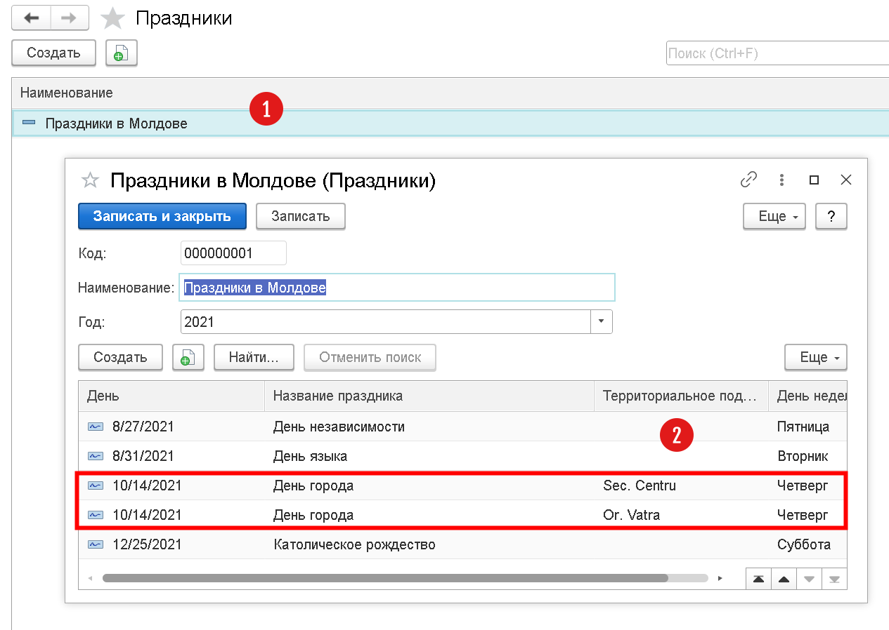

На картинке указано, 14 октября будут отдыхать сотрудники, работающие в территориальных подразделениях Sec. Centru и Or.Vatra. Соответственно, праздники, для которых территориальные подразделения не указаны, являются общегосударственными.

См. также:

- [Где задается принадлежность сотрудника к территориальному подразделению?](#divisions)
- [Как вводятся праздники в программу?](#holidays)

# Где задается принадлежность сотрудника к территориальному подразделению?

При приеме сотрудника на работу, в обязательном порядке указывается подразделение, в которое принимается сотрудник. В свою очередь, в карточке подразделения указывается принадлежность к территориальному подразделению. Таким образом, принадлежность сотрудника к территориальному подразделению определяется реквизитом `Территориальное подразделение` в элементе справочника Подразделения:

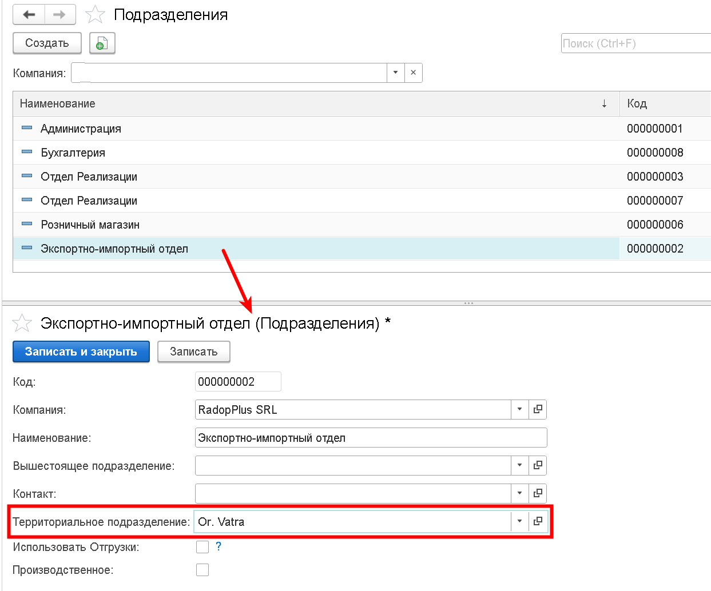

На картинке показано, что персонал, принятый на работу в подразделение Экспортно-импортный отдел, относится к территориальному подразделению Or. Vatra.

# Как вводятся праздники в программу?

Для учета праздников, в программе существует специальный справочник, он находится в меню `Сотрудники / Праздники`:

В поле `Год` задается год, а в таблице ниже - даты праздников. Для заполнения праздников на 2022 год и далее, нужно в поле `Год` установить нужный год, провести заполнение дат в таблице, и сохранить справочник.

!!!note "Примечание"
	Таким образом, если у вас все сотрудники работают в Молдове, тогда достаточно иметь только одну запись в справочнике праздников (как на картинке выше), и создавать для каждого года новый элемент непосредственно в справочнике праздников, не требуется.

Праздники учитываются в расчетах программы автоматически. После того, как вы заполнили праздники, дополнительных действий по перезаполнению графиков работ, не требуется. Однако, для того что бы графики работ учитывали праздники, такая связь должна быть задана на уровне самих графиков, пример на картинке ниже. Откройте меню `Сотрудники / Графики`, затем откройте сам график (пятидневку например):

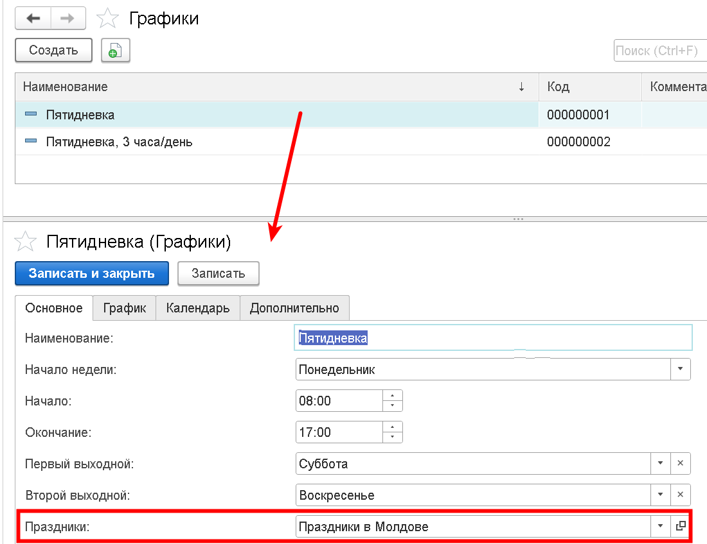

То есть через поле `Праздники`, мы связываем график с праздниками. Если у вас более одного графика, такая связь должна быть задана для каждого из них.

!!!note "Примечание"
	Если вы изменяете праздники или график уже после того, как в программе было проведено начисление зарплаты за соответствующий период, такие начисление придется перезаполнить.

# Рабочий день перенесли на субботу, как правильно это отразить в программе?

В августе 2021, сложилась такая ситуация, что праздники выпали на 27 (это пятница) и 31 (это вторник). Правительство решило понедельник 30 августа сделать выходным, чтобы получилось 5 выходных подряд. Отрабатывать этот понедельник, правительство решило в субботу 21. Как отразить эту ситуацию в программе?

Для этого нужно:

1. Открыть список графиков работ, меню `Сотрудники / Графики`.
2. Открыть график по которому работают сотрудники и перейти на вкладку `График`. Если графиков несколько, шаги с 2 по 9 нужно будет повторить для всех графиков.
3. Активировать строку с нужным годом: 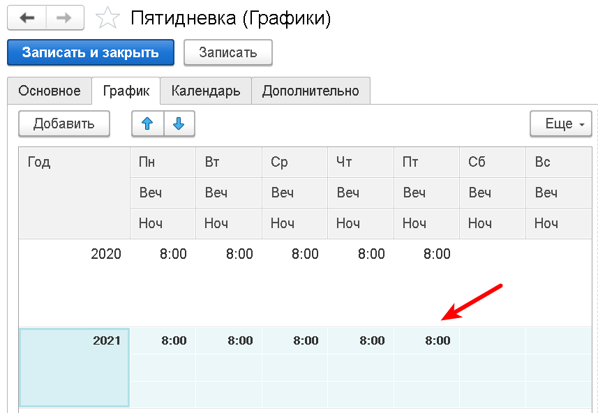
4. Переключиться на вкладку `Календарь` и включить возможность ручных изменений: 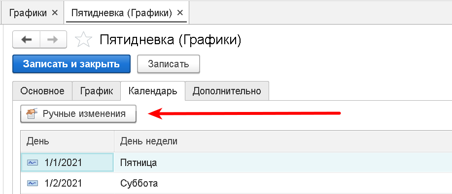
5. При этом обратите внимание, чтобы указанная стрелкой кнопка не была прижата. Если она прижата, значит ручные изменения уже были включены ранее и их повторное включение не требуется.
6. После того, как ручные изменения будут активированы (кнопка должна быть прижата, как на картинке): 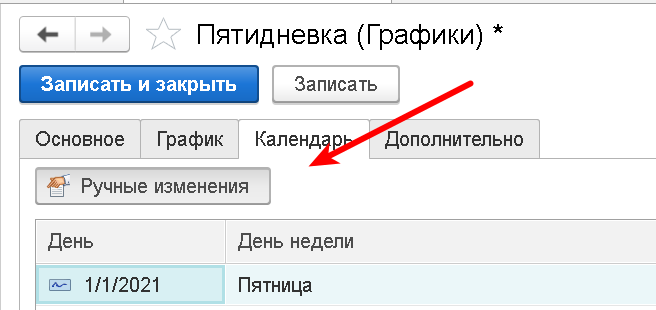  станет доступной для редактирования таблица с данными графика на каждый день.
7. Далее, в календаре (в самом низу, а календарь можно прокручивать мышкой), находим 21 августа, нажимаем два раза и ставим в этот день 8 часов, и сохраняем информацию: 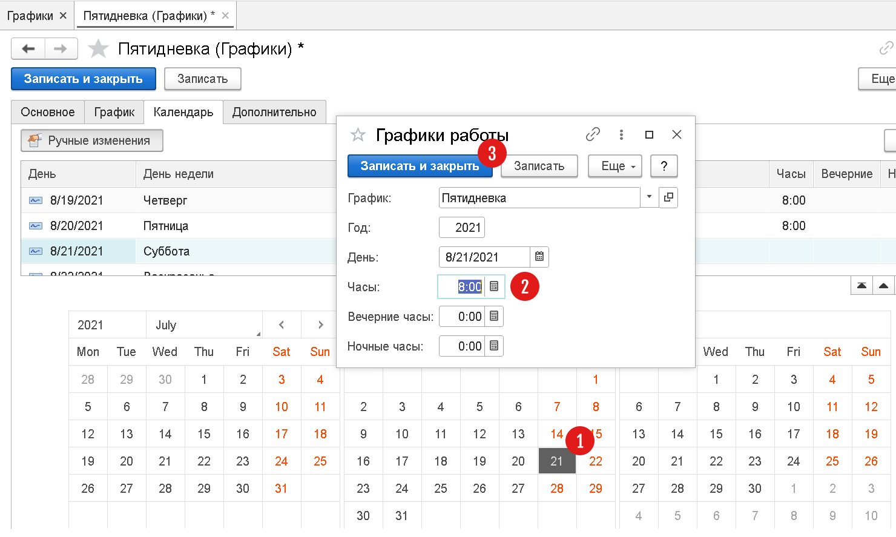
8. Затем, проделываем туже операцию с 30 августа, только вместо 8 часов, там вы ставим 0.
9. Записываем и закрываем график.

После проделанных изменений, суббота станет рабочим днем, а понедельник выходным.

!!!warning "Внимание!"
	Описанный способ не должен применяться для установки праздничных дней в графиках работы сотрудников. Государственные праздничные дни хранятся в специальном справочнике, меню `Сотрудники / Праздники`. Именно туда нужно вносить данные о праздниках.

# Почему в отчет IPC неверно выводятся коды профессий?

Проверьте, чтобы коды должностей (меню `Сотрудники / Должности`) совпадали с кодами из классификатора должностей (меню `Сотрудники / Классификатор должностей`). Код должности, это четырехзначный цифровой код (не путать с кодом классификатора).

# Почему в отчет IPC неверно выводится социальный фонд, хотя в начислении он есть?

Такое может происходить из-за несовпадения зарегистрированных периодов начислений и удержанных с них налогов.

Например, период начисления в документе Начисление ЗП, был изменен вручную, но при этом запись в таблице с налогами не редактировалась и соответственно осталась со старым периодом. В этом случае, из-за несовпадения периодов, система не может определить сумму исчисленного социального фонда для откорректированного вручную начисления. Совпадение периодов требуется в силу специфики отчета, в котором исчисленный социальный фонд должен выводится строго в соответствии с периодом начисленного дохода, что при наличии, например, больничного в середине месяца, разобьет оклад как минимум на два разных периода.

Для решения проблемы, нужно в документе начисления зарплаты, произвести корректировку периода налога (или периода начисления), чтобы эти периоды совпадали. Таким образом, отчет сможет для каждого начисления и его периода действия, найти сумму социального фонда из данных по налогам.

# Можно ли выдать зарплату в месяце начисления?

Да, конечно, но есть тонкость, имеющая место при начислении зарплаты от обратного. В этом случае, в документе Начисление ЗП, становится важным параметром реквизит `Выплата`:

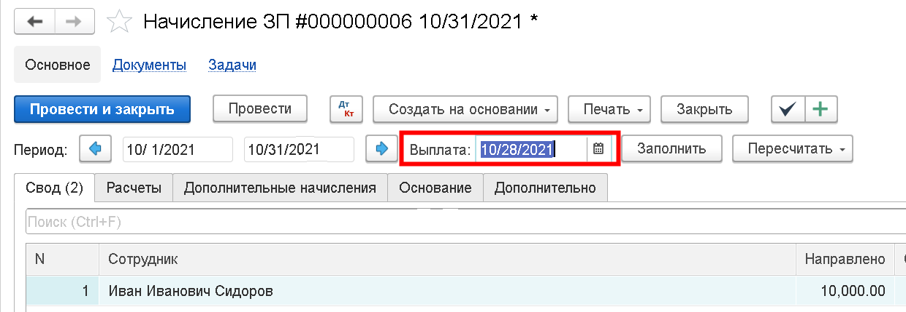

Когда зарплата считается от обратного, этот реквизит нужен для того, чтобы программа смогла вычислить сумму применяемых освобождений при расчете подоходного налога. При этом важен не только месяц выплаты, но и дата, потому что система будет подсчитывать сумму уже примененных освобождений по указанную дату (не включительно, а на начало дня). Соответственно выплату, уже желательно провести или датой в поле `Выплата`, или позже, но в рамках указанного месяца. В противном случае, повторное перезаполнение документа Начисление ЗП, увидит проведенную выплату и некорректно с т.з. пользователя, произведет перерасчет.

Яснее на примере.

- Допустим, мы 28.10 производим выплату заработной планы.
- Перед выплатой, сделаем начисление, где в поле `Выплата` укажем 28.10, заполним и проведем документ.
- Потом проведем выплату 28.10. Пока все в порядке.
- Затем, мы обнаруживаем механическую ошибку, выплата была произведена не 28.10 а 27.10, нам нужно изменить дату выплаты. Для исправления, мы отменяем проведение выплаты, меняем дату документа и проводим его заново. Пока вроде бы все в порядке.
- Но потом, обнаруживается еще одна проблема, один из сотрудников 15 октября был переведен в другое подразделение, и нам нужно ввести кадровое перемещение. Вводим.
- Далее, для того, чтобы правильно села аналитика расчетов, нам нужно перезаполнить (или перерасчитать) документа Начисление ЗП.
- Так вот, когда мы будем перезаполнять документ Начисление ЗП, мы обнаружим странную ситуацию: практически все цифры в документе поменяются.

Это произойдет потому, что в начислении, в поле `Выплата`, у нас все еще стоит 28.10, что вынуждает систему принять во внимание выплату от 27.10, что скажется на показателе суммы уже примененных освобождений, и как результат, изменение сумм начисленной зарплаты от обратного. Для того, чтобы этой проблемы не возникало, нужно перед перезаполнением начисления, не забыть установить в поле `Выплата` дату 27.10.