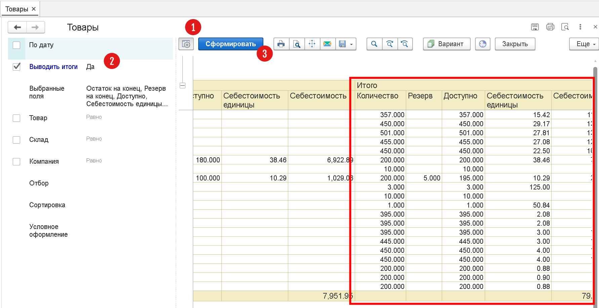

# Где указывается путь к библиотеке штрих-кодов?

Библиотека печати штрих-кодов не хранится в конфигурации приложения и поставляется отдельным файлом. Путь к файлу с библиотекой задается в системных настройках, см. меню `Настройки / Система / Библиотеки`. См. также [Системные настройки](/cf/System).

# Как в отчете Товары получить остатки по всем складам?

Отчет по остаткам товаров находится в меню `Склад / Товары`. Для того, чтобы получить остатки по всем складам, необходимо:

1. Открыть настройки отчета.
2. Поставить галочку `Выводить итоги`.
3. Убрать галочку (если есть) для поля `Склад`.
4. И нажать кнопку `Сформировать`.

# Как произвести резерв товара/материала на складе?

В программе предусмотрены специальные механизмы резервации товаров. Для резервирования можно воспользоваться одним из документов:

- [Заказ покупателя](/d/SalesOrder)
- [Внутренняя заявка](/d/InternalOrder)

Подробнее о работе механизма см. [Резервирование и размещение](/warehousing)

# Почему при сканировании товара нет возможности создать или назначить товару штрихкод?

Для того, чтобы у пользователя была возможность создания товаров или назначения им серий/характеристик/штрих-кодов, у пользователя должно быть право изменения справочника Номенклатура. Права доступа задаются в меню `Настройки / Пользователи` и назначаются администратором системы.