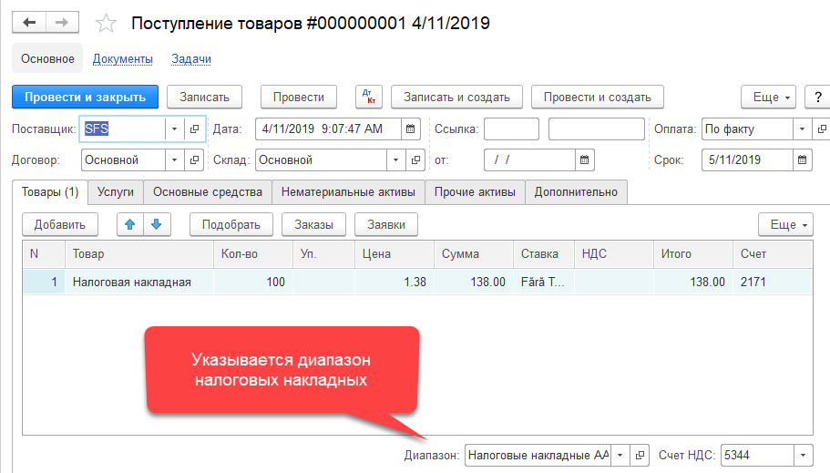
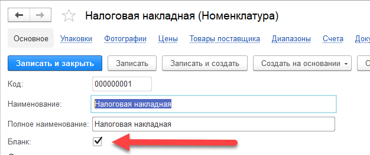
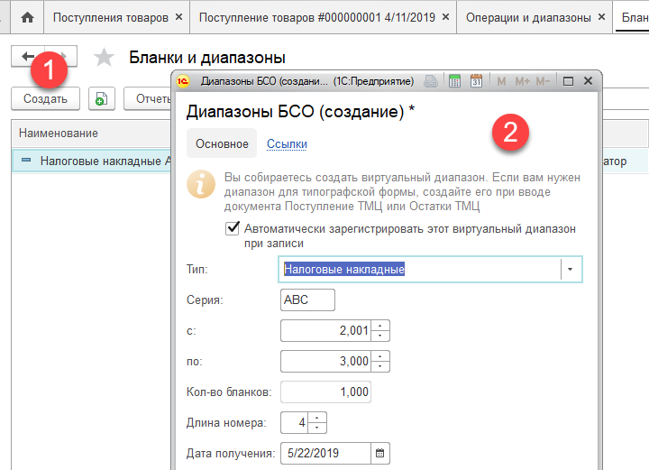
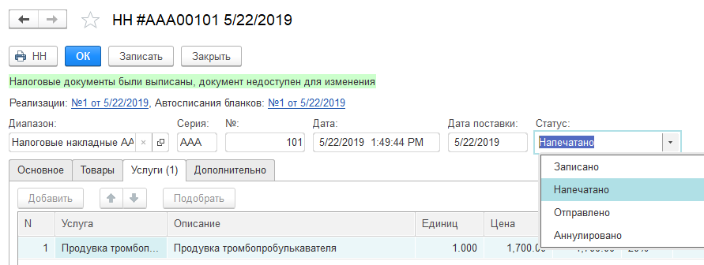

Учет БСО основан на возможности системы вести штучный контроль бланков строгой отчетности в разрезе диапазонов номеров. Операции по работе с БСО расположены в меню `Бухгалтерия > БСО`.

Диапазоны номеров - это конфигурируемый пользователем справочник, в котором задается серия, начальный и конечный номера, и другие параметры.

В системе реализован учет диапазонов трех видов:

1.  Диапазон для физически заказываемых в типографии бланков
2.  Виртуальные диапазоны, регистрируемые и выдаваемые государственными органами
3.  Электронные налоговые накладные (e-Factura)

Диапазоны первого варианта требуют материального учета, что включая в себя: поступление, перемещение, поштучное автоматическое списание бланков при выписке первичных документов (например, [Налоговая накладная](/d/InvoiceRecord)).

Диапазоны второго вида – виртуальные, не требуют материального учета, но также как в первом случае, нуждаются в контроле номеров и серий.

В обоих вариантах учета, программа контролирует последовательное списание номеров заданных диапазонов. Эта важная концепция позволяет избежать проблем с пропусками, дублированием номеров, или беспорядком очередности их формирования. Например, считается недопустимой возможность выписки НН с номером не по порядку следования (в определенных случаях, такая необходимость может появиться в случае разделения диапазона, подробнее см. [Разделение диапазона](#SplitRange).

# Поступление типографских бланков

Для физически заказываемых в типографии бланков, поступление оформляется документом [Поступление товаров](/d/VendorInvoice):

!!!note "Примечание"
	В каждом документе, где могут быть задействованы БСО, используется реквизит `Диапазон`, расположенный ниже основной табличной части.

При этом, для номенклатуры `Налоговая накладная` (товар указанный в табличной части) должно быть определено свойство, что элемент является БСО:

При проведении документа, система зарегистрирует диапазон специальным образом для дальнейшего контроля его местонахождения и нумерации.

При создании диапазона физического бланка, следует отметить, что в систему также необходимо внести информацию о его списании:

Эти данные будут использоваться при автоматическом списании бланка, при вводе соответствующих первичных документов.

# Регистрация выданных диапазонов

Для диапазонов, полученных в электронном виде, документ [Поступление товаров](/d/VendorInvoice) вводить не нужно. Регистрация выданного диапазона может быть выполнена во время его создания в справочнике Диапазоны (см. меню `Бухгалтерия > БСО > Бланки и диапазоны`):

При необходимости, регистрацию уже существующего диапазона можно осуществить при помощи документов `Регистрация диапазона, ввод документа осуществляется в Меню > Бухгалтерия > Операции и диапазоны`.

# Ввод остатков

Документ [Остатки ТМЦ](/d/ItemBalances) с указанием диапазонов имеет смысл вводить только для типографских бланков. Для электронных диапазонов, достаточно регистрации диапазона документом `Регистрация диапазона`.

В обоих случаях, при создании диапазона, его начало следует указывать в соответствии с фактически доступным начальным номером бланка на момент ввода документа.

Например, если был выдан диапазон на 1000 номеров (с 2001 по 3000), но на момент ввода данных в систему, осталось только 300 номеров, начальный номер следует указать 2701.

# Списание

Для типографских бланков, система производит автоматическое поштучное списание при вводе первичных документов. Например, при печати документа [Налоговая накладная](/d/InvoiceRecord), система автоматически формирует документ `Списание бланка`, который в свою очередь, формирует бухгалтерские проводки по списанию.

Важно отметить, что авто-списание бланка происходит только на определенных статусах первичного документа. Например, в случае с НН, такими статусами являются: `Напечатано, Отправлено и Аннулировано`.

То есть, если накладная будет только записана (статус: `Записано), автоматическое списание производиться не будет. Кроме этого, следует учитывать, что авто-списание будет произведено только тогда, когда в поле Диапазон` будет задан диапазон типографского бланка. Подробнее см. описание документа [Налоговая накладная](/d/InvoiceRecord).

В случае утери или порче бланков, их можно списать используя документ [Списание](/d/WriteOff). При списании, нужно учитывать следующий нюанс: если из диапазона бланков требуется списать только некоторую часть, тогда предварительно, этот диапазон следует [разделить](#SplitRange).

# Разделение диапазона

Операция разделения диапазона может быть полезна для выделения под-диапазонов ответственным лицам или подразделениям/складам. Операция может производиться как над электронными диапазонами, так и над физическими бланками. В результате разбиения, разделяемый диапазон отмечается в системе как неактивный, и больше не может быть использован при вводе первичных документов. Полученные новые диапазоны могут быть перемещены на другие склады.

# Перемещение диапазона

Для перемещения типографских диапазонов используется документ [Перемещение](/d/Transfer) (см. меню `Склад > Перемещения`). Документ оформляется как обычное перемещение актива, с указанием перемещаемого диапазона.

Для перемещения электронных диапазонов используется документ [Перемещение диапазона](/d/TransferRange) (см. меню `Бухгалтерия > БСО > Операции и диапазоны`).

# Отчет Диапазоны БСО

Данный отчет используется для текущего анализа использования диапазонов номеров. В отчете также выводится информация по количеству доступных для использования номеров. Отчет строится по всем видам бланков, электронным и физическим.

# Отчет Проблемные БСО

Данный отчет предназначен для получения информации о БСО, которые были введены в систему без использования диапазонов. Это случаи, когда серия и номер бланка были введены в первичные документ вручную, без задействования автоматизации со стороны блока учета диапазонов.

Кроме этого, в отчет выводится информация о пропущенных номерах в диапазонах, если такие ситуации будут обнаружены.

---

{!id/ranges.md!}