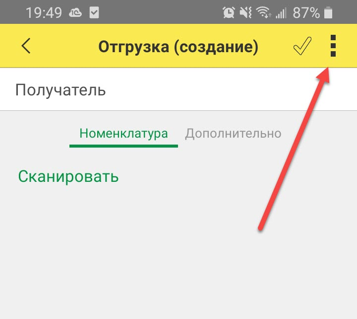
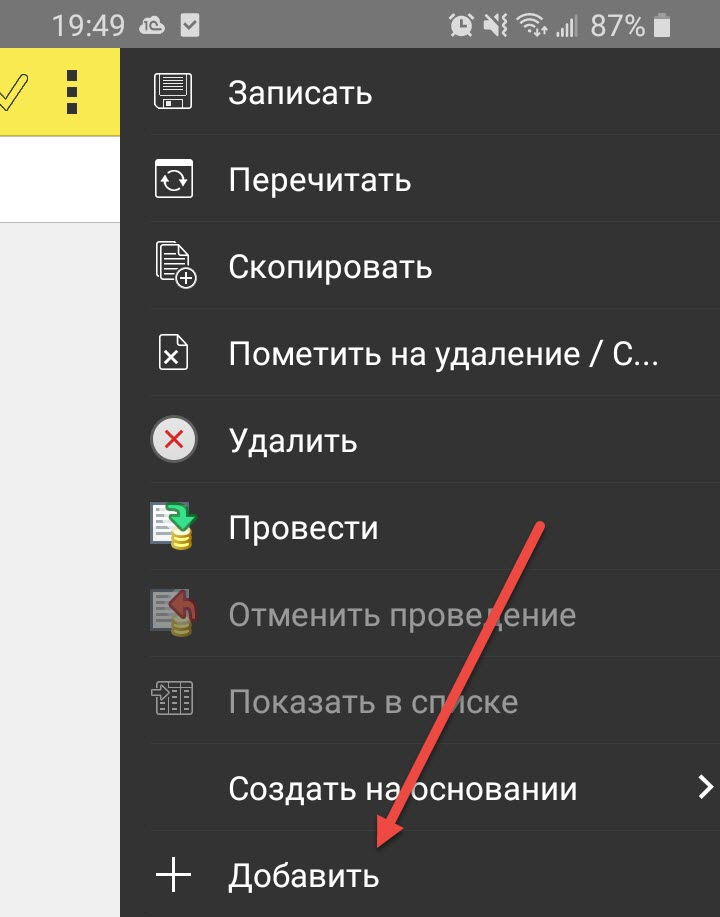

Данный раздел описывает функциональность складской подсистемы, специально разработанной для мобильных устройств с возможностью сканирования штрихкодов. Подробнее о том, как установить мобильное приложение читайте [здесь](faqmobile.md#setup).

# Инвентаризация кладовщика 

Документ используется для регистрации остатков товаров на складе, доступен для работы на ТСД (терминал сбора данных). Документ не является классической инвентаризацией, и используется в качестве основания при заполнении документа `Инвентаризация` (в бухгалтерском учете). Также, документ может применяться при вводе в эксплуатацию системы учета товаров по штрихкодам.

!!!warning "Внимание!"
	При проведении складской инвентаризации, предполагается что для всего товара было проведено предварительное этикирование, и номенклатура корректно внесена в справочники информационной системы.

Сценарий использования документа при проведении инвентаризации на складе:

1. Кладовщик, применяя ТСД, вводит данный документ систему и производит сканирование штрихкодов с этикеток товаров.
2. Каждый отсканированный товар заносится в табличную часть документа. В процессе, пользователю предоставляется возможность указания количества остатка инвентаризуемого товара.
3. Процесс инвентаризации кладовщика завершается проведением документа. Если инвентаризация не закончена, документ следует записать перед завершением работы с программой во избежание потери введенных данных.
4. После завершения работ по подсчету остатков и вводу документов `Инвентаризация кладовщика`, результат инспекции должен быть отражен в бухгалтерском учете, документом `Инвентаризация`.
5. После записи документа `Инвентаризация` (в бухгалтерском учете), складские инвентаризации становятся недоступными для изменений.

!!!note "Примечание"
    В процессе сканирования товаров, у кладовщика будет возможность ассоциировать считанный штрихкод с товаром в базе, что особенно актуально на начальном этапе применения сканеров и другого оборудования автоматизации складских операций.

Для обеспечения одновременной работы сотрудников, допускается ввод нескольких документов `Инвентаризация кладовщика` в рамках одного склада. Также, допускается пересечение инвентаризуемой номенклатуры в различных документах по инвентаризации, что позволяет проводить инвентаризацию территориально распределенного товара. В результирующей бухгалтерской инвентаризации, такой товар будет сгруппирован.

!!!warning "Внимание"
	При заполнении документа `Инвентаризация` (в бухгалтерском учете), программа анализирует все проведенные складские инвентаризации в периоде две недели до и после даты ввода документа бухгалтерского документа.

# Отгрузка кладовщика

Документ предназначен для отражения операций выбытия товаров со склада. Документ вводится кладовщиками, через мобильное устройство, в момент совершения фактических действий по подготовке товара к отгрузке.

Под выбытием подразумеваются следующие операции:

1. Продажа
2. Перемещение между складами
3. Списание

На основании отгрузки, в основной программе могут быть введены следующие бухгалтерские документы:

- Реализация
- Перемещение
- Списание

После ввода бухгалтерского документа, операция по отгрузке считается завершенной, а документ `Отгрузка кладовщика` помечается специальным флагом, больше не доступен для изменения, и не отображается в списке отгрузок (при настройках по умолчанию).

!!!warning "Внимание!"
	Отгрузка считается завершенной при наличии введенного на её основании документа. Строгий контроль состава и количества товара, между документами, не производится.

# Поступление кладовщика

Документ предназначен для отражения складской операций поступления товаров от поставщика. Документ вводится кладовщиками, через мобильное устройство, в момент совершения фактических действий при приемке груза. На основании документа, впоследствии, должен быть введен документ `Поступление товаров` бухгалтерией предприятия.

После ввода бухгалтерского документа, операция по приходу считается завершенной, документ помечается специальным флагом, больше не доступен для изменения, и не отображается в списке приходов (при настройках по умолчанию).

!!!warning "Внимание!"
	Приход считается завершенной при наличии введенного на его основании документа. Строгий контроль состава и количества товара, между документами, не производится.

Другой важной функцией документа является возможность печати на его основании штрихкодов для новых товаров и/или партий.

# Учет по сериям (срокам годности)

Для учета товаров со сроками годности, вам придется печатать свои этикетки, так как штрихкод на коробке от производителя, для разных партий, скорее всего будет один и тот же. Для идентификации по сериям, необходимо будет включить учет по сериям (см. меню `Настройки / Приложение / Товары`), и включить флаг `Серия` для каждого такого товара, в карточке товара) и в процессе приемки/инвентаризации товаров, в программе можно будет задать свои параметры серии (включая номер партии и срок годности). Таким образом, для каждой пары товар/серия вы сможете печатать/клеить свои этикетки. В дальнейшем, сканирование такой этикетки при выбытии товара, будет сразу идентифицировать его серию при заполнении документов системы, что в свою очередь, существенно повышает точность данных и оценку остатка по срокам годности.

Для этикирования товаров, можно использовать следующие документы:

1. `Инвентаризация кладовщика`, в случае когда товар уже есть на складе
2. `Поступление кладовщика`, при получении товаров на склад

В процессе работы с этими документами, у пользователя будет возможность задания дополнительных характеристик товаров и печать этикеток в нужном количестве.

# Профили печати этикеток

Этот справочник отвечает за настройки размеров и оформления печати этикеток со штрихкодами товаров. Каждый профиль задает макет одной этикетки и предполагает печать с использованием специального принтера этикеток, по одной этикетке на лист (в терминах принтера этикеток).

В состав настраиваемых параметров входит:

1. Угол поворота штрихкода. Например, в некоторых случаях печати больших этикеток, угол поворота имеет смысл установить в 90 градусов.
2. Размер шрифта цифр штрихкода.
3. Параметр `Description`, включая его положение и настройки оформления. Поле `Description` всегда включает в себя наименование товара, упаковку и номер партии (если применимо).
4. Положение и размер картинки со штрихкодом.

Профиль печати устанавливается в настройках пользователя. Список всех профилей доступен в меню `Справочники / Товары / Профили печати этикеток`.

# Настройка сканера

У каждого сканера может быть свой состав настроек сканирования. Программа не предъявляет особых требований к оборудованию, однако для корректного распознавания кодов при использовании различных устройств (ТСД, смартфон или ручной сканер), убедитесь, что сканер высылает контрольный символ.

Например, для сканера Honeywell Scan Pal EDA 60K это будет: `Настройки / Scan Settings / Internal Scanner / Default profile / Symbology Settings / EAN-13` флаги должны быть на `EAN-13` и `Send check digit`

# Проблемы при сканировании

При работе на мобильном устройстве, основной режим ввода товаров в документы - это сканирование штрихкода. В том случае, когда товар не может быть отсканирован (например испачкана или порвана этикетка, или товар не имеет этикетки вообще), его можно добавить вручную. Функция добавления товара в таблицу в ручном режиме, располагается в правом верхнем меню мобильного приложения:

Важно отметить, что в случае добавления товара, для которого в системе не задан штрихкод, он будет сгенерирован автоматически, при проведении документа (данная функция реализована для документов `Инвентаризация кладовщика` и `Поступление кладовщика`). 
