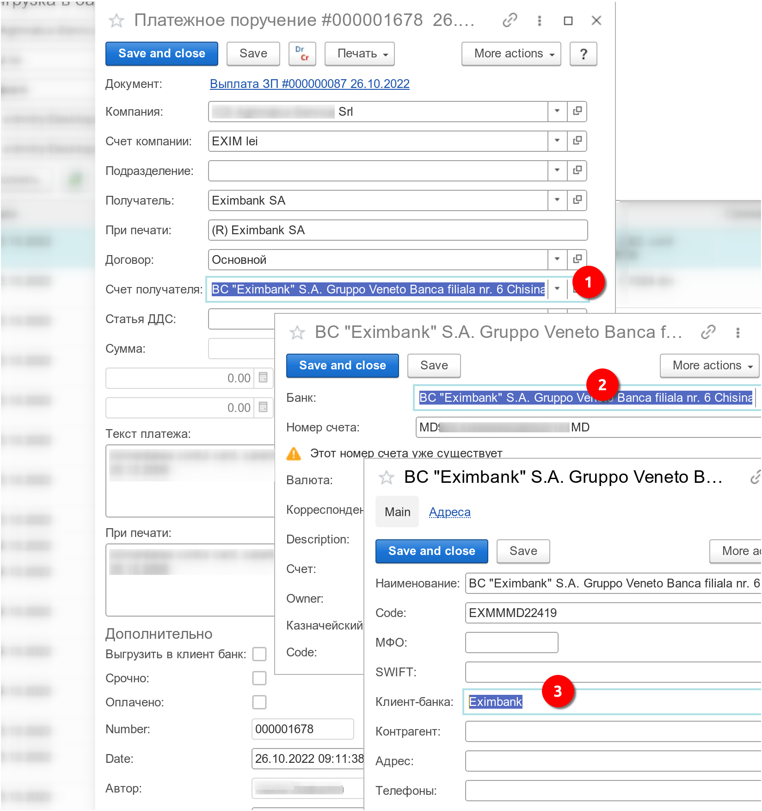

Выгрузка платежных поручений для системы Клиент-Банка. Операция выгрузки запускается по кнопке `Выгрузка в банк`, расположенной на верхней командной панели журнала платежных поручений, см. меню `Бухгалтерия / Платежные поручения`.

!!!note "Примечание"
	Существует нюанс при формировании файла выгрузки заработной платы. Файл формируется только по тому банковскому приложению, которое указано в форме обработки, в поле `Клиент банка`. Это означает, что для банков, заданных в расчетных счетах-получателей выгружаемых платежных поручений, нужно указать соответствующее банковское приложение: 
  

	Одновременная выгрузка заработной платы в разные банковские программы не поддерживается.