Для справочников [Номенклатура](/c/Items), [Характеристики](/c/Features), [Контрагенты](/c/Organizations), [ОС](/c/FixedAssets) и [Затраты](/c/Expenses), в программе реализована возможность создания дополнительных пользовательских реквизитов. В подсистеме реализована следующая функциональность:

- Создание произвольного набора свойств и характеристик объектов
- Настройка правил формирования наименования объекта из состава его свойств
- Настройка правил контроля заполненности свойств при вводе информации
- Задание шаблонов для групп и элементов объектов, включая иерархию

Набор свойств может быть задан как для группы справочника, так и для элемента(ов). Следует отличать реквизиты объектов, созданных на уровне приложения, от свойств, конфигурируемых пользователем. Реквизиты объектов, заданные на уровне структуры приложения, участвуют в бизнес-логике программы (например, выводятся в некоторые печатные формы), и тип таких данных не может быть изменен. В свою очередь, пользовательские реквизиты, конфигурируются как по составу так и по типу, однако, играют роль дополнительных данных и не завязаны на алгоритмах работы системы. Тем не менее, стоит отметить, что пользовательские реквизиты, могут участвовать в отчетах и динамических списках, а также служить механизмом унификации построения и именования объектов НСИ.

!!!warning "Внимание!"
    Конфигурирование свойств может быть сопряжено с механизмом автоматического формирования наименования элемента справочника. В этом случае, ручное редактирование полей `Наименование` (и/или `Полное наименование`) становится недоступным.

Дальнейший обзор работы механизма будет выполнен на примере справочника Номенклатура, остальные объекты имеют аналогичный принцип конфигурирования.

# Область действия

Наличие дополнительных реквизитов у элемента справочника регулируется специальными свойствами его родителя (группы, в которую он входит), или самого элемента. За функциональность дополнительных свойств группы или её элементов, отвечают следующие реквизиты:

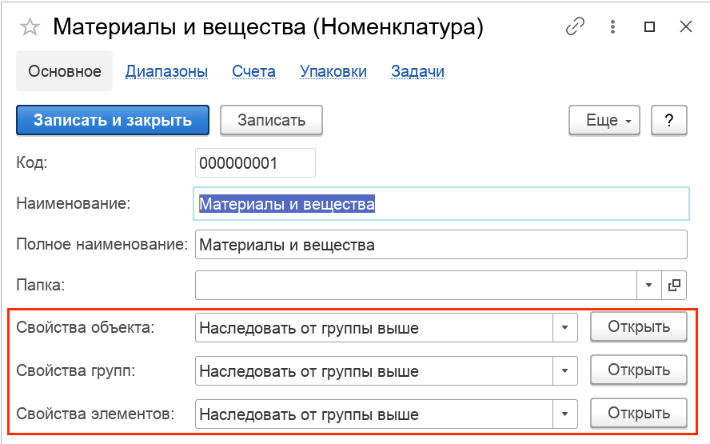

## Свойства объекта

Это поле определяет правило, согласно которого будут отображаться дополнительные реквизиты данной группы. Возможны следующие варианты:

1. `Наследовать от группы выше`. В этом случае, дополнительные реквизиты этой группы будут унаследованы от вышестоящей группы. Если в вышестоящей группе, свойства также будут наследоваться, система найдет самую первую по восходящей иерархии группу, где реквизиты заданы явно. В противном случае, никаких дополнительных реквизитов в форму группы добавлено не будет.
2. `Задать для текущего объекта`. В этом случае, дополнительные реквизиты этой группы можно будет задать индивидуально. Таким образом, вне зависимости от того, в какой группе/подгруппе находится данная группа, её свойства могут быть определены отдельно.
3. `Свойства не заданы`. В этом случае, у группы ввод свойств не предусмотрен, или отключен, в случае, если она находится в некоторой группе, дополнительные реквизиты для которой определены.

## Свойства групп

Это поле определяет правило, согласно которого будут отображаться дополнительные реквизиты групп, подчиненных данной. Тут действуют точно такие же правила, только применяются они не к данной группе, а ко всем группам, которе ей подчинены.

## Свойства элементов

Это наиболее частотный случай использования, когда мы задаем дополнительные реквизиты для элементов, входящих в данную группу (включая иерархию).

# Пример

Допустим требуется, чтобы при вводе материалов в группу `Материалы и вещества`, у пользователя была возможность задания цвета вещества. Для этого, нужно открыть группу `Материалы и вещества`, и в поле `Свойства элементов`, установить значение `Задать для текущего объекта`:

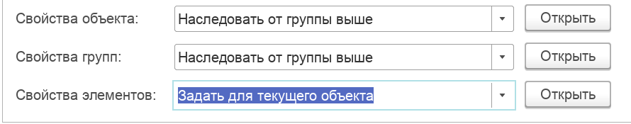

Затем, нужно нажать кнопку `Открыть`, и в форме `Свойства` настроить нужное свойство:

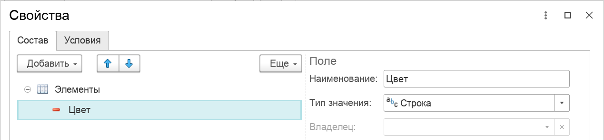

Далее, подтверждаем изменения, сохраняем и закрываем группу справочника. Последующее создание в этой группе нового материала, будет сопровождаться выводом на форму реквизита `Цвет`:

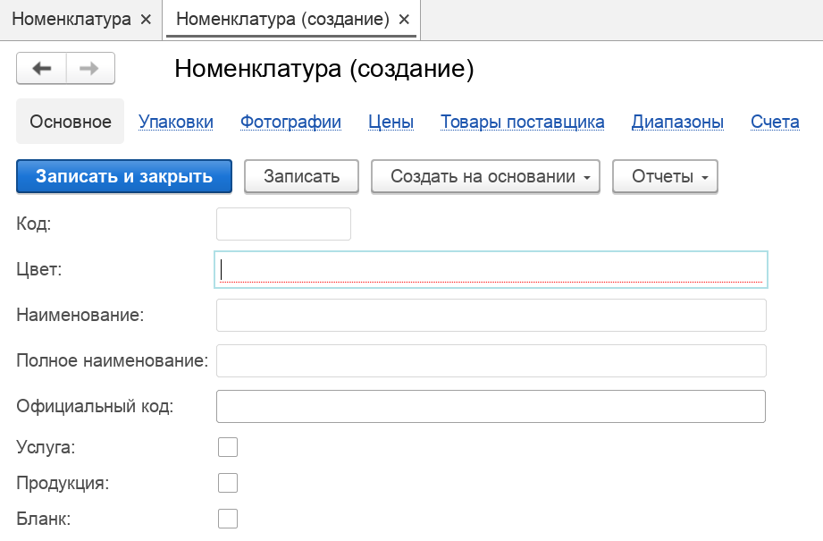

!!! note "Примечание"
    Точно по такому же принципу задаются реквизиты для групп или единичных элементов. Например, для группы можно задать правило, согласно которому, все входящие в неё подгруппы должны содержать реквизит `Страна-производитель`.

# Редактор свойств

В примере выше, мы затронули функцию создания реквизита `Цвет`, но рассмотрим возможности конфигурирования реквизитов подробнее.

## Структура редактора

Редактор представляет собой окно модального типа, логически разделенного на две части:

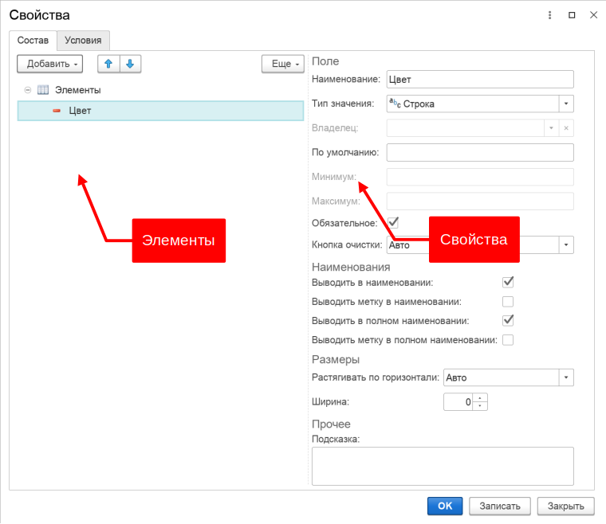

В левой части (Элементы) создаются элементы. В правой части (Палитра свойств), определяются настройки и дополнительные параметры элементов, расположенных в левой части. Навигация по дереву элементов в левой части формы, приводит к синхронизации палитры свойств с текущим выбранным элементом. Таким образом, палитра свойств отображает настройки текущего элемента дерева.

!!!note "Примечание"
    Элементы свойств имеют разные виды (см. ниже). Набор свойств в палитре зависит от вида выбранного элемента.

## Виды элементов

Кроме того, что редактор позволяет конфигурировать свойства объекта, он также позволяет настраивать отображение этих свойств на экране пользователя. Для этого, в дерево могут быть добавлены следующие виды элементов:

| Вид      | Описание                                                                                                                                                                                                                                                                                          |
|----------|---------------------------------------------------------------------------------------------------------------------------------------------------------------------------------------------------------------------------------------------------------------------------------------------------|
| Свойство | Непосредственно, свойство.                                                                                                                                                                                                                                                                        |
| Группа   | Группа свойств. Это визуальный элемент, который может визуально отделить одни свойства от других. В группах могут быть созданы другие группы. Вложенность групп не ограничена. Комбинация разных вариантов групп позволяет создавать разнообразные варианты расположения конфигурируемых свойств. |
| Метка    | Специальный элемент, предназначенный для формирования частей наименований объектов.                                                                                                                                                                                                               |

## Конфигурирование

Допустим, стоит задача сконфигурировать группу **Радиостанции импортные** так, чтобы все материалы там создаваемые, подчинялись такому правилу-шаблону:

    Наименование: Радиостанция <Торговая марка> <Марка>[ <Диапазон частот>]

    Полное наименование: Радиостанция <Вид радиостанции (по мобильности)> <Торговая марка> <Марка>[ <Диапазон частот>]

И в результате, чтобы получалось такое наименование:

    Пример наименования: Радиостанция Motorola GM340 136-174 МГц

    Пример полного наименования: Радиостанция мобильная Motorola GM340 136-174 МГц

Сконфигурируем свойства радиостанций таким образом, чтобы они с одной стороны, работали как дополнительные поля ввода информации о радиостанциях, а с другой, участвовали в формировании наименования и полного наименования.

Для этого нам нужны такие элементы:

| Элемент          | Вид                                                                                         | Обязательный | Наименование | Полное наименование |
|------------------|---------------------------------------------------------------------------------------------|--------------|--------------|---------------------|
| Радиостанция     | Метка. Потому что пользователь не должен каждый раз вводить, что это Радиостанция           | да           | да           | да                  |
| Вид радиостанции | Свойство. Потому что пользователь должен ввести это значение                                | да           | нет          | да                  |
| Торговая марка   | Свойство. Потому что пользователь должен ввести это значение                                | да           | да           | да                  |
| Марка            | Свойство. Потому что пользователь должен ввести это значение                                | да           | да           | да                  |
| Диапазон частот  | Группа, с двумя свойствами внутри, С-По. Потому что пользователь должен ввести эти значения | да          | да           | да                  |

где:

- Элемент: условная часть шаблона
- Вид: вид элемента (виды элементов описаны выше)
- Обязательный: означает, что данное свойство должно быть указано пользователем обязательно и система должна контролировать его заполненность
- Наименование: означает, включается ли данная часть свойства в наименование материала
- Полное наименование: означает, включается ли данная часть свойства в полное наименование материала

Дополнительного внимания заслуживает группа свойств **Диапазон частот**. В нашем примере, для охвата возможностей редактора, условимся, что диапазон будет представлять из себя фактически два свойства: **Диапазон с** и **Диапазон по**.

### Создание элементов

Согласно таблице элементов, формируем такую структуру:

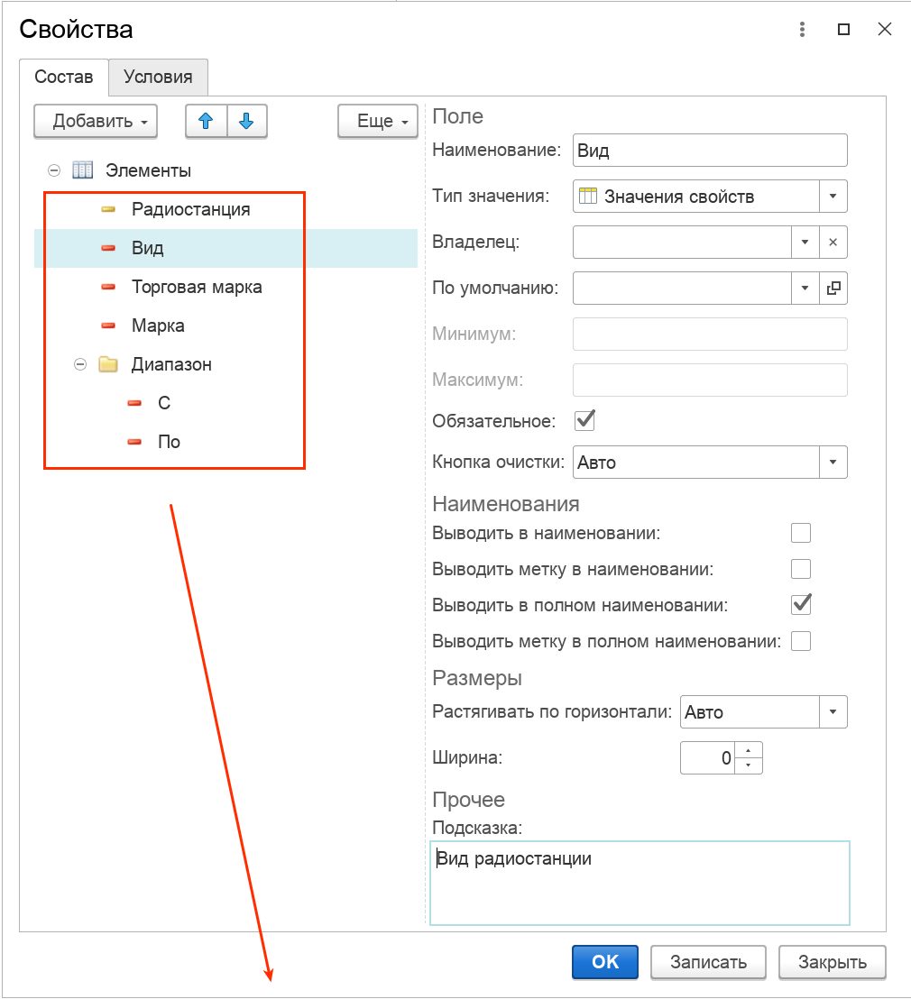

Сохраняем данные редактора, сохраняем группу Радиостанции, и при вводе новой номенклатуры в эту группу, получаем примерно такую форму ввода данных справочника Номенклатура:

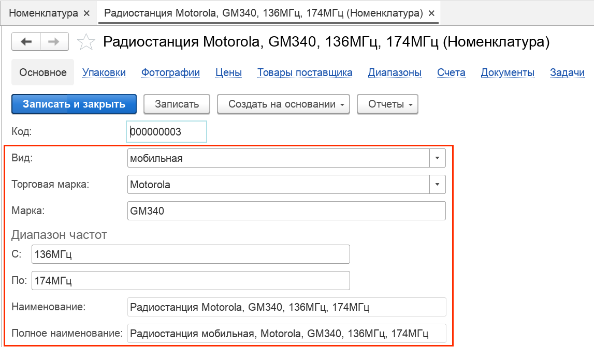

На картинке представлен готовый вариант сконфигурированных свойств. Перейдем к рассмотрению каждого свойства в деталях.

### Свойства метки Радиостанция

#### Наименование

Свойство отвечает за название метки. За вывод метки отвечают свойства `Выводить метку в наименовании` и `Выводить метку в полном наименовании наименовании`

#### Выводить метку в наименовании
#### Выводить метку в полном наименовании

Признак включения метки в наименование объекта. Если флаг установлен, наименование объекта начнет формироваться автоматически, согласно выбираемых значений пользователем:

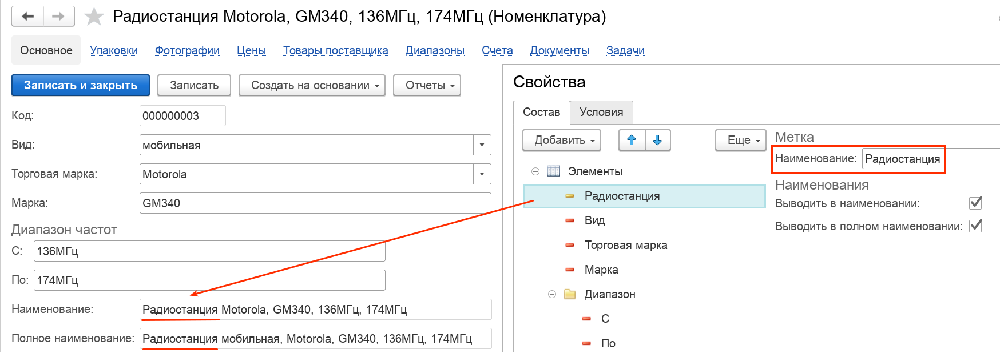

### Свойства поля Вид

#### Наименование

Свойство отвечает за название метки. На предыдущей картинке, это метка `Вид`, которая выводится левее поля ввода. Кроме этого, название метки может быть включено в наименование объекта (см. ниже `Выводить метку в наименовании`). По умолчанию, данный флаг выключен.

#### Тип

Тип свойства отвечает за то, какие значения в это поле могут быть введены пользователем. Поддерживаются как простые типы (строка, число, дата, булево), так и ссылочные (справочник Контрагенты и другие).

Пример 1. Допустим, необходимо создать свойство, которое будет определять аналог материала. Для этого, в редакторе свойств, нужно будет создать свойство `Аналог`, и установить тип этого свойства `Номенклатура`. Таким образом, при вводе нового материала в справочник `Номенклатура`, у пользователя будет возможность выбора аналога из этого же справочника.

Пример 2. Допустим, необходимо создать свойство, которое будет описывать виды радиостанций. Кроме этого, мы хотим, чтобы вид радиостанции был классифицирован, и указывался из справочника, а не вводился произвольной строкой. Для этого, в поле `Тип` нужно выбрать `Значения свойств`:

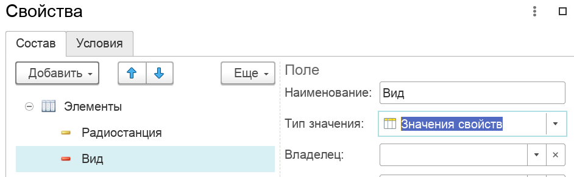

Что уже при воде данных в справочник, предоставит пользователю возможность выбора значений из справочника. Наполнение этого справочника может выполняться по мере ввода информации:

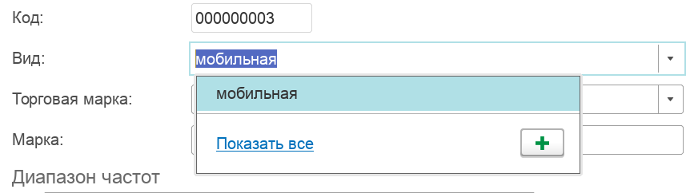

#### Владелец

Система позволяет создавать взаимосвязанные типы по принципу один ко многим. В данном поле, указывается свойство, которое будет являться владельцем для данного поля. В примере выше, такая зависимость у нас задана для свойств Производитель и Марка. У каждого производителя существует собственный набор марок радиостанций. Это и есть связь один-ко-многим: один производитель, много марок. Эта зависимость нужна для того, чтобы при выборе пользователем производителя, выбор марки радиостанции, производился из марок только выбранного производителя. Задается это следующим образом:

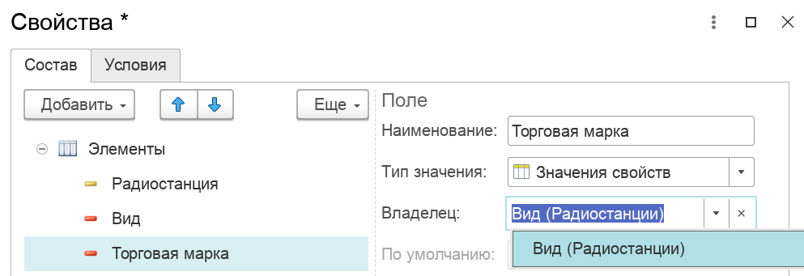

То есть в поле `Владелец` указывается зависимость от поля `Вид`, которое было описано ранее.

#### По умолчанию

В данном поле задается значение по умолчанию для данного свойства. При вводе новых элементов, это значение будет автоматически установлено для данного свойства.

#### Обязательное

Признак обязательной проверки заполненности свойства. Если флаг установлен, система будет контролировать заполнение поля в момент сохранения объекта. Если свойство будет не заполнено, программа сгенерирует ошибку.

#### Кнопка очистки

Данная настройка регулирует наличие кнопки-очистки (крестика) в правой части поля ввода.

#### Выводить в наименовании
#### Выводить в полном наименовании

Признак включения значения данного свойства в наименование объекта. Если флаг установлен, наименование объекта начнет формироваться автоматически, согласно выбираемых значений пользователем.

#### Выводить метку в наименовании
#### Выводить метку в полном наименовании

Признак включения метки (названия) свойства в наименование объекта. Если флаг установлен, наименование объекта начнет формироваться автоматически, согласно выбираемых значений пользователем. Отличие метки от значения свойства, на примере полного наименования, показано на картинке:

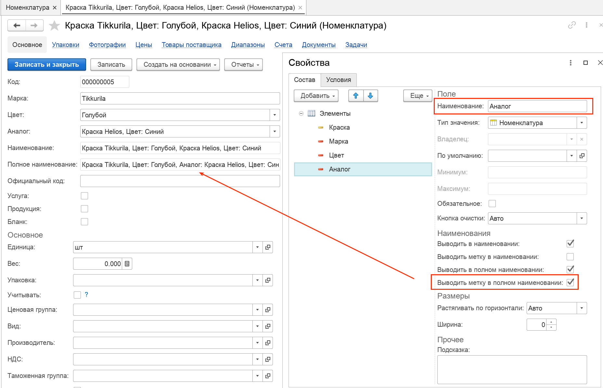

Таким образом, за вывод слова **Аналог:** перед значением свойства (самого аналога) **Краска Helios** и отвечает данный флаг.

#### Растягивать

Свойство отвечает за способ растягивания поля по горизонтали. В режиме `Авто`, система будет анализировать тип свойства и автоматически подбирать ширину поля на форме.

#### Ширина

Ширина поля в логических единицах по соотношению с другими полями. Если значение = 0, ширина подбирается автоматически. Для точной настройки ширины, можно сделать следующее:

1. Установить `Растягивать` = `Нет`
2. Задать необходимое значение в поле `Ширина`

Ширина и высота элемента формы задается в абстрактных величинах, зависящих от особенностей отображения данного элемента и клиентского приложения. Также нужно помнить, что при явном указании ширины элемента, фактические размеры будут зависеть от используемой операционной системы, ее настроек и клиентского приложения. Ширина (и высота) элемента формы не описывают размер области данных элемента. Эти параметры описывают общие размеры элемента, включающие заголовок.

#### Подсказка

Произвольная информация для отображения подсказки к полю. Подсказка выводится в виде небольшого окна над полем при наведении на него мышкой.

### Свойства группы Диапазон

#### Наименование

Наименование группы.

#### Тип

Тип группы, возможны следующие варианты:

- `Вертикальная`. В этом случае, все поля внутри группы будут располагаться одно под другим.
- `Горизонтальная`. В этом случае, все поля внутри группы будут располагаться по горизонтали, слева-направо.
- `Горизонтальная, если возможно`. В этом случае, все поля внутри группы будут располагаться по горизонтали, слева-направо, если системе получается их уместить на экране пользователя. В противном случае, элементы будут располагаться вертикально.

#### Тип

Варианты визуального оформления группы:

- `Нет`. Группа специально никак не выделяется.
- `Слабое выделение`. Заголовок группы отображается большим шрифтом.
- `Обычное выделение`. Заголовок группы отображается большим шрифтом, вокруг элементов группы (с каждой стороны) формируются отступы.
- `Сильное выделение`. Заголовок группы отображается большим шрифтом, с левой стороны (на всю высоту группы) формируется выделяющаяся черта, снизу формируется отступ.

#### Показывать заголовок

Признак вывода заголовка группы. Если флаг установлен, в поле `Заголовок` можно будет ввести заголовок для группы.

#### Заголовок

Поясняющий заголовок для группы, который будет выведен на форму объекта:

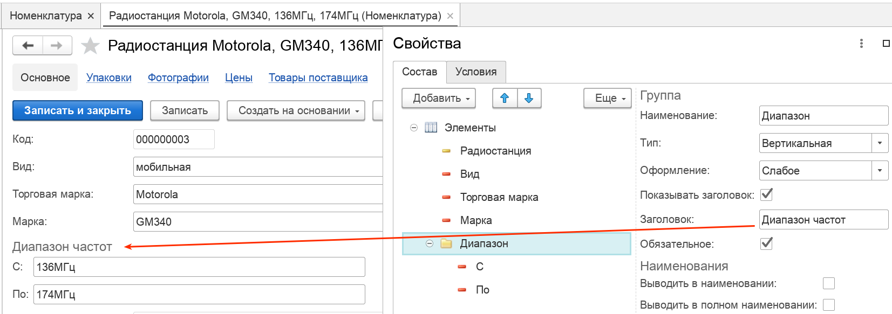

#### Растягивать по горизонтали

Изменение размеров группы (растягивание) зависит от значения этого свойства. Возможны следующие варианты:

- `Авто`. Растягиваемость определяется подчиненными элементами группы. Если есть хотя бы один подчиненный элемент, для которого возможно растягиванием означает, что группа также может растягиваться.
- `Да`. Группа растягивается без ограничений.
- `Нет`. Группа не растягивается. Размер определяется вложенными элементами или свойством группы `Ширина`.

#### Обязательное
#### Выводить метку в наименовании
#### Выводить метку в полном наименовании
#### Ширина
#### Подсказка

Значения данных полей аналогичны свойствам описанным для [Свойства поля Вид](#PropetyField)

# Отчеты

Дополнительные свойства справочников могут использоваться в отчетах в качестве фильтров или выводимых полей. На картинке ниже приведен пример сформированного отчета [Товары](/r/Items) с установленным отбором по виду радиостанции:

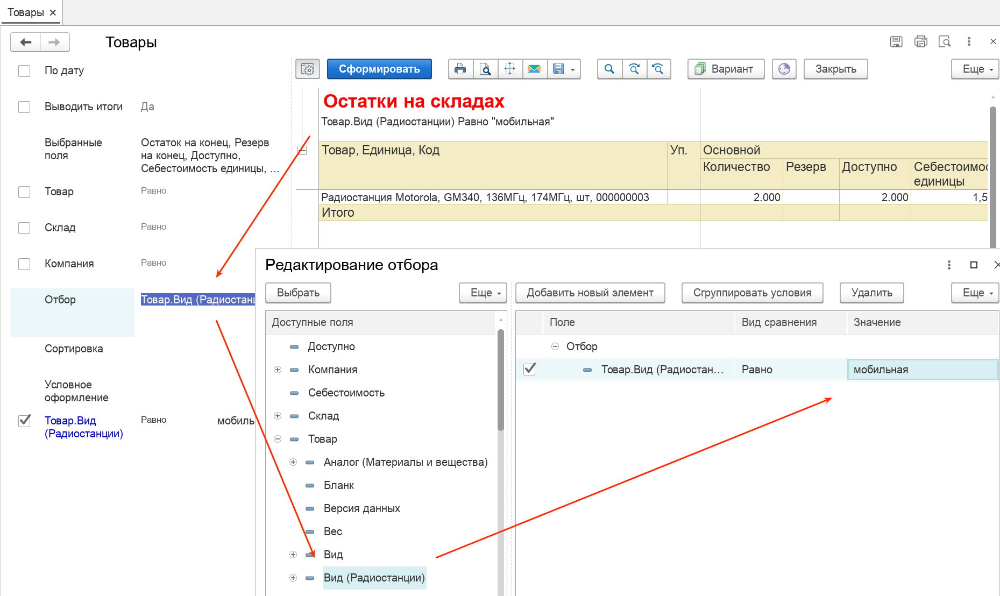

Аналогичные

# Права доступа

Для работы с подсистемой, в программе предусмотрен следующий набор прав пользователей:

| Право                    | Описание                                                                                               |
|--------------------------|--------------------------------------------------------------------------------------------------------|
| Свойства, просмотр       | Данное право позволяет пользователю просматривать свойства материала, редактировать свойства запрещено |
| Свойства, редактирование | Это свойство дает право редактировать значения свойств материала                                       |
| Свойства, настройка      | Данное свойство наделяет пользователя правами на конфигурирование свойств                              |

Права пользователей задаются в справочнике [Пользователи](/c/Users).
