В программе Nullarity 5 реализован механизм независимого разделения данных. Это означает, что в одной информационной базе, вы можете создавать неограниченное количество организаций ("подбаз") которые будут полностью изолированы друг от друга, включая пользователей и их доступ.

!!!note "Примечание"
	Описываемая функциональность не является аналогом ведения учета нескольких юридических лиц в одной информационной базе, что также поддерживается в Nullarity 5.

Описываемый подход имеет ряд преимуществ:

1. Если вы бухгалтер и ведете учет нескольких организаций, вам будет удобно видеть их все прямо в программе, создавать их там, переключаться с одной на другую
2. Любое обновление и/или доработка будет применяться сразу ко всем используемым предприятиям. Нет необходимости переносить обновления/доработки между базами
3. Администрирование пользователей теперь может быть существенно упрощено и взято под понятный контроль. Для каждого пользователя вы можете указать, к какой базе (организации) он имеет доступ, включая смену пароля и раздельного ограничения доступа к данным.
4. Каждый пользователь в системе уникален с т.з. авторизации, и одновременно с этим, может иметь независимый набор прав на уровне каждой организации. Например, в одной организации он может иметь административный доступ, в другой - права рядового пользователя.
5. Вы можете создавать глобальные группы пользователей, которые будут действовать по всем организациям, созданным в системе.
6. Отдельно нужно отметить, что для создания новой организации не требуется отдельно докупать лицензию Nullarity 5. Вы можете приобрести одну лицензию и вести учет (включая получение обновлений) неограниченного числа предприятий (в рамках одной физической информационной базы). 

# Организации (информационные базы)

Организацией в системе считается изолированная область данных предприятия, для которого ведется хозяйственный учет. Организации, это практически информационные базы, с той разницей, что физически они хранятся в одной базе. В дальнейшем, будем считать что информационная база и организация - синонимы, если не будет дано контекстное уточнение.

Список организаций доступен через панель быстрых функций программы. Там же, производится их создание, редактирование и активация:

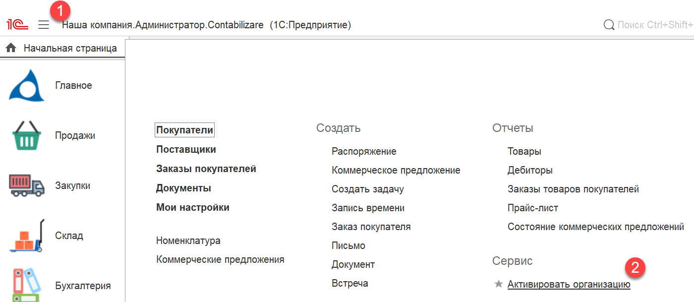

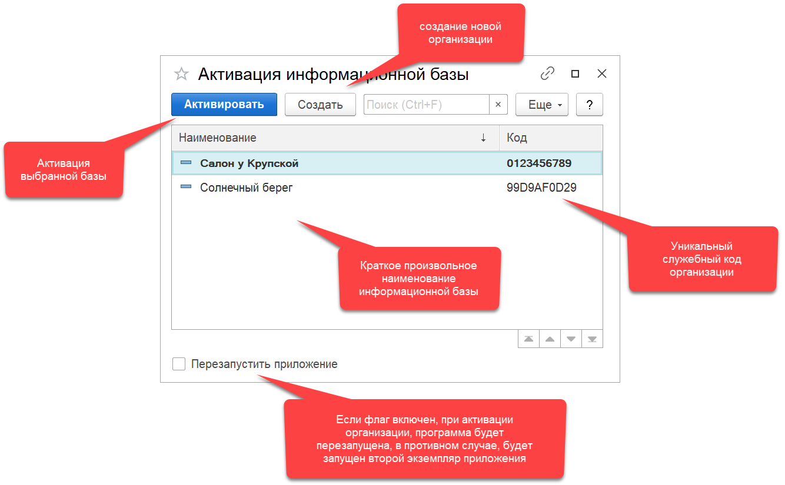

При создании организации, система подготовит начальный пустой образ предприятия, заполненный базовыми настройками. Право на создание организаций есть у пользователя с ролью `Системный администратор`.

Для каждого пользователя системы (включая администраторов), задается право доступа к той или иной организации. Пользователи, для которых задан доступ к нескольким организациям, имеют возможность авторизации в указанных организациях под одним именем/паролем. Изменение учетных данных пользователя в любой из организаций, автоматически синхронизируется со всеми остальными организациями.

# Системный администратор и Администратор

Системный администратор (строго говоря, пользователь с ролью `Системный администратор`) это супер пользователь с максимальным уровнем доступа. Системный администратор имеет право создания организаций, назначения доступа к организациям, и право работы в конфигураторе.

!!!warning "Внимание!"
	Обычные пользователи системы, не имеют доступа на просмотр профилей пользователей с ролью `Системный администратор`. Это означает, что в списке пользователей, системные администраторы, для них будут скрыты. В связи с этим, не рекомендуется использовать профиль системного администратора для регулярной работы и ввода документов в систему. Такие документы могут быть недоступны другим пользователям, или отображаться для них некорректно. Используйте профиль системного администратора для выполнения административных задач.

Администратор (или пользователь с ролью `Администратор`) это администратор в рамках организации, к которой у него есть доступ. Администратор имеет право создавать других пользователей, группы пользователей, задавать необходимые права и доступы. Администратору может быть предоставлен доступ к нескольким организациям. На картинках ниже показана разница между системным администратором и обычным администратором в процессе создания пользователя.

Вот так выглядит настройка доступа при создании пользователя у системного администратора:

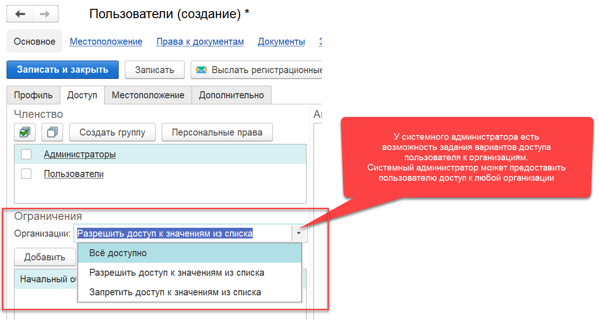

А вот так выглядит создание пользователя обычным администратором:

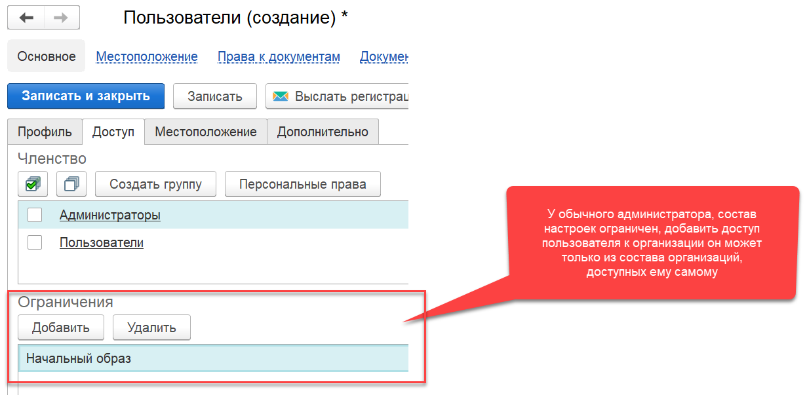

# Права пользователей, группы

Права пользователя определяются совокупностью индивидуальных прав и прав групп, в которые может входить пользователь. Индивидуальные права пользователя действуют только в рамках организации, где эти права были предоставлены. Права, определяемые членством в группах действуют в рамках тех организаций, которые входят в область действия этих групп.

> Список пользователей можно открыть через меню `Настройки / Пользователи`

На картинке ниже пользователю задаются персональные права, которые действуют только для него, и только для текущей (активированной) организации:

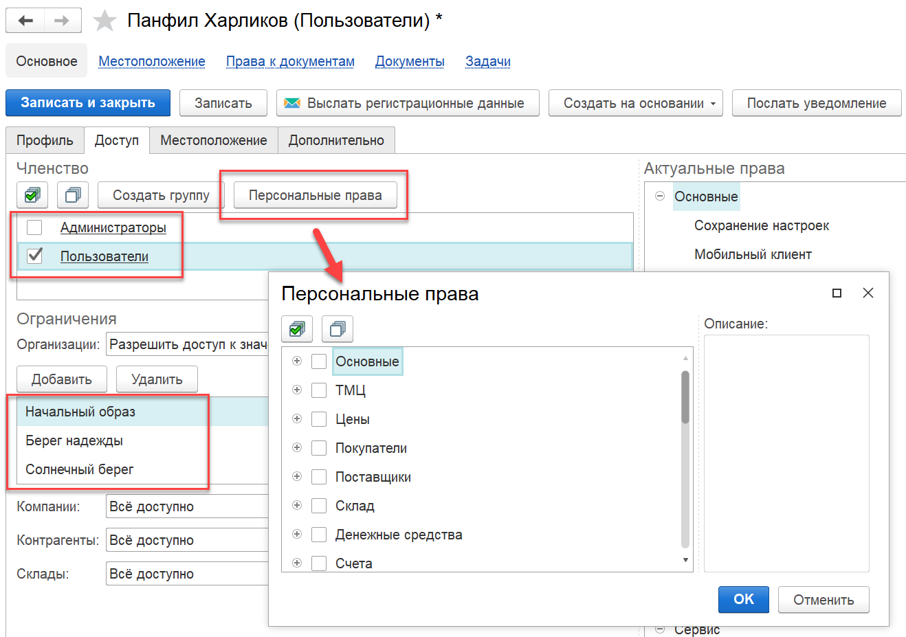

Даже если пользователь имеет доступ к трем организациям, персональные права будут действовать только для текущей (на картинке текущей организации не видно).

!!!tip "Подсказка"
	Система прав устроена по принципу "всё что не разрешено - запрещено". Например, на картинке Панфил Харликов включен в группу `Пользователи`, соответственно он наделяется правами, установленными для этой группы. В тоже самое время, персональные права для Харликова могут только расширить его полномочия, но не ограничить.

> Список групп пользователей можно открыть через меню `Настройки / Группы`

На картинке ниже проиллюстрирован практический случай. Системный администратор создал группу Пользователи с минимальным набором прав, который должен быть у каждого пользователя системы. Для этой группы, он задал область действия - все организации (значение `Всё доступно` для поля `Организации`). В правой части, в дереве прав, он выделил флажками права, которыми должны обладать пользователи этой группы. В результате такой настройки, группа Пользователи доступна в любой из информационных баз (как в существующих, так создаваемых в будущем). Теперь, при создании пользователя в любой из организаций, достаточным будет его включение в группу Пользователи, без необходимости индивидуальной настройки прав каждый раз. Более того, когда для всех пользователей нужно будет изменить состав прав, достаточным будет изменить права для группы Пользователи, и доступ всех пользователей этой группы, во всех организациях, будет автоматически модифицирован.

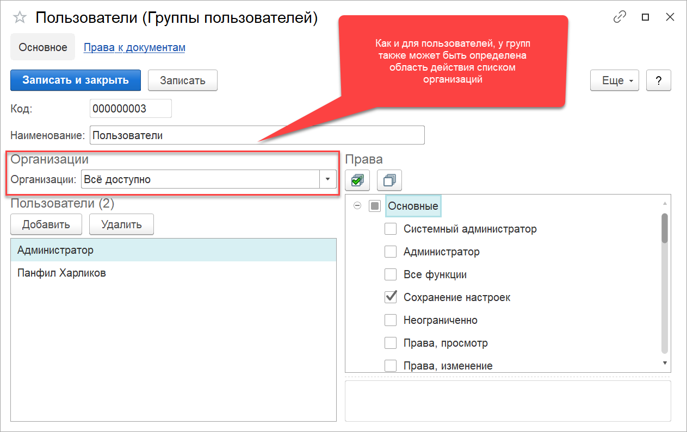

Хорошими кандидатами на группы общего назначения могут быть: Менеджеры, Кладовщики и другие. Очевидно, что группы могут быть созданы как для всех организаций, так и выборочно.

# Особенности

## Отключение доступа локальным администратором

Если пользователю, системный администратор предоставил доступ ко всем организациям, у обычного администратора остается право запрета доступа этого пользователя к организации(ям) к которым этот администратор имеет доступ.

Например, у нас есть аудитор Скоробогатько Ефим Аполлонович, которому необходим доступ ко всем организациям. На картинке ниже, системный администратор создал этого пользователя и дал ему надлежащие права:

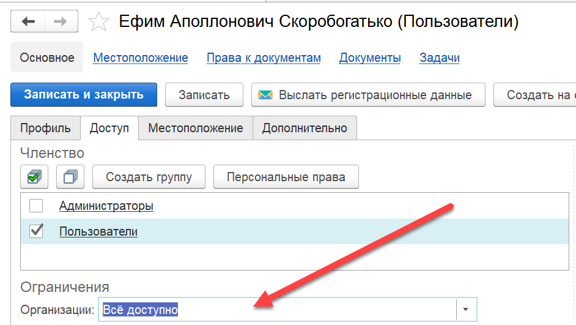

Согласно настроек профиля, Ефим может входить во все организации используя своё имя/пароль. Теперь допустим, что руководитель компании Солнечный берег принял на работу другого аудитора, и доступ Ефиму теперь нужно ограничить. В этом случае, администратор организации Солнечный берег может открыть профиль Ефима в своей информационной базе, и отключить его, как показано на картинке:

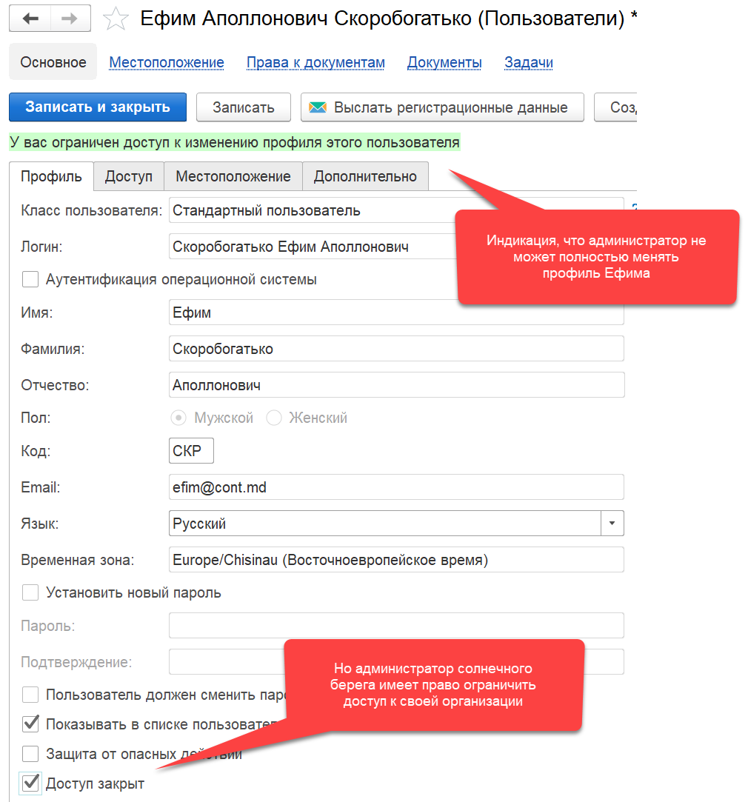

После такой настройки, в доступе к организации Солнечный берег, Ефиму будет отказано.

## Аннулирование доступа

Существует еще один способ ограничения доступа пользователя к организации, основанный на отзыве профиля. Суть операции лучше раскрывается на примере.

Допустим, пользователю предоставили доступ к некоторому списку организаций:

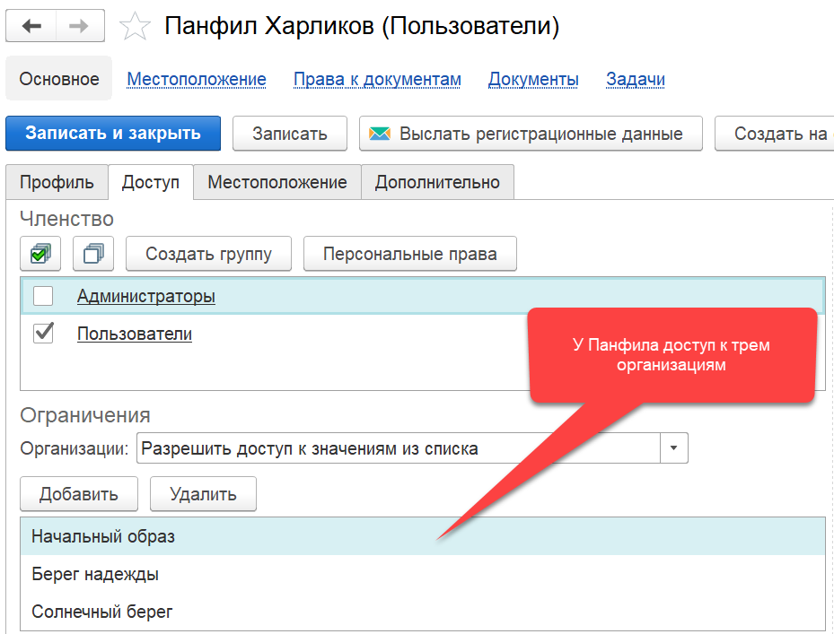

Затем, по прошествии времени, решено было удалить доступ к организации Берег надежды. После этой операции, профиль пользователя Панфил Харликов, в организации Берег надежды будет помечен специальным флагом `Доступ отозван`, и доступ к базе будет закрыт:

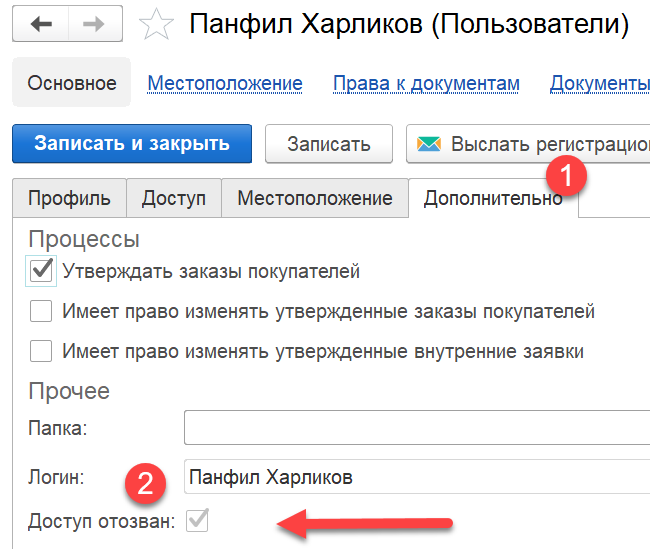

!!!tip "Подсказка"
	При открытии списка пользователей, система по умолчанию скрывает профили, доступ которых отозван, закрыт или помечен на удаление. Чтобы отобразить всех пользователей, нужно воспользоваться командой `Показать неактивных`, расположенной на верхней командной панели списка.

Стоит обратить внимание, что отзывая доступы к организациям, вы можете полностью отключить пользователя от системы. Для этого вам нужно в списке организаций оставить только текущую, и включить на вкладке `Профиль` флаг `Доступ закрыт`.

# Доступ к документам 

Доступ к документам, это категория прав, определяющая возможность изменения документов, в зависимости от их даты. Наиболее частым ограничением является установка запрета редактирования периодов, отчетность за которые уже была сдана. Таким образом, обеспечивается уверенность пользователей в достоверности обработанной и хранимой информации. Контроль основан на проверке даты действия и самого действия, производимого над документом. Доступ к настройке таких прав осуществляется в меню `Настройки / Права к документам`:

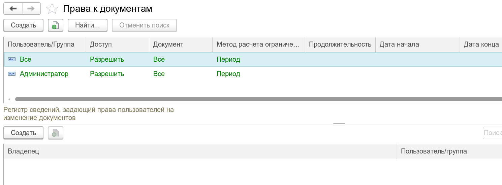

Каждая строка в этом списке задает правило контроля. Записи красным цветом - запрещающие, зеленым - разрешающие. Записи серым цветом - неактивные, срок их действия вышел или они временно выключены. Ограничить можно как само действие (ввод нового/отмена проведения и т.д.), так и дату действия, производимого над документом. Момент проверки полномочий осуществляется при открытии документа, изменении его даты или сохранении (включая проведение, отмену проведения и другие).

Записи на запрет имеют наивысший приоритет. При проверке полномочий, вначале проверяются все запреты, после - все разрешения. Если ни запретов ни разрешений не задано, неопределенная ситуация является запретной, документ сохранить система не позволит.

Пример правила:

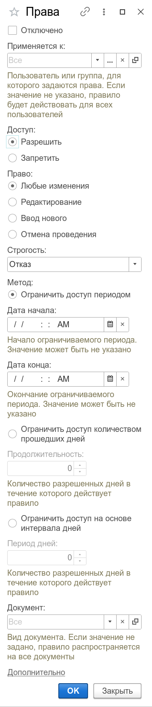

### Отключено

Флаг, позволяющий временной отключить правило, без того, чтобы его нужно было удалять из списка.

### Применяется к

В данном поле может быть указано значение конкретного пользователя, роли или ничего. Если поле остается пустым - правило назначается для всех пользователей и ролей системы.

### Доступ

Принимает одно из значений:

- Запретить
- Разрешить

Правила на запрет имеют наивысший приоритет, это значит, что если буду заданы два правила, одно на запрет редактирования документов, другое - на разрешение, пользователю будет запрещено редактировать документ.

### Право

Вид действия, на которое накладывается ограничение. Принимает одно из значений:

- Любые изменения
- Редактирование
- Ввод нового
- Отмена проведения

Рассмотрим сторону запрета:

`Запрет / Любые изменения` означает, что с документами ничего нельзя будет сделать в указанном периоде. 

`Запрет / Редактирование` запрещает модификацию уже введенных документов, вместе с тем, не запрещает ввод новых и отмену проведения. Если пользователя необходимо наделить правами: запрет на изменение существующих документов, но разрешение на ввод новых, потребуется создать два правила: одно для запрета редактирования, другое на разрешение ввода нового. Очевидно, что после ввода нового документа, изменить его пользователю уже не удастся.

`Запрет / Ввод нового` запрещает пользователю вводить новые документы, вместе с тем, потенциально разрешает изменять существующие. Методика аналогична описанной выше.

`Запрет / Отмена проведения` запрещает отменять проведение введенных в систему документов, но потенциально разрешает все остальное, по аналогии выше.

Рассмотрим сторону разрешения:

`Разрешить / Любые изменения` срабатывает оставшаяся часть запрещенных действий. Например, если одновременно действуют два правила: Запрет на отмену проведения и Разрешение на любые изменения, то в результате у пользователя будет возможность производить над документом любые действия, за исключением отмены проведения (пометку на удаление проведенного документа также установить возможности не будет, так как при данной операции, как следствие, происходит отмена проведения).

`Разрешить / Редактирование` позволяет редактировать существующие документы, если нет других ограничений.

`Разрешить / Ввод нового` разрешение на ввод новых документов, срабатывает в случае, если в указанном периоде нет запрета на изменение любых данных.

`Разрешить / Отмена проведения` разрешение на отмену проведения документов, срабатывает в случае, если в указанном периоде нет других ограничений.

### Строгость

Режим ограничения, может принимать одно из двух значений:

- Отказ. В этом случае, срабатываемое ограничение будет запрещать пользователю проводить изменение.
- Предупреждение. В этом случае, пользователь получит предупреждение об ограничении, но выполнение изменения будет доступно. Такой режим может быть удобен для предостережения пользователя о попытке внести изменения в закрытый период, без полного запрета это выполнить.

### Метод

В поле можно задать одно из следующих значений:

- Ограничить доступ периодом. Если дата начала периода не будет указана, правило начинает действовать с начала существования информационной базы. Дата начала не включается в период ограничений, ограничение начинает действовать со следующей секунды за датой начала. Дата окончания действия также может быть не заполнено, в таком случае, правило распространяется на любой документ, следующий за датой начала. Дата конца не включается в период ограничений, ограничение начинает действовать за секунду до даты конца.
- Ограничить доступ количеством прошедших дней. При выборе этого значения, действие правила будет рассчитываться исходя из даты исходного документа и оперативной отметки времени базы данных (текущей даты). Количество дней, в течение которого правило действует, задается в поле `Продолжительность`. Правило решает такую задачу: ограничить/разрешить доступ к введенным ранее определенного числа дней данным. Например, если, требуется запретить редактирование документов, введенных ранее семи дней.
- Ограничить доступ на основе интервала дней. Работает аналогично методу выше, с той разницей, что период определяется количеством дней как назад, так и вперед. Количество дней периода задается в поле `Период дней`.

### Вид документа

В данном поле может быть указан конкретный вид документа, для которого задается ограничение. Если значение пусто - правило будет относиться ко всем документам.

### Действует до (Дополнительно)

Дата, в которой может быть указано, до какого момента времени правило активно. Например, можно открыть период для редактирования какому-то пользователю, с тем условием, что на следующий день, эта возможность у него быть не должна. В последствии, такие правила по прошествии из срока действия могут быть удалены.

### Автор правила (Дополнительно)

Пользователь, последним внесший (или создавший) изменения в правиле.
