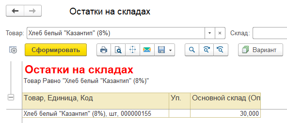
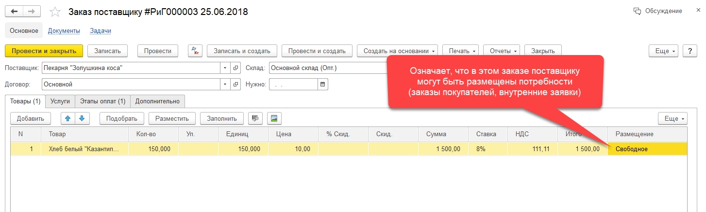
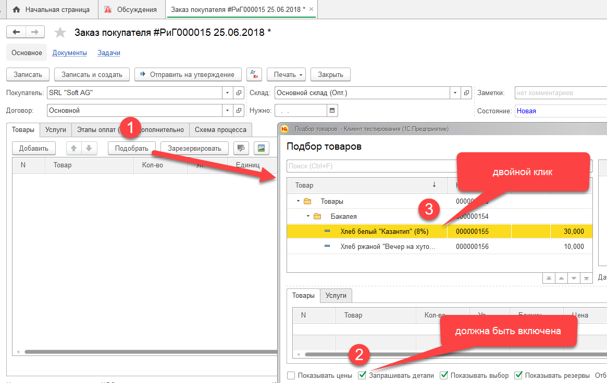
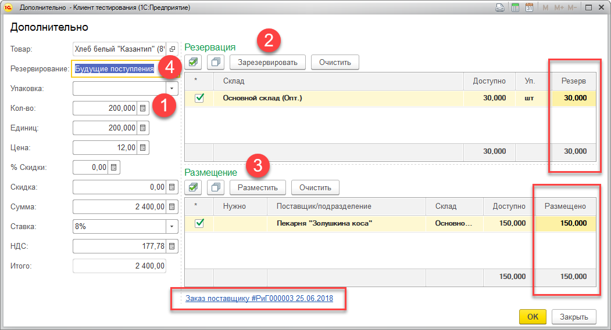
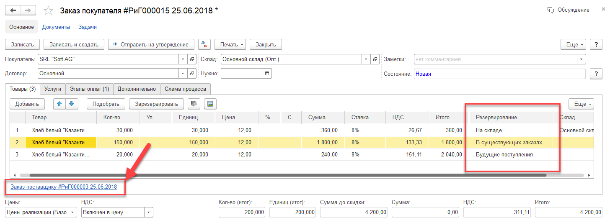

Резервирование - это процесс, при котором документ формирующий потребность в товаре (см. [Заказ покупателя](/d/SalesOrder), [Внутренняя заявка](/d/InternalOrder)) накладывает резерв на складской остаток.

Цель резервирования - гарантировать отгрузку товара в соответствии с потребностью (отгрузка под конкретный заказ покупателя или внутреннюю заявку).

Резерв задается при вводе документов-потребностей (заказов клиентов, внутренних заявок) в систему. В табличной части таких документов присутствует реквизит `Резервирование`, который может принимать следующие значения:

*   На складе
*   Будущие поступления
*   В существующих заказах
*   Нет

Анализ данных и регистрация резерва производится в момент финального утверждения документа. Это означает, что фактический резерв будет наложен только после того как документ будет положительно утвержден.

## Резервирование: На складе

Этот способ позволяет произвести резерв на имеющийся остаток на складе. Данным способом нельзя наложить резерв на несуществующий остаток.

## Резервирование: Будущие поступления

Этот способ позволяет наложить резерв на будущий остаток. Будущий остаток формируется документом-поступления (например, [Поступление товаров](/d/VendorInvoice)). Для того, чтобы документ-поступления, автоматически формировал резерв, необходимо в его табличной части указать соответствующие документы-потребности, или заказы поставщику, с размещенными в них потребностями. Ввод поступления без указания таких данных формирует свободный остаток на складе.

## Резервирование: В существующих заказах

Этот способ позволяет размещать потребности в ранее введенных заказах поставщикам (см. [Заказ поставщику](/d/PurchaseOrder)). Для того, чтобы заказ поставщику был доступен для размещения в нем потребностей, в его табличной части, для требуемых позиций, в поле `Размещение, должно быть задано значение Свободное`. Кроме этого, системой контролируются сроки поставок и требований, с целью предотвращения ситуаций размещения потребностей в заказах, превышающих сроки поставок конечным клиентам/подразделениям.

## Резервирование: Нет

В этом случае, формируемая потребность не участвует в процессе резервирования. Стоит отметить, что даже если на основании документа-потребности будет введен документ поступления, резервирование под указанный документ-потребности всё равно сделано не будет и поступивший товар будет свободным остатком на складе.

# Пример резервирования

Задача: необходимо реализовать клиенту `SRL "Soft AG", 200 штук Хлеб белый "Казантип" (8%)`.

Исходно: у нас имеется 30 штук хлеба на складе, у нас введен в систему заказ поставщику, в котором указано свободное размещение на 150 штук:

Таким образом, 20 штук у нас без обеспечения: 20 = 200 нужно – 30 есть – 150 скоро будет.

Вводим заказ покупателя. В процессе ввода данных, будем использовать механизм подбора (см. [Подбор товаров](/p/Items)):

После двойного клика, система выведет форму дополнительных данных:

На первом шаге (см. картинку выше), мы указываем, что нам нужно 200 штук. Система, в двух таблицах справа, показывает, что у нас уже есть 30 штук на складе, и 150 штук может вместить в себя заказ поставщику. Нажимаем кнопки `Зарезервировать и Разместить`, система автоматически заполнит поля согласно возможностей склада/заказа.

На шаге 4 мы указываем способ резервирования заказываемого товара. В нашем случае, это будет означать, что только 20 единиц (остаток после резервации и размещения) будут зарезервированы в будущих поступлениях.

Нажимаем кнопку `ОК` в данной и предыдущей форме, и смотрим что у нас получилось в табличной части заказа покупателя:

Одна строка на 200 штук разбилась в заказе на три с соответствующими способами резервирования и количеством. Для второй строки, задан заказ поставщику.

После утверждения документа (см. [Заказ покупателя / Бизнес-процесс](/d/SalesOrder#Process)) введенная информация будет отражена в системе, и на её основании можно получить аналитическую отчетность.